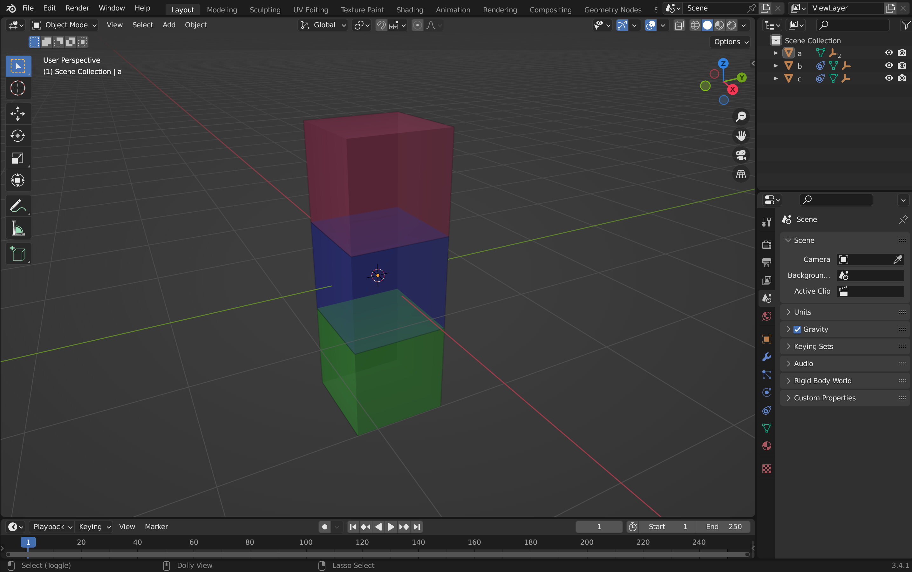

<div align="center">
    <a href="https://pypi.org/project/codetocad/0.2.1688153771/">
    <h1>CodeToCAD</h1>
    </a>
    <p><strong>One language for all your CAD needs</p>
</div>
<p align="center">
   <a href="https://codetocad.github.io/CodeToCAD/docs.html"></a>
   <a href="https://discord.gg/MnZEtqwt74"></a>
   <a href="https://github.com/CodeToCAD/CodeToCAD/stargazers"></a>
   <a href="https://github.com/search?q=repo%3ACodeToCAD%2FCodeToCAD++language%3APython&type=code"></a>
   <a href="https://codetocad.github.io/CodeToCAD/examples.html"></a>
</p>

## Table of Contents

- [Table of Contents](#table-of-contents)
- [What is CodeToCAD](#what-is-codetocad)
- [Why CodeToCAD?](#why-codetocad)
- [Getting started](#getting-started)
- [Supported Applications](#supported-applications)
    - [Alpha/Beta Support](#alphabeta-support)
    - [To Be Developed](#to-be-developed)
- [Working with the software of your choice](#working-with-the-software-of-your-choice)
  - [Compatible software](#compatible-software)
  - [Blender](#blender)
    - [Sidebar Panel](#sidebar-panel)
    - [Fusion 360](#fusion-360)
    - [Onshape](#onshape)
- [What's next](#whats-next)
- [For the developers](#for-the-developers)
- [Additional Resources](#additional-resources)
- [Contributors](#contributors)
- [Support us ❤️](#support-us-️)


## What is CodeToCAD
CodeToCAD is an open source code-CAD automation. It provides extendable, declarative and imperative interfaces that allow engineers and developers to write code-CAD scripts that can be checked into source control, collaborated on, and run on any supported 3D modeling software.

## Why CodeToCAD?

✅ Simplified modeling interface - it's all text! No more scrolling and clicking into sub-menus to edit your models.

🔓 Not vendor locked - your models are created in an open-source language. If you want to use another software, you do not lose the features you have defined. Note: There is no guarantee that a model created for, e.g. Blender, will work right away for another software, but with some refactoring, it theoretically should!

🪶 Lightweight and portable. All you need is a text-editor to model. You can occasionally fire-up your modeling software to run your creations.

💪 Leverages existing programming languages, like Python. You can keep using the languages you're familiar with and love. There is no one-off language you and your team has to learn. Use CodeToCAD like a library or a framework.

🚦Easy version control. Your models are written in code, you can use industry-loved git to keep track of versions of your models.

💕 Built by people who believe in automation and that modeling workflows should be intuitive, reliable and most importantly free and open source!

<div align="center">
<image src="https://raw.githubusercontent.com/CodeToCAD/CodeToCAD/develop/docs/images/three_axis_mill.gif"/>
</div>

## Getting started

> Pre-requisites: [Python 3.11 or newer](https://www.python.org/downloads/).

1. Install the [CodeToCAD PIP Package](https://pypi.org/project/CodeToCAD/) to get intellisense syntax highlighting.

   ```
   pip install CodeToCAD
   ```

2. Create your own CodeToCAD python file and save it ([docs](https://codetocad.github.io/CodeToCAD/docs.html)):

   ```python
   # my_codetocad_script.py
   # More examples can be found under CodeToCAD/examples/
   from codetocad import *

   my_material = Material("material").set_color(169, 76, 181, 0.8)
   Part("Cube").create_cube(1, 1, 1).set_material(my_material)
   ```

3. Watch as your code gets seemlessly translated into CAD using our [custom addon](#working-with-the-software-of-your-choice) for your desired application


4. You may also run `codetocad my_codetocad_script.py` from the CLI to run your script.

> Above is the above script being run in blender using our [Blender Addon](#blender) below.

> Warning: Since CodeToCAD scripts are written and executed in Python, be careful when running scripts you find on the internet!


## Supported Applications
#### Alpha/Beta Support
- [Blender 4.1](https://www.blender.org/) - Digital Modeling Software
   - [Instructions](#blender)
- [Fusion 360](https://www.autodesk.com/products/fusion-360/overview) - M-CAD, E-CAD and CAE Software developed by Autodesk
   - [Instructions](#fusion-360)
- [Onshape](https://www.onshape.com/en/) - Product Development and CAD Software 
   - [Instructions](#onshape)

#### To Be Developed
- [PyBullet](https://pybullet.org/) - Real-time Physics Simulation Library 
- [KiCAD](https://www.kicad.org/) - Electronic/PCB Design Software
- LLM/AI based model generation
- [FreeCAD](https://www.freecad.org/) - CAD Software
- [ThreeJS](https://threejs.org/) - Web-based 3D Library
- [Libfive](https://libfive.com/) - Signed Distance Field Modeling library

## Working with the software of your choice
> Remember to first follow the getting [started instructions](#getting-started)

### Compatible software
1. [Blender 4.1](#blender)
2. [Fusion360](#fusion-360)
2. [Onshape](#onshape)

### Blender

1. Download a release of the Blender Addon from the latest [release](https://github.com/CodeToCAD/CodeToCAD/releases)
   > Note for developers: instead of downloading a release, you can clone this repository, then import [blender_addon.py](./providers/blender/blender_addon.py) and set to CodeToCAD path in the addon to the root of this repository. Please watch this guide to get set up: [Video Guide](https://youtu.be/YD_4nj0QUJ4)

2. Install the Blender Addon in the blender software

    

3. Import your script using the file menu > import > CodeToCAD or the CodeToCAD menu in the sidebar.

   

> Note, you can also run CodeToCAD in Blender via cli: `blender -- --codetocad $(pwd)/yourScript.py` or `codetocad yourScript.py blender /path/to/blender/executable`

#### Sidebar Panel

You can use the side-panel to import CodeToCAD files or start a debugger server.

   

#### Fusion 360

To use CodeToCAD with Fusion 360, please install the Add-In. Please check out the [README](./providers/fusion360/codetocad_fusion360_addin/README.md) for more information.

   

#### Onshape

Please refer to the [Onshape README](./providers/onshape/README.md) for more information on how to setup an API key and connect to the Onshape Client.

## What's next
- Run or browse the [examples](./examples/)!

  

- Join the [Discord Server](https://discord.gg/MnZEtqwt74) to receive updates and help from the community!

## For the developers
We welcome all contributors to the project, to get started with contributing check out our [Contributing guidelines](/development/README.md)

## Additional Resources
 - [CodeToCAD docs](https://codetocad.github.io/CodeToCAD/docs.html)
 - [CodeToCAD PyPI](https://pypi.org/project/codetocad/)
 - [Blender API docs](https://docs.blender.org/api/current/index.html)

## Contributors
Thank you to all our contributors for their invaluable time, effort, and expertise in making CodeToCAD possible: 

<a href="https://github.com/CodeToCAD/CodeToCAD/graphs/contributors">
  
</a>


## Support us ❤️
Any and all donations toward the project are much appreciated and help greatly:
 - [GitHub Sponsors](https://github.com/sponsors/CodeToCAD)
 - [Patreon](https://www.patreon.com/CodeToCAD)