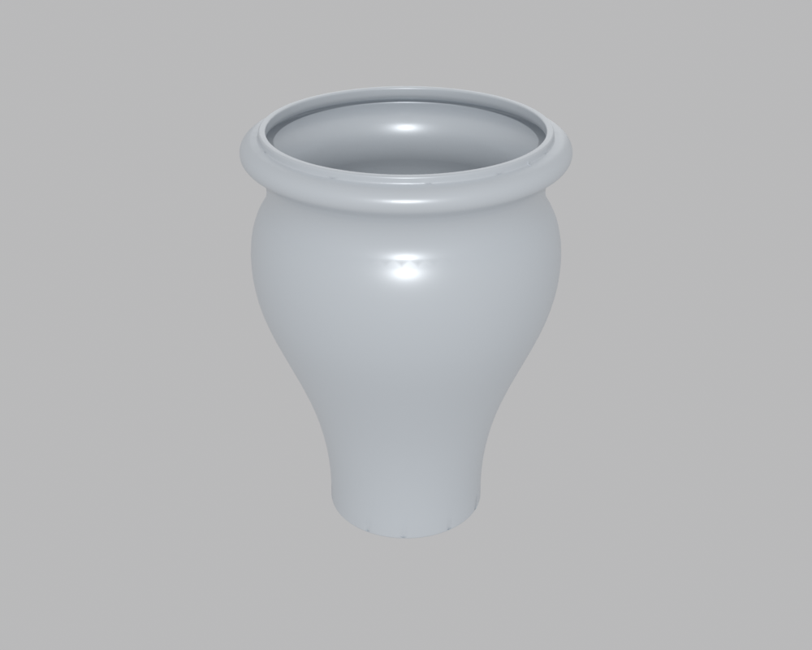
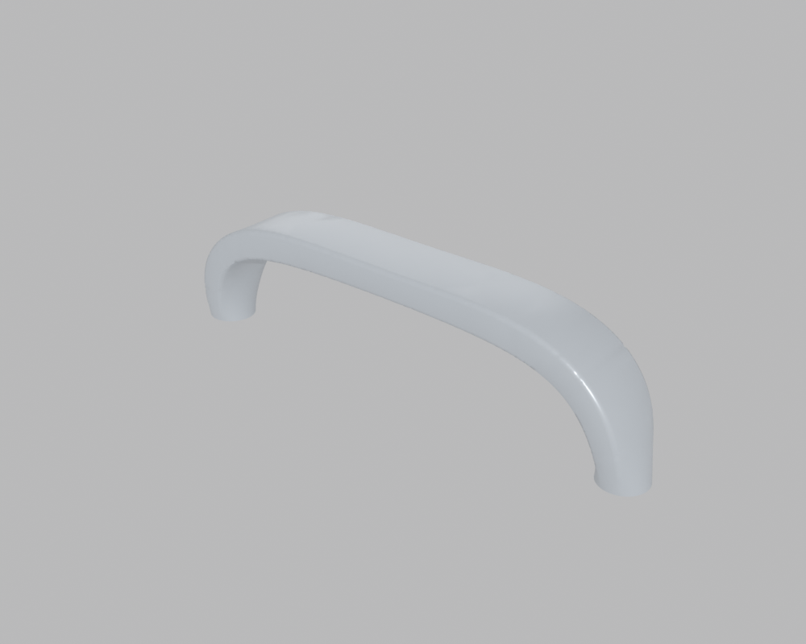
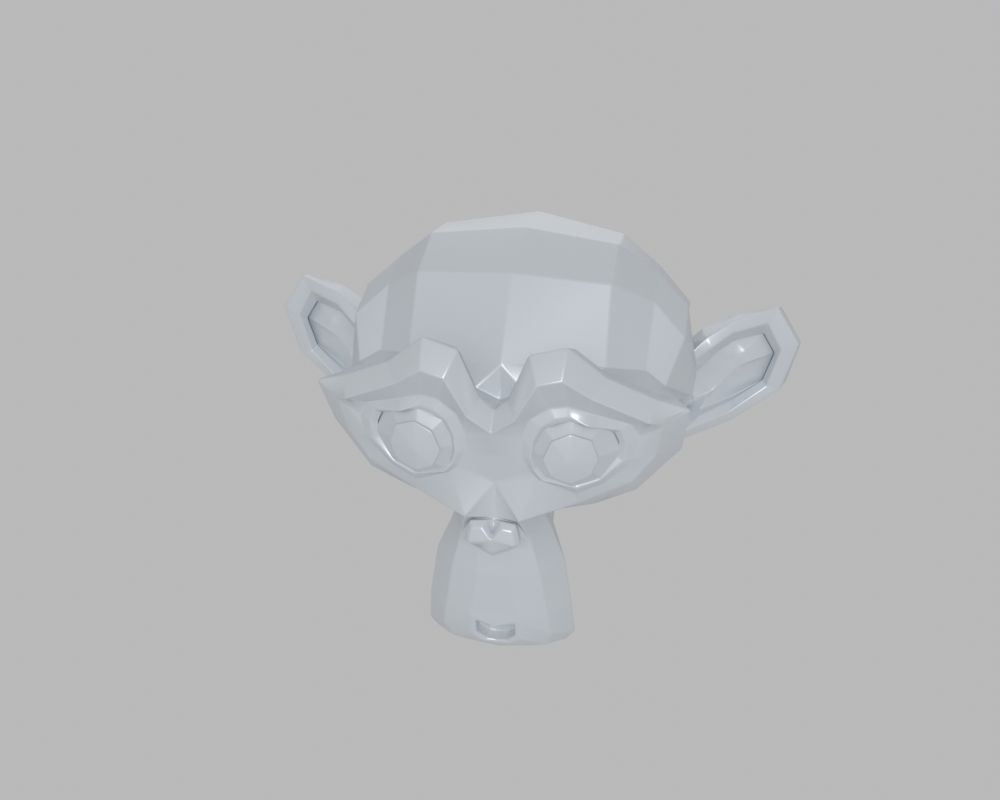
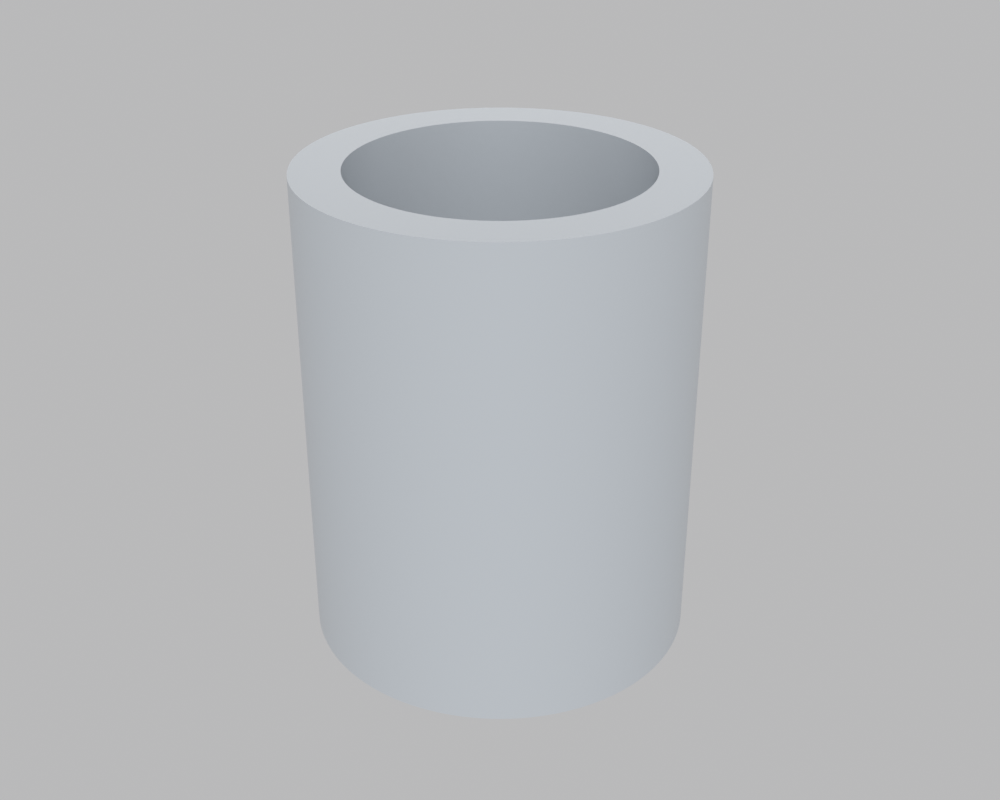
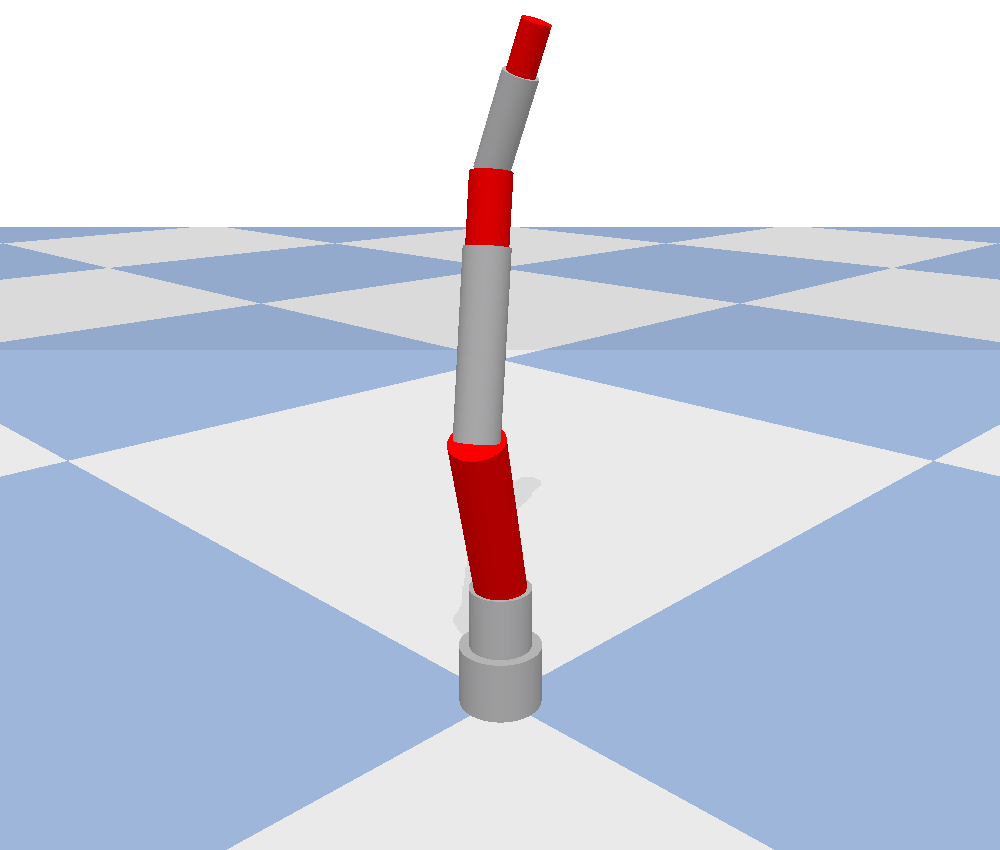
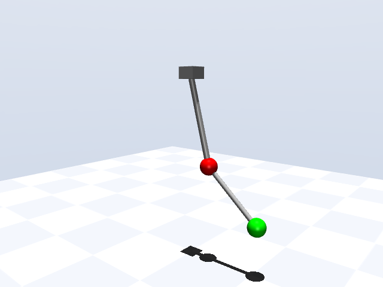
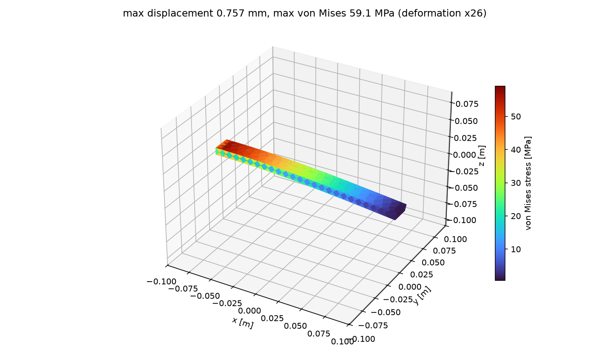

# CodeToCAD

CodeToCAD accelerates mechanical and electrical CAD design, simulations/FEA,
controls software and MCU firmware by giving you **one language to define your
design** — your script is federated to the modeling or design application
automatically.

## Install

```sh
pip install codetocad
```

## Quick start (CLI)

```sh
codetocad init cup
```

This creates a `cup/` folder with a `cup.py` file and opens an interactive
menu to create parts and sketches, transform, boolean, shell, constrain and
export them. Every action updates generated python part files (for example
`cup_cylinder.py`), so the CLI extends to the full functionality of the
CodeToCAD classes.

Run a script:

```sh
codetocad path/to/script.py
```

## Quick start (Python)

```python
import codetocad

body = codetocad.cylinder(radius="2cm", height="5cm")
body.shell(thickness="5mm")
body.set_material(codetocad.aluminum_material())
body.export("cup.stl")
```

## Highlights

- **Units**: floats are meters/radians; strings such as `"2in"`, `"10 deg"`
  or expressions like `"2in - 5mm"` are parsed and converted.
- **Locations**: 6-dof positions/orientations; `CubeLocations` shortcuts to
  the 23 topological locations of any shape's bounding cube; the
  `@codetocad.location` decorator marks named locations on your part classes.
- **Parts & assemblies**: `Part2D`/`Part3D` with extrude, shell, fillet,
  chamfer, hole; `Assembly2D`/`Assembly3D` constraints (coincide, parallel,
  fixed, revolute, prismatic, ...) recorded in ledgers.
- **Primitives**: `cube`, `cylinder`, `sphere`, `rectangle`, `circle`,
  `text`, `import_file` and material presets.
- **ECAD**: `led`, `resistor`, `capacitor` components and an `ECADMixin` for
  electrical properties.
- **Mixins**: sensors (`CameraMixin`, `IMUMixin`, `MicrophoneMixin`) and
  actuators (`DCMotorMixin`, `BLDCMotorMixin`) for custom parts.
- **Fasteners**: `CommonFasteners` enum that can `build()` a part or apply
  features (clearance holes) to another part.

## Build123D integration

Install the extra (`uv sync --extra build123d`) and your parts are federated
to real OpenCascade solids — booleans, shells, fillets, chamfers, holes and
transforms are replayed natively, and geometry queries, analysis and STL/STEP
export use the native topology:

```python
from codetocad_integrations.build123d import make_cube

if __name__ == "__main__":
    cube = make_cube("10cm", "10cm", "5cm")
    cube.hole(cube.top_center, radius="4cm", amount="5cm")
    cube.export("my_cube.stl")
```

Subclass `codetocad_integrations.build123d.Part3D` and override
`build_native()` to model a custom base shape with the Build123D API; all
CodeToCAD operations still apply on top. `adapt(part)` converts any core
CodeToCAD part (including `led()`, `resistor()`, fasteners, ...) into a
Build123D-federated one.




See [codetocad_integrations/build123d/examples/](codetocad_integrations/build123d/examples/)
for the full gallery.

## Blender integration

With Blender on your PATH (or `CODETOCAD_BLENDER` pointing at it), the same
designs federate to Blender mesh objects — booleans, shells (solidify),
fillets/chamfers (bevel), holes and transforms are replayed with modifiers,
and you can export .stl, .obj, .glb, .fbx or a full .blend scene:

```python
from codetocad_integrations.blender import ensure_blender, make_cube

if __name__ == "__main__":
    ensure_blender()  # relaunches this script under `blender --background`
    cube = make_cube("10cm", "10cm", "5cm")
    cube.hole(cube.top_center, radius="4cm", amount="5cm")
    cube.export("my_cube.blend")
```

Subclass `codetocad_integrations.blender.Part3D` and override
`build_native()` to model with bpy/bmesh directly. See
[codetocad_integrations/blender/examples/](codetocad_integrations/blender/examples/).




## Simulation (PyBullet & MuJoCo)

Model in Build123D or Blender, assemble with joint constraints, and import
right into physics simulation — `simulate(part)` walks the assembly, exports
the meshes and generates a URDF (PyBullet) or MJCF (MuJoCo):

```python
from codetocad import Location
from codetocad_integrations.build123d import make_cube, make_cylinder
from codetocad_integrations.pybullet import simulate  # or ...mujoco

mount = make_cube("6cm", "6cm", "4cm", start_location=Location(z="52cm"))
rod = make_cylinder("1cm", "40cm", start_location=Location(z="30cm"))
pivot = Location.from_euler(0, 0, "50cm", x_deg=-90, name="pivot")
mount.revolute(pivot, rod, pivot)  # hinge about the Y axis

sim = simulate(mount, gui=True)
sim.set_joint_value("pivot", 1.0)
sim.run(10.0, realtime=True)
```

Joint axes come from the constraint Location's orientation, limits from
`min_limits`/`max_limits`, masses/inertias from part materials and geometry,
and `codetocad.Lighting` describes scene lights. See the examples in
[codetocad_integrations/pybullet/examples/](codetocad_integrations/pybullet/examples/)
and [codetocad_integrations/mujoco/examples/](codetocad_integrations/mujoco/examples/)
(6-DOF keyboard-controlled arm, pendulum, double pendulum).




## FEA (CalculiX)

Analyze the same parts with finite elements — `analyze(part)` meshes the
exported geometry with gmsh, applies fixtures/loads described with
Locations, solves with CalculiX via [pygccx](https://github.com/calculix/pygccx),
and returns displacement and von Mises stress fields with visualization:

```python
from codetocad import steel_material
from codetocad_integrations.build123d import make_cube
from codetocad_integrations.calculix import analyze

beam = make_cube("200mm", "20mm", "10mm")
beam.set_material(steel_material())

fea = analyze(beam)
fea.fix(beam.left_center)                          # clamp the left face
fea.add_force(beam.right_center, force=(0, 0, -100))
results = fea.solve()
print(results.max_displacement, results.max_von_mises)
results.visualize("beam_fea.png")
```

Materials carry elastic properties (`steel_material()`, `aluminum_material()`
or set `youngs_modulus`/`poissons_ratio` on any `MaterialBase`). The ccx
solver is auto-discovered from `CODETOCAD_CCX`, the PATH, or
`~/.codetocad/ccx/bin/ccx`. See
[codetocad_integrations/calculix/examples/](codetocad_integrations/calculix/examples/).



## User-defined parts

Define a part with the API of your choice (for example
[Build123D](https://build123d.readthedocs.io)):

```python
import build123d
import codetocad

class Box(codetocad.Part3D):
    def build(self):
        length, width, thickness = 80.0, 60.0, 10.0
        with build123d.BuildPart() as ex1:
            build123d.Box(length, width, thickness)

    @codetocad.location
    def example_location(self):
        return codetocad.CubeLocations.top_center.translate(x="2cm", y="2mm")
```

See [CodeToCAD.md](CodeToCAD.md) for the full design document.
