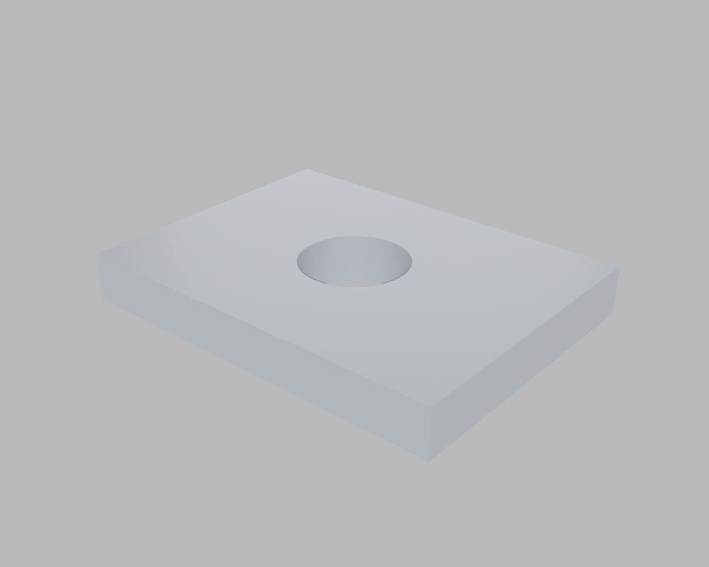
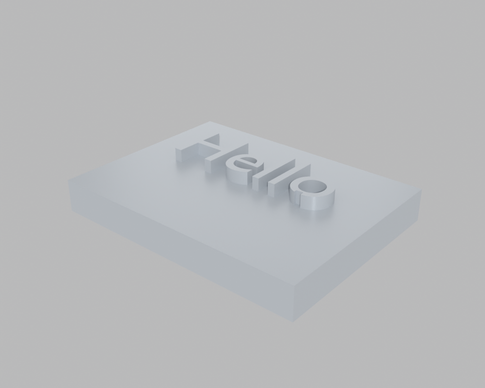
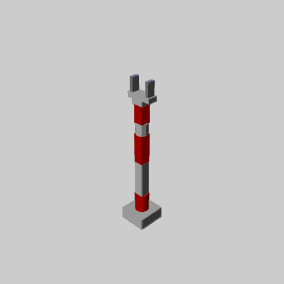

# Blender integration examples

Run any of these with a normal Python interpreter (`codetocad <example>.py`
or `python <example>.py`) — `ensure_blender()` relaunches the script inside
`blender --background` automatically. Blender must be on the PATH (or point
`CODETOCAD_BLENDER` at the executable).

- `plate_with_hole.py` — cube primitive + `hole()`

  

- `shelled_cup.py` — cylinder + `shell()` with a top opening + material,
  exported as STL and a .blend scene

  

- `embossed_text.py` — text extruded and unioned into / subtracted from a
  plate using anchor locations

  

- `suzanne.py` — a custom user part built with the bpy/bmesh API directly
  (Blender's monkey), with a CodeToCAD fillet and transform applied on top,
  exported to glTF and STL

  

- `arm_6dof_keyframes.py` — a 6-DOF arm simulated with the Blender backend,
  its joints realized as empties driven by Blender's native keyframing.
  Command the joints to a pose, pin it with `sim.set_keyframe(t)` (real
  Blender keyframes), then `sim.record_gif(keyframes=True)` writes
  `images/arm_6dof_keyframes.gif`; `sim.launch_viewer()` opens a Blender GUI
  playing the animation instead.

  
