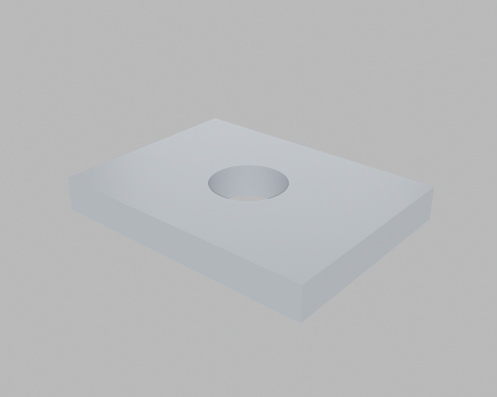
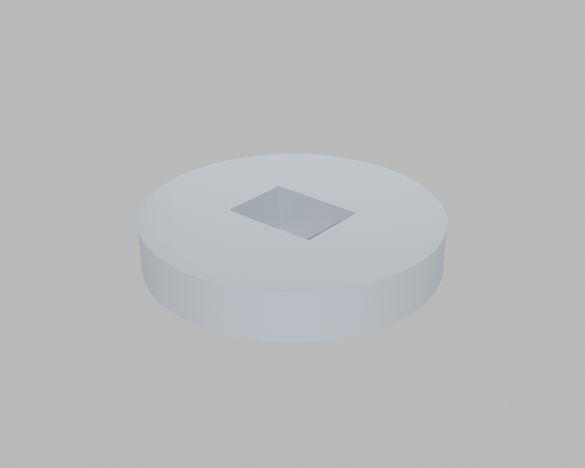
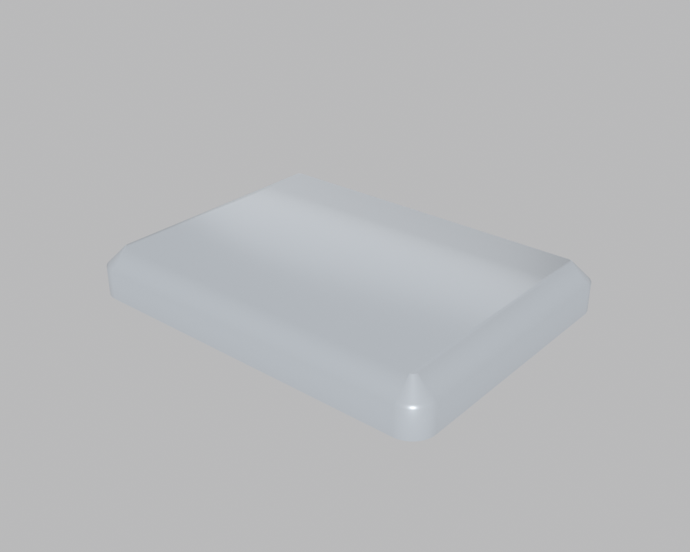
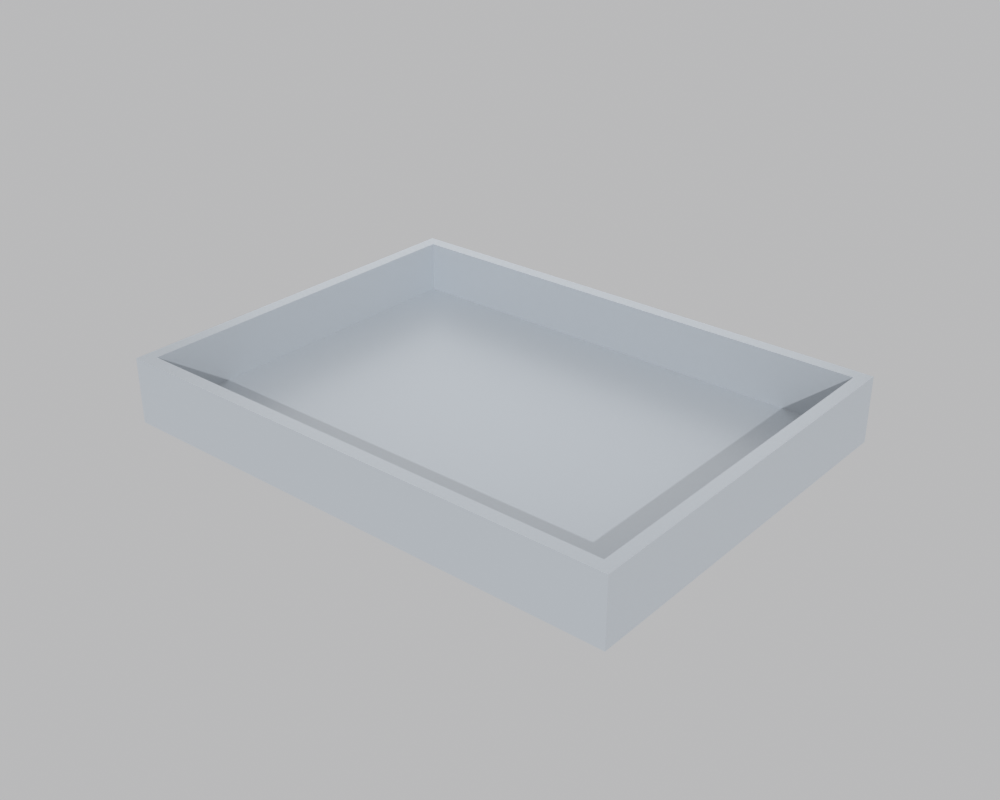
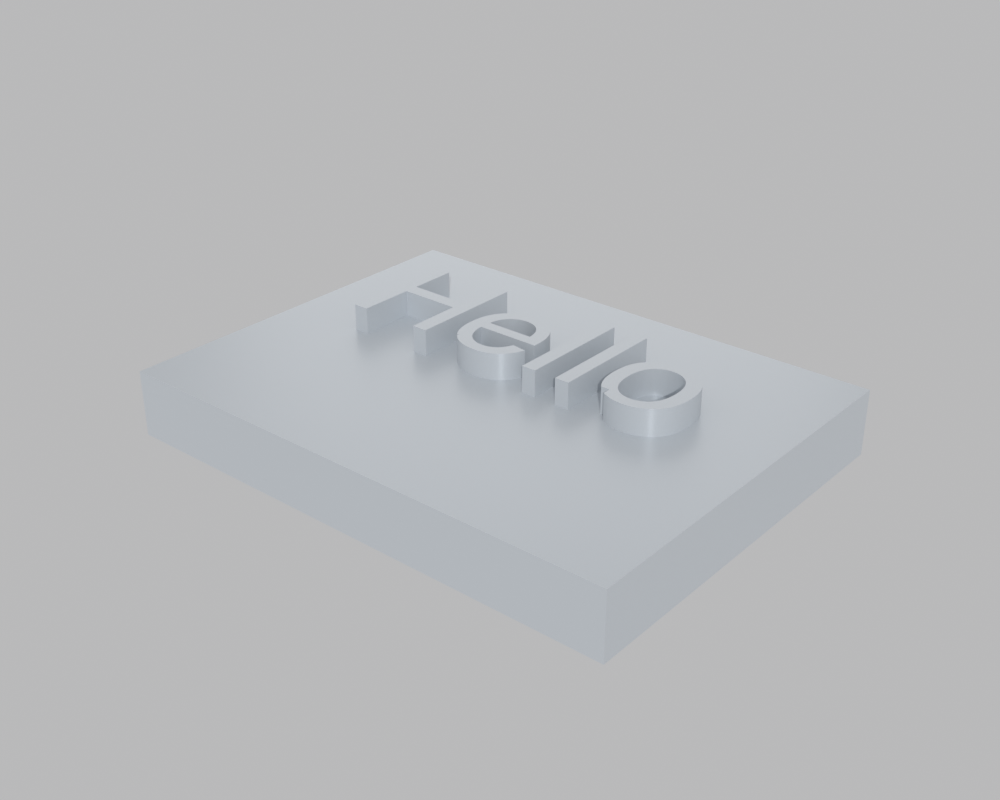
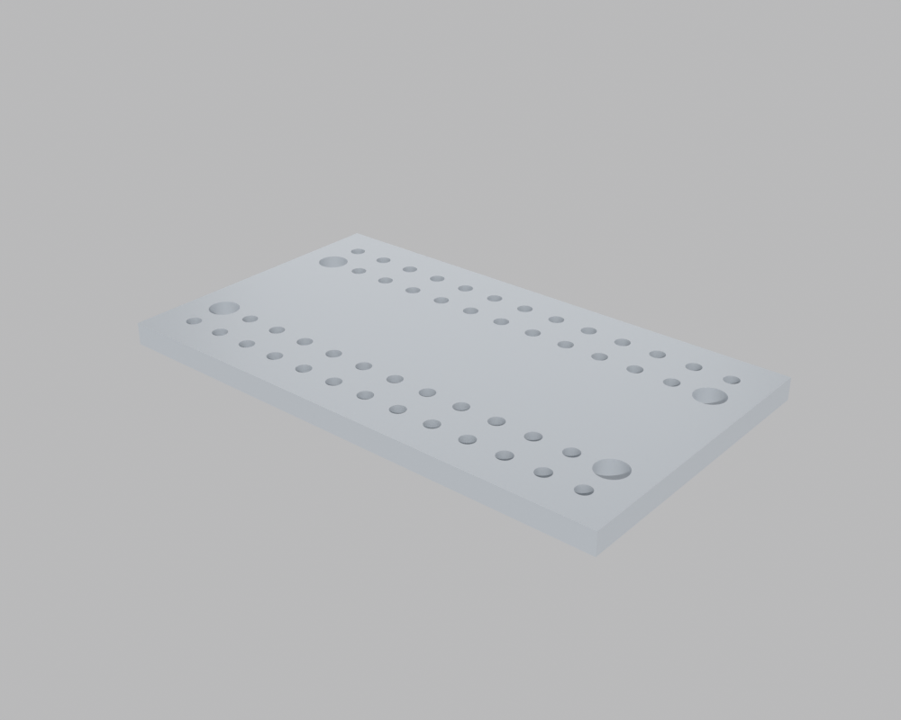
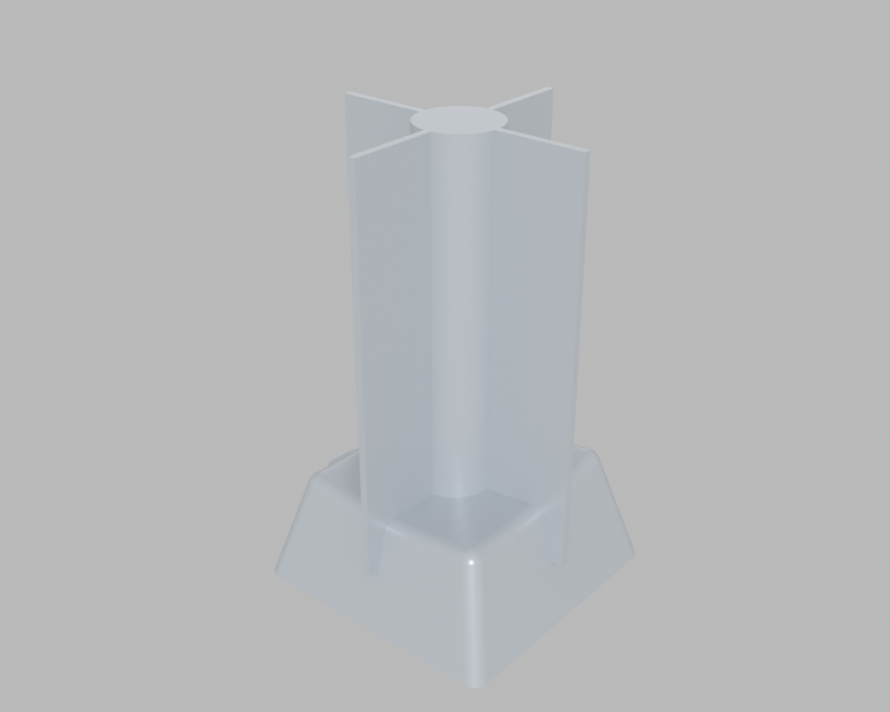
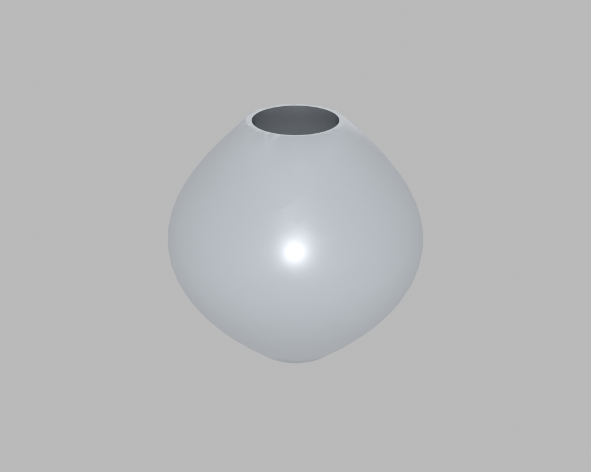
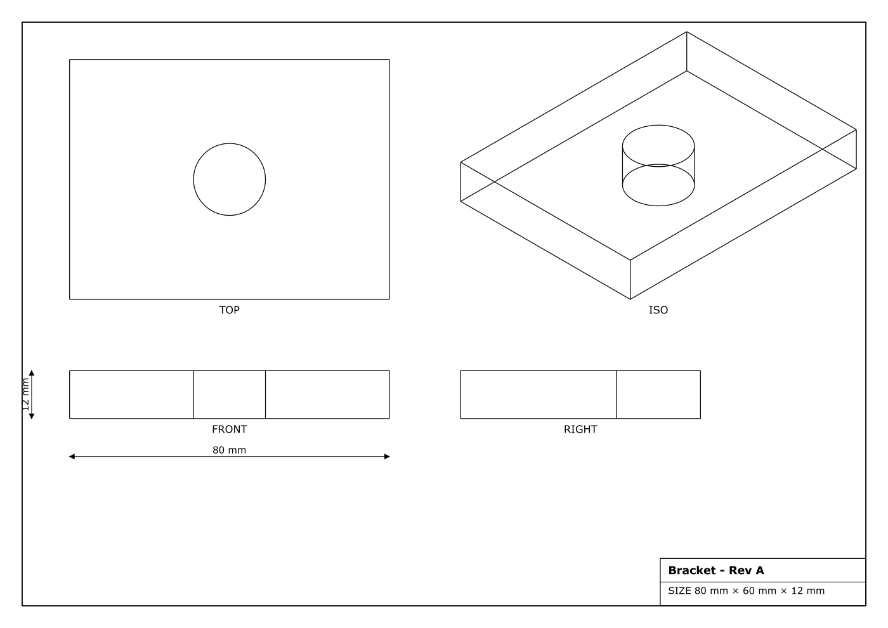

# Build123D integration examples

Translations of examples from the Build123D documentation into CodeToCAD.
Run any of them with `codetocad <example>.py` (requires the `build123d`
extra: `uv sync --extra build123d`). Each exports an STL next to where it is
run.

From the [introductory examples](https://build123d.readthedocs.io/en/latest/introductory_examples.html),
using CodeToCAD primitives and operations:

- `intro_02_plate_with_hole.py` — Box + `hole()`

  

- `intro_03_prismatic_solid.py` — extruded sketches + boolean `subtract()`

  

- `intro_09_fillet_chamfer.py` — edge selection with bounded geometry
  queries + `fillet()`/`chamfer()`

  

- `intro_26_shelled_box.py` — `shell()` with an opening face

  

- `intro_34_embossed_text.py` — text sketches extruded, then unioned/
  subtracted using anchor locations

  

From the [examples gallery](https://build123d.readthedocs.io/en/stable/examples_1.html),
as custom user parts overriding `build_native()` with the Build123D API
(CodeToCAD operations, queries, analysis and export still apply on top):

- `gallery_circuit_board.py` — Circuit Board With Holes (pure CodeToCAD
  primitives: extruded rectangle + 56 `hole()` operations)

  

- `gallery_key_cap.py` — Key Cap (taper extrude, dish, ribs, socket)

  

- `gallery_handle.py` — Handle (multi-section sweep + a
  `@codetocad.location` named location)

  

- `gallery_multi_sketch_loft.py` — Multi-Sketch Loft (loft + shell)

  

- `gallery_vase.py` — Vase (revolved profile + shell + fillets)

  

Output:

- `technical_drawing.py` — `generate_drawing()` projects the native solid
  (so the hole shows up) into a third-angle SVG sheet; the returned drawing is
  an editable `Part2D` you rename, transform and `export("...svg")`.

  

Note: CodeToCAD's base unit is meters, so the original (millimeter) values
appear as `"80mm"` strings or are scaled by `MM = 0.001` in custom parts.
