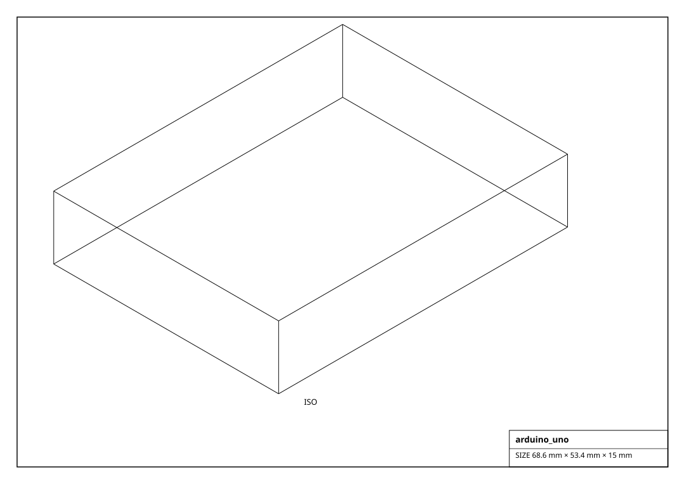
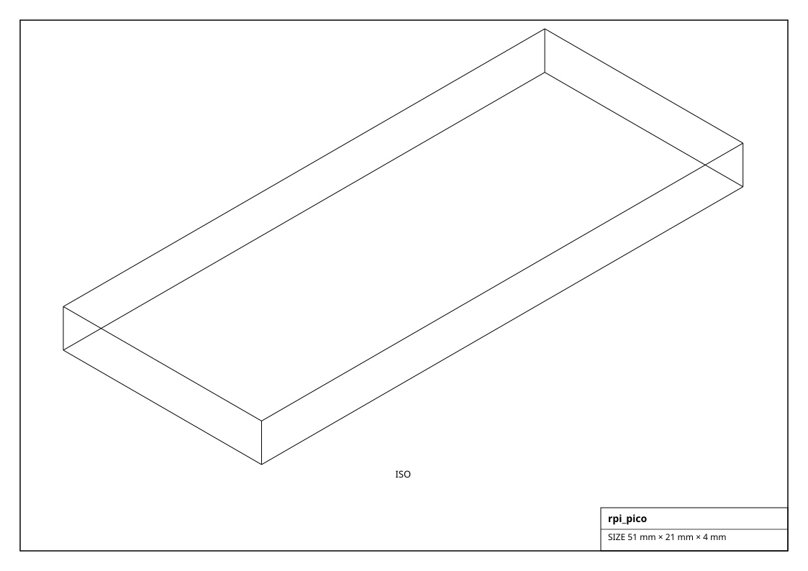
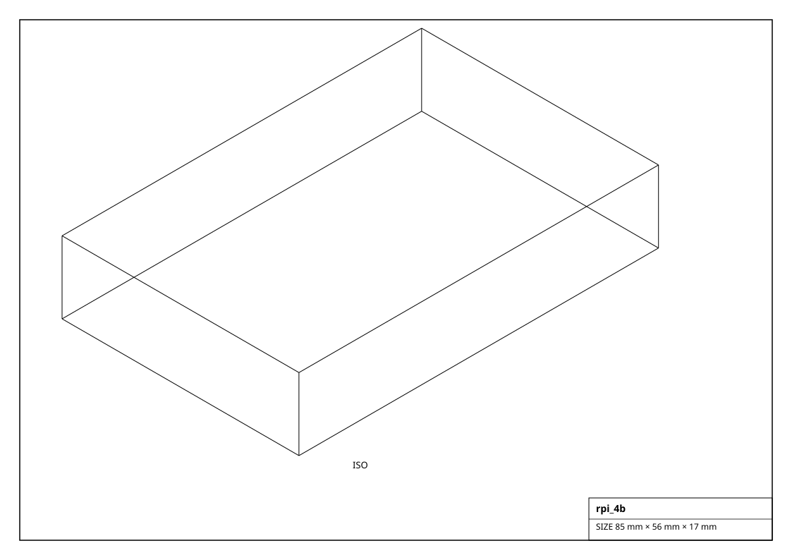

# Compute Boards

Physical microcontroller and single-board-computer outlines. For the logical pin-binding API use `codetocad.Microcontroller`.

## Renderings

*Isometric projections of `arduino_uno` and others (generated from the parts themselves).*

## Microcontroller Board  (13)

| Factory | Part | Chip | Logic | GPIO | Connectivity | Size (mm) | Mass (g) |
|---|---|---|---|---|---|---|---|
| `get_arduino_mega()` | Mega 2560 | ATmega2560 | 5.0 V | 54 | USB | 101.5 x 53.3 x 15.0 | 37.0 |
| `get_arduino_nano()` | Nano | ATmega328P | 5.0 V | 22 | USB | 45.0 x 18.0 x 7.0 | 7.0 |
| `get_arduino_uno()` | Uno R3 | ATmega328P | 5.0 V | 20 | USB | 68.6 x 53.4 x 15.0 | 25.0 |
| `get_esp32_devkit()` | DevKitC | ESP32 | 3.3 V | 34 | USB / WiFi / BT | 55.0 x 28.0 x 13.0 | 10.0 |
| `get_esp32_s3()` | S3 DevKit | ESP32-S3 | 3.3 V | 44 | USB / WiFi / BT | 63.0 x 26.0 x 13.0 | 11.0 |
| `get_esp8266_nodemcu()` | NodeMCU | ESP8266 | 3.3 V | 17 | USB / WiFi | 58.0 x 31.0 x 13.0 | 10.0 |
| `get_rpi_pico()` | Pico | RP2040 | 3.3 V | 26 | USB | 51.0 x 21.0 x 4.0 | 3.0 |
| `get_rpi_pico_w()` | Pico W | RP2040 | 3.3 V | 26 | USB / WiFi | 51.0 x 21.0 x 4.0 | 3.0 |
| `get_seeed_xiao_rp2040()` | XIAO RP2040 | RP2040 | 3.3 V | 11 | USB-C | 20.0 x 17.5 x 3.5 | 1.0 |
| `get_stm32_bluepill()` | Blue Pill | STM32F103 | 3.3 V | 37 | USB | 53.0 x 22.0 x 8.0 | 6.0 |
| `get_stm32_nucleo_f401()` | Nucleo-F401RE | STM32F401 | 3.3 V | 50 | USB | 70.0 x 82.0 x 20.0 | 30.0 |
| `get_teensy_40()` | Teensy 4.0 | IMXRT1062 | 3.3 V | 40 | USB | 35.0 x 18.0 x 4.0 | 3.0 |
| `get_teensy_lc()` | Teensy LC | MKL26Z64 | 3.3 V | 27 | USB | 35.0 x 18.0 x 4.0 | 2.0 |

## Sbc  (8)

| Factory | Part | Chip | Logic | GPIO | Connectivity | Size (mm) | Mass (g) |
|---|---|---|---|---|---|---|---|
| `get_beaglebone_black()` | BeagleBone Black | AM3358 (Cortex-A8) | 5.0 V | 65 | Ethernet / USB | 86.0 x 53.0 x 15.0 | 40.0 |
| `get_jetson_nano()` | Jetson Nano DevKit | Tegra X1 (quad A57 + 128 CUDA) | 5.0 V | 40 | GbE / USB3 | 100.0 x 80.0 x 29.0 | 140.0 |
| `get_jetson_orin_nano()` | Jetson Orin Nano | Orin (6x A78 + 1024 CUDA) | 5.0 V | 40 | GbE / USB3 / PCIe | 100.0 x 79.0 x 30.0 | 180.0 |
| `get_libre_lepotato()` | AML-S905X-CC | S905X (quad A53) | 5.0 V | 40 | GbE / USB | 85.0 x 56.0 x 19.0 | 45.0 |
| `get_radxa_zero()` | Zero | S905Y2 (quad A53) | 5.0 V | 40 | WiFi / USB-C | 65.0 x 30.0 x 8.0 | 15.0 |
| `get_rpi_4b()` | 4 Model B | BCM2711 (quad A72) | 5.0 V | 40 | GbE / WiFi / USB3 | 85.0 x 56.0 x 17.0 | 46.0 |
| `get_rpi_5()` | 5 | BCM2712 (quad A76) | 5.0 V | 40 | GbE / WiFi / USB3 / PCIe | 85.0 x 56.0 x 18.0 | 46.0 |
| `get_rpi_zero_2w()` | Zero 2 W | RP3A0 (quad A53) | 5.0 V | 40 | WiFi / BT / USB | 65.0 x 30.0 x 5.0 | 11.0 |
