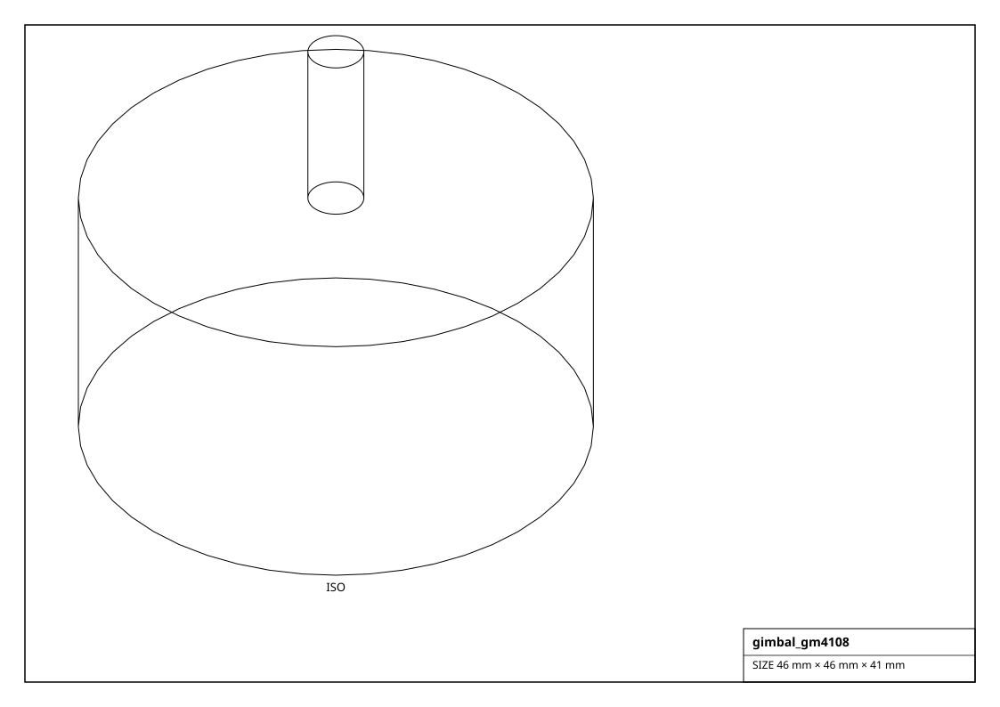
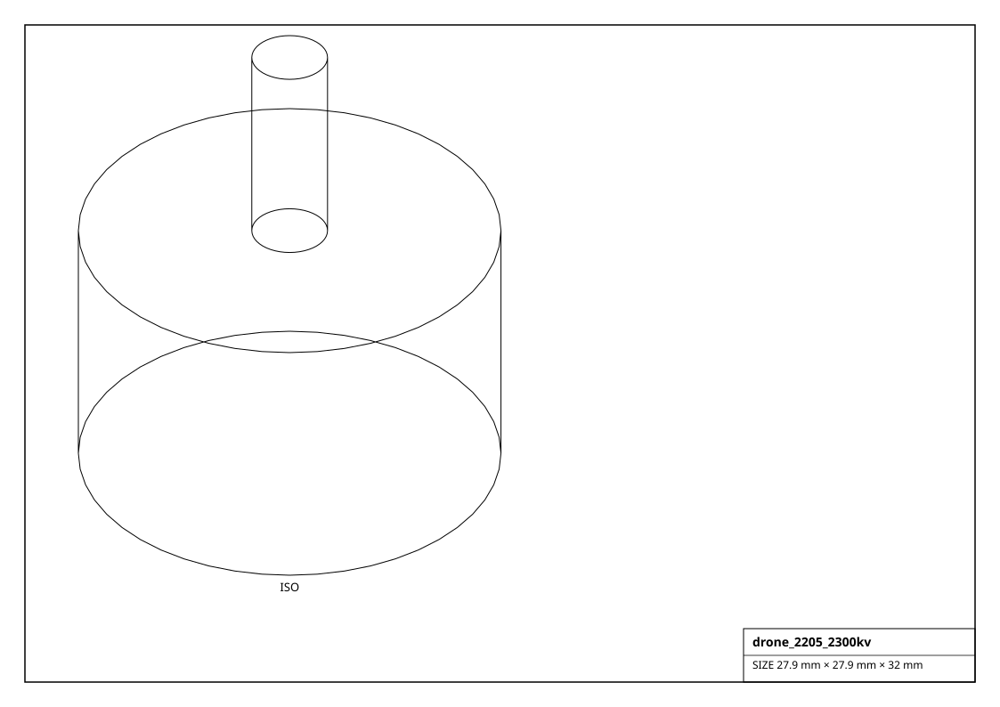
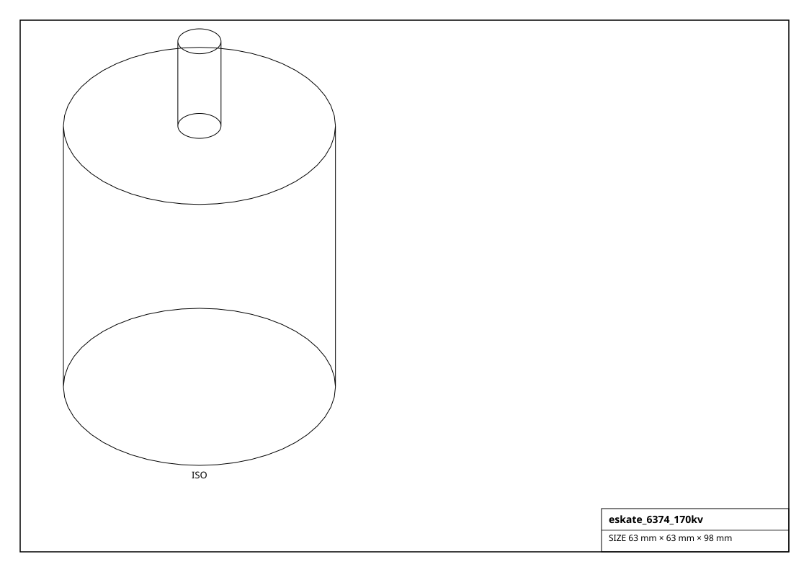

# Brushless (BLDC) Motors

Gimbal, drone / FPV, RC, e-skate and hub brushless motors. No-load speed ~= kv x volts; drive with an ESC or a VESC / ODrive.

## Renderings

*Isometric projections of `gimbal_gm4108` and others (generated from the parts themselves).*

| Factory | Part | kv | Poles | Voltage | Max current | Power | Size (mm) | Mass (g) |
|---|---|---|---|---|---|---|---|---|
| `get_drone_2205_2300kv()` | 2205-2300KV | 2300 | 14 | 16 V | 30 A | 350 W | 27.9 x 27.9 x 18.0 | 30.0 |
| `get_drone_2207_1750kv()` | 2207-1750KV | 1750 | 14 | 22 V | 35 A | 500 W | 27.9 x 27.9 x 20.0 | 33.0 |
| `get_drone_2306_1700kv()` | ECO II 2306 | 1700 | 14 | 22 V | 38 A | 550 W | 27.9 x 27.9 x 22.0 | 35.0 |
| `get_drone_emax_rs2205()` | RS2205 | 2300 | 14 | 16 V | 28 A | 320 W | 27.9 x 27.9 x 18.0 | 29.0 |
| `get_drone_mn3110_780kv()` | MN3110 | 780 | 14 | 15 V | 15 A | 200 W | 34.0 x 34.0 x 27.0 | 86.0 |
| `get_drone_mn5208_340kv()` | MN5208 | 340 | 28 | 22 V | 20 A | 400 W | 58.0 x 58.0 x 26.0 | 180.0 |
| `get_drone_tmotor_f60()` | F60 Pro IV | 1950 | 14 | 22 V | 33 A | 480 W | 27.9 x 27.9 x 20.0 | 34.0 |
| `get_drone_u8_135kv()` | U8 | 135 | 42 | 44 V | 24 A | 900 W | 96.0 x 96.0 x 33.0 | 240.0 |
| `get_eskate_5065_270kv()` | 5065-270KV | 270 | 14 | 36 V | 40 A | 1200 W | 50.0 x 50.0 x 65.0 | 430.0 |
| `get_eskate_6354_190kv()` | 6354-190KV | 190 | 14 | 44 V | 60 A | 1800 W | 63.0 x 63.0 x 54.0 | 700.0 |
| `get_eskate_6374_170kv()` | 6374-170KV | 170 | 14 | 44 V | 80 A | 2500 W | 63.0 x 63.0 x 74.0 | 900.0 |
| `get_gimbal_gbm2804()` | GBM2804-100T | 100 | 14 | 12 V | 0.5 A | 5 W | 34.0 x 34.0 x 25.0 | 70.0 |
| `get_gimbal_gm2804()` | GM2804 | 90 | 14 | 12 V | 0.6 A | 6 W | 35.0 x 35.0 x 30.0 | 78.0 |
| `get_gimbal_gm3506()` | GM3506 | 130 | 14 | 12 V | 0.8 A | 8 W | 41.0 x 41.0 x 25.0 | 95.0 |
| `get_gimbal_gm4108()` | GM4108H | 160 | 22 | 16 V | 1.2 A | 15 W | 46.0 x 46.0 x 25.0 | 110.0 |
| `get_gimbal_gm5208()` | GM5208-24T | 24 | 22 | 24 V | 2.0 A | 40 W | 60.0 x 60.0 x 25.0 | 180.0 |
| `get_hoverboard_hub_6_5in()` | 6.5" hoverboard hub | 16 | 30 | 36 V | 8 A | 250 W | 165.0 x 165.0 x 55.0 | 2800.0 |
| `get_odrive_d5065_270kv()` | D5065-270KV | 270 | 14 | 24 V | 40 A | 1000 W | 50.0 x 50.0 x 65.0 | 420.0 |
| `get_odrive_d6374_150kv()` | D6374-150KV | 150 | 14 | 44 V | 60 A | 2000 W | 63.0 x 63.0 x 74.0 | 890.0 |
| `get_rc_a2212_1000kv()` | A2212 | 1000 | 14 | 11.1 V | 12 A | 130 W | 27.9 x 27.9 x 27.0 | 52.0 |
| `get_rc_sunnysky_x2212()` | X2212 | 980 | 14 | 11.1 V | 15 A | 160 W | 27.9 x 27.9 x 26.0 | 56.0 |
| `get_rc_turnigy_sk3_3548()` | Aerodrive SK3 3548 | 900 | 14 | 14.8 V | 40 A | 570 W | 42.0 x 42.0 x 45.0 | 163.0 |
