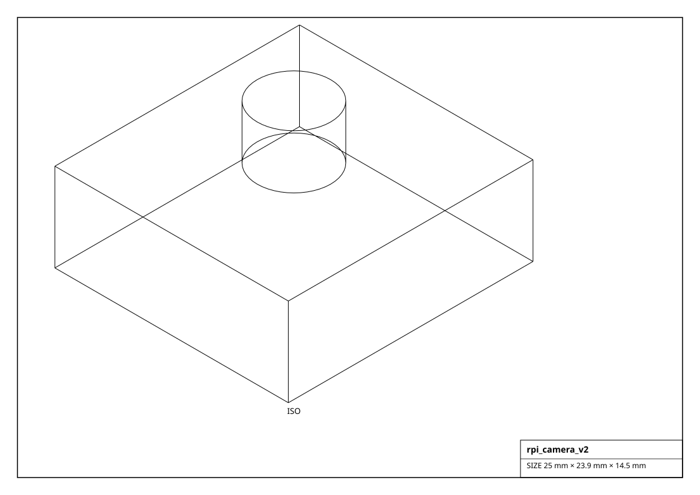
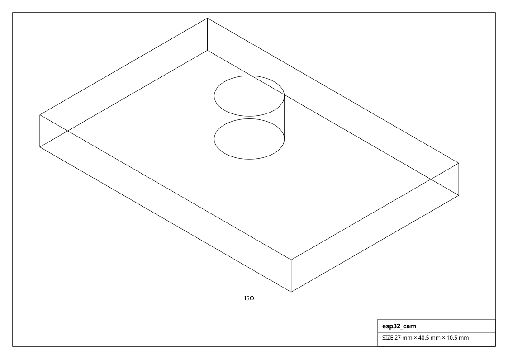
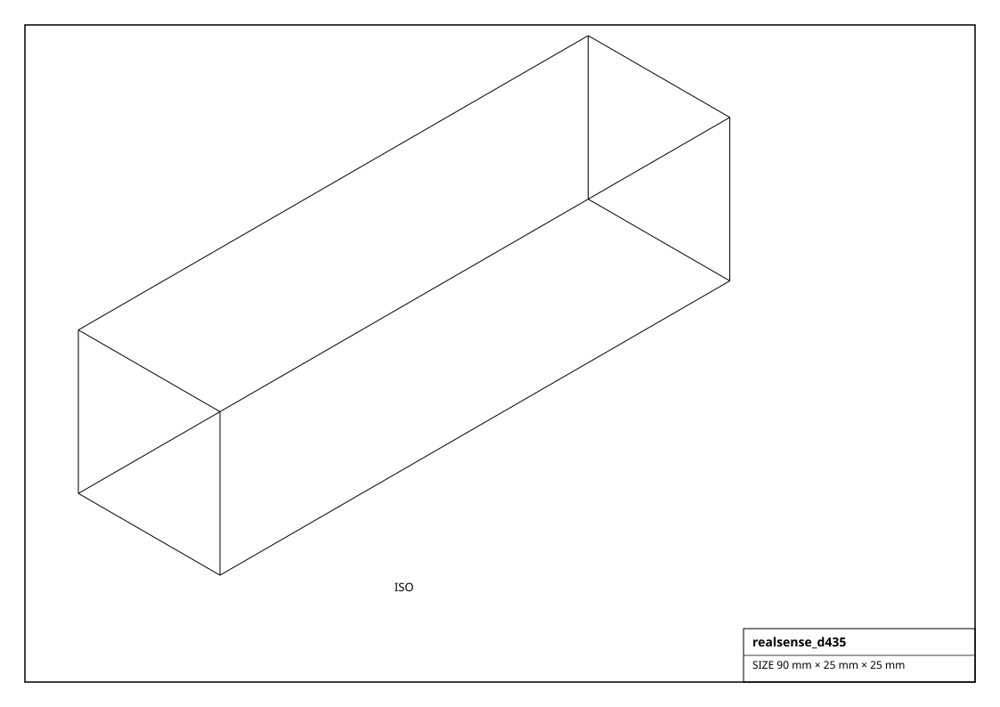

# Cameras

CSI / USB / depth cameras carrying `CameraMixin`.

## Renderings

*Isometric projections of `rpi_camera_v2` and others (generated from the parts themselves).*

| Factory | Part | Resolution | FOV | Interface | Voltage | Size (mm) | Mass (g) |
|---|---|---|---|---|---|---|---|
| `get_arducam_imx219()` | IMX219 | 3280x2464 | 62 deg | MIPI CSI-2 | 3.3 V | 25.0 x 24.0 x 9.0 | 3.0 |
| `get_esp32_cam()` | ESP32-CAM (OV2640) | 1600x1200 | 65 deg | WiFi | 5.0 V | 27.0 x 40.5 x 4.5 | 10.0 |
| `get_logitech_c920()` | C920 | 1920x1080 | 78 deg | USB 2.0 | 5.0 V | 94.0 x 29.0 x 24.0 | 90.0 |
| `get_oak_d_lite()` | OAK-D Lite | 1920x1080 | 69 deg | USB 3.0 | 5.0 V | 91.0 x 28.0 x 17.5 | 61.0 |
| `get_ov7670()` | OV7670 | 640x480 | 60 deg | DVP parallel | 3.3 V | 30.0 x 30.0 x 10.0 | 6.0 |
| `get_realsense_d435()` | RealSense D435 | 1280x720 | 87 deg | USB 3.0 | 5.0 V | 90.0 x 25.0 x 25.0 | 72.0 |
| `get_rpi_camera_v2()` | Camera Module v2 (IMX219) | 3280x2464 | 62 deg | MIPI CSI-2 | 3.3 V | 25.0 x 23.9 x 9.0 | 3.0 |
| `get_rpi_camera_v3()` | Camera Module v3 (IMX708) | 4608x2592 | 66 deg | MIPI CSI-2 | 3.3 V | 25.0 x 24.0 x 12.4 | 4.0 |
| `get_rpi_hq_camera()` | HQ Camera (IMX477) | 4056x3040 | 60 deg | MIPI CSI-2 | 3.3 V | 38.0 x 38.0 x 18.4 | 30.0 |
