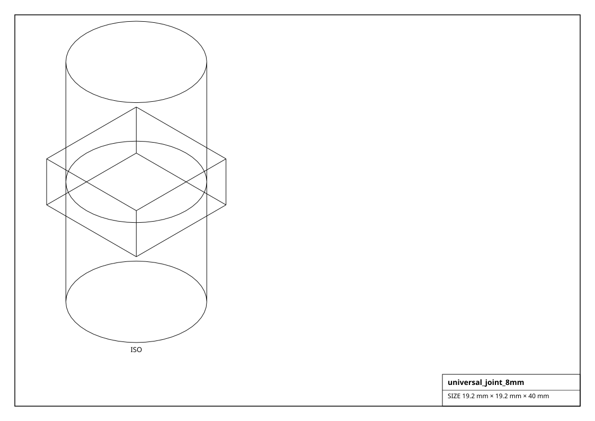
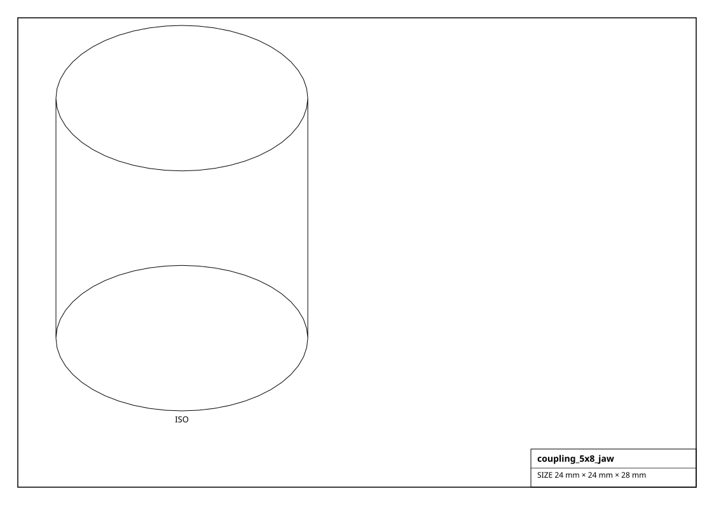
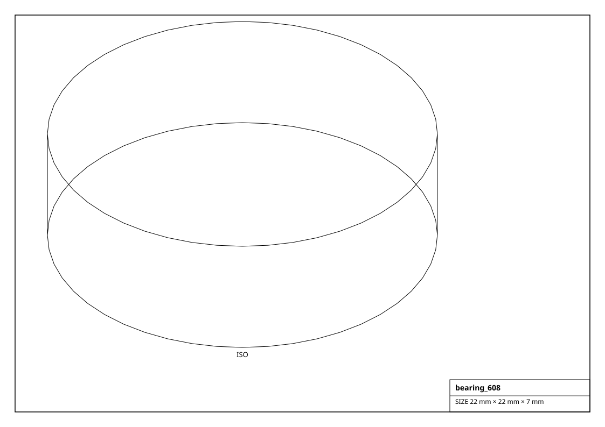

# Universal Joints, Couplings & Bearings

Universal joints (which articulate via `bend_joint`), shaft couplings and bearings -- from `universal_joint()`, `shaft_coupling()` and `ball_bearing()`.

## Renderings

*Isometric projections of `universal_joint_8mm` and others (generated from the parts themselves).*

## Universal Joint  (7)

| Factory | Part | Bore | Outer dia | Max bend | Size (mm) | Mass (g) |
|---|---|---|---|---|---|---|
| `get_universal_joint_10mm()` | U-joint 10mm | 10 mm | 24 mm | +/-45deg | 24.0 x 24.0 x 25.0 | 106.5 |
| `get_universal_joint_12mm()` | U-joint 12mm | 12 mm | 28.8 mm | +/-45deg | 28.8 x 28.8 x 30.0 | 184.1 |
| `get_universal_joint_4mm()` | U-joint 4mm | 4 mm | 9.6 mm | +/-45deg | 9.6 x 9.6 x 10.0 | 6.8 |
| `get_universal_joint_5mm()` | U-joint 5mm | 5 mm | 12 mm | +/-45deg | 12.0 x 12.0 x 12.5 | 13.3 |
| `get_universal_joint_6_35mm()` | U-joint 6.35mm | 6.35 mm | 15.24 mm | +/-45deg | 15.2 x 15.2 x 15.9 | 27.3 |
| `get_universal_joint_6mm()` | U-joint 6mm | 6 mm | 14.4 mm | +/-45deg | 14.4 x 14.4 x 15.0 | 23.0 |
| `get_universal_joint_8mm()` | U-joint 8mm | 8 mm | 19.2 mm | +/-45deg | 19.2 x 19.2 x 20.0 | 54.5 |

## Coupling  (10)

| Factory | Part | Bore A | Bore B | Type | Size (mm) | Mass (g) |
|---|---|---|---|---|---|---|
| `get_coupling_5x5_jaw()` | jaw-5-5 | 5 mm | 5 mm | jaw | 15.0 x 15.0 x 17.5 | 17.0 |
| `get_coupling_5x5_rigid()` | rigid-5-5 | 5 mm | 5 mm | rigid | 15.0 x 15.0 x 17.5 | 17.0 |
| `get_coupling_5x5_setscrew()` | setscrew-5-5 | 5 mm | 5 mm | setscrew | 15.0 x 15.0 x 17.5 | 17.0 |
| `get_coupling_5x8_helical()` | helical-5-8 | 5 mm | 8 mm | helical | 24.0 x 24.0 x 28.0 | 69.6 |
| `get_coupling_5x8_jaw()` | jaw-5-8 | 5 mm | 8 mm | jaw | 24.0 x 24.0 x 28.0 | 69.6 |
| `get_coupling_5x8_oldham()` | oldham-5-8 | 5 mm | 8 mm | oldham | 24.0 x 24.0 x 28.0 | 69.6 |
| `get_coupling_6_35x10_helical()` | helical-635-10 | 6.35 mm | 10 mm | helical | 30.0 x 30.0 x 35.0 | 135.9 |
| `get_coupling_6_35x8_jaw()` | jaw-635-8 | 6.35 mm | 8 mm | jaw | 24.0 x 24.0 x 28.0 | 69.6 |
| `get_coupling_8x10_jaw()` | jaw-8-10 | 8 mm | 10 mm | jaw | 30.0 x 30.0 x 35.0 | 135.9 |
| `get_coupling_8x8_rigid()` | rigid-8-8 | 8 mm | 8 mm | rigid | 24.0 x 24.0 x 28.0 | 69.6 |

## Bearing  (14)

| Factory | Part | Bore | Outer dia | Width | Size (mm) | Mass (g) |
|---|---|---|---|---|---|---|
| `get_bearing_6000()` | 6000 | 10 mm | 26 mm | 8 mm | 26.0 x 26.0 x 8.0 | 14.2 |
| `get_bearing_6001()` | 6001 | 12 mm | 28 mm | 8 mm | 28.0 x 28.0 x 8.0 | 15.8 |
| `get_bearing_608()` | 608 | 8 mm | 22 mm | 7 mm | 22.0 x 22.0 x 7.0 | 9.1 |
| `get_bearing_623()` | 623 | 3 mm | 10 mm | 4 mm | 10.0 x 10.0 x 4.0 | 1.1 |
| `get_bearing_624()` | 624 | 4 mm | 13 mm | 5 mm | 13.0 x 13.0 x 5.0 | 2.4 |
| `get_bearing_625()` | 625 | 5 mm | 16 mm | 5 mm | 16.0 x 16.0 x 5.0 | 3.6 |
| `get_bearing_626()` | 626 | 6 mm | 19 mm | 6 mm | 19.0 x 19.0 x 6.0 | 6.0 |
| `get_bearing_6800()` | 6800 | 10 mm | 19 mm | 5 mm | 19.0 x 19.0 x 5.0 | 4.0 |
| `get_bearing_688()` | 688 | 8 mm | 16 mm | 5 mm | 16.0 x 16.0 x 5.0 | 3.0 |
| `get_bearing_6900()` | 6900 | 10 mm | 22 mm | 6 mm | 22.0 x 22.0 x 6.0 | 7.1 |
| `get_bearing_r188()` | R188 | 6.35 mm | 12.7 mm | 4.762 mm | 12.7 x 12.7 x 4.8 | 1.8 |
| `get_lm10uu()` | LM10UU | 10 mm | 19 mm | 29 mm | 19.0 x 19.0 x 29.0 | 23.3 |
| `get_lm12uu()` | LM12UU | 12 mm | 21 mm | 30 mm | 21.0 x 21.0 x 30.0 | 27.5 |
| `get_lm8uu()` | LM8UU | 8 mm | 15 mm | 24 mm | 15.0 x 15.0 x 24.0 | 11.9 |
