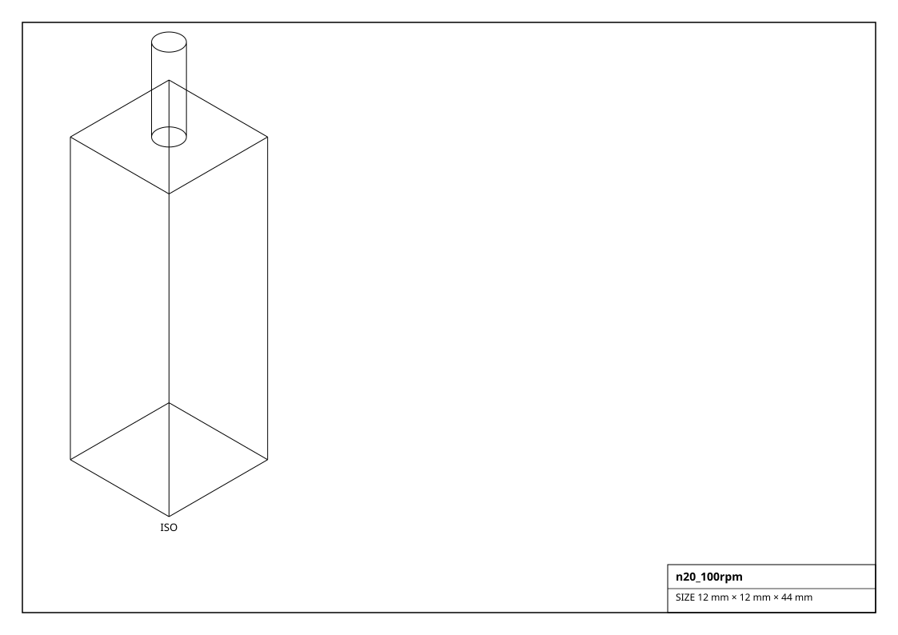
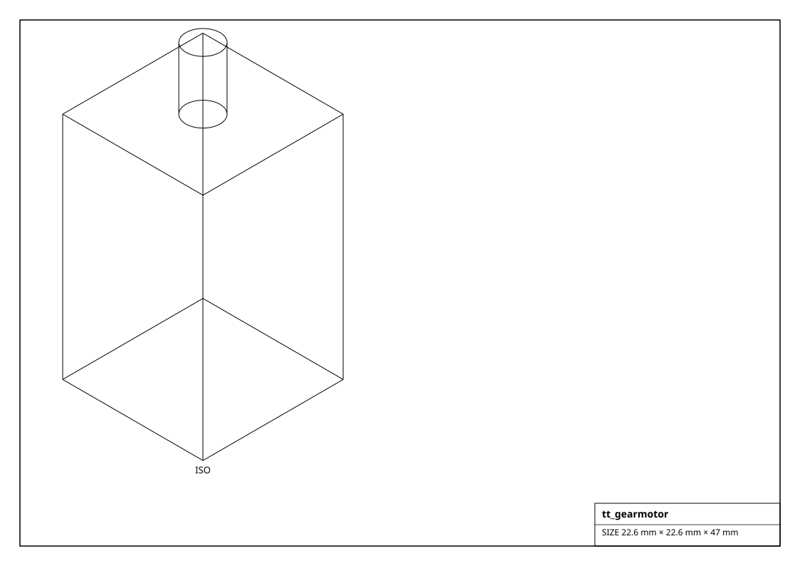
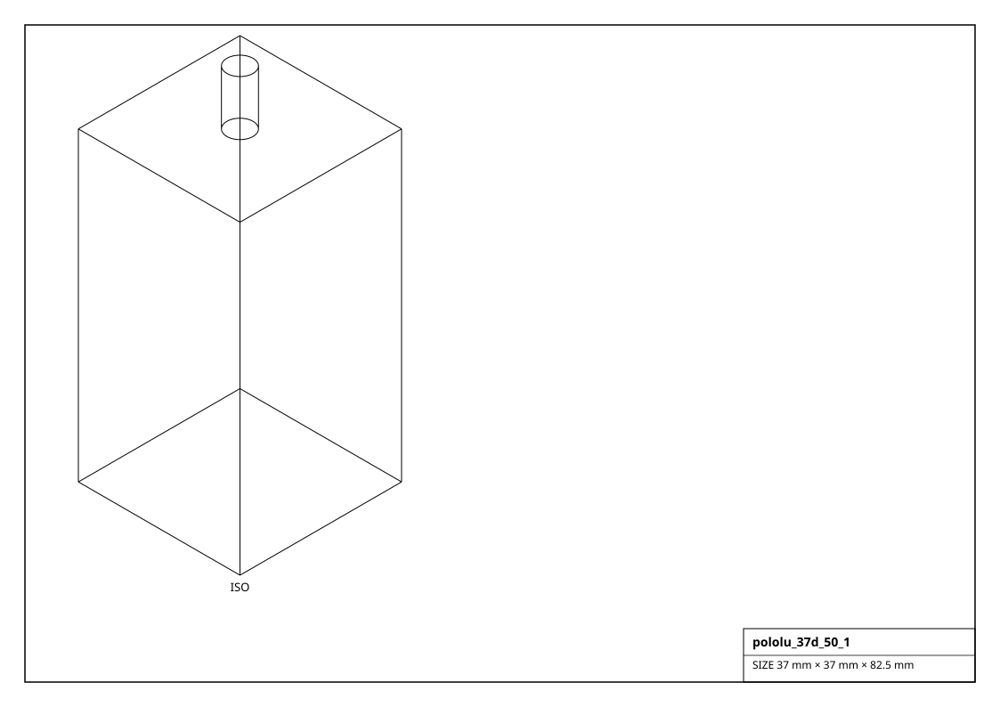

# DC Gearmotors

Brushed DC motors and gearmotors (N20, TT, metal gearboxes, RC cans). Output rpm / torque are after the gear ratio; drive from an H-bridge.

## Renderings

*Isometric projections of `n20_100rpm` and others (generated from the parts themselves).*

| Factory | Part | Gear ratio | No-load | Stall torque | Voltage | Encoder | Size (mm) | Mass (g) |
|---|---|---|---|---|---|---|---|---|
| `get_25ga_370_130rpm()` | 25GA-370 | 34:1 | 130 rpm | 0.343 N*m | 12 V | - | 25.0 x 25.0 x 68.0 | 96.0 |
| `get_jgb37_520_178rpm()` | JGB37-520 | 56:1 | 178 rpm | 1.471 N*m | 12 V | yes | 37.0 x 37.0 x 74.0 | 210.0 |
| `get_my1016_250w()` | MY1016 | 9.78:1 | 2650 rpm | 5.884 N*m | 24 V | - | 82.0 x 82.0 x 98.0 | 2300.0 |
| `get_n20_100rpm()` | N20-100 | 100:1 | 100 rpm | 0.216 N*m | 6 V | - | 12.0 x 12.0 x 34.0 | 10.0 |
| `get_n20_200rpm()` | N20-200 | 50:1 | 200 rpm | 0.118 N*m | 6 V | - | 12.0 x 12.0 x 30.0 | 10.0 |
| `get_n20_encoder_100rpm()` | N20-100-Enc | 100:1 | 100 rpm | 0.216 N*m | 6 V | yes | 12.0 x 12.0 x 43.0 | 13.0 |
| `get_pololu_25d_hp_75_1()` | 25D-HP 75:1 | 75:1 | 130 rpm | 0.5 N*m | 12 V | yes | 25.0 x 25.0 x 71.0 | 108.0 |
| `get_pololu_37d_50_1()` | 37Dx70L 50:1 | 50:1 | 200 rpm | 1.079 N*m | 12 V | yes | 37.0 x 37.0 x 70.0 | 215.0 |
| `get_pololu_micro_hp_100_1()` | micro metal HP 100:1 | 100:1 | 120 rpm | 0.235 N*m | 6 V | - | 12.0 x 12.0 x 26.0 | 9.5 |
| `get_rs540_12v()` | RS-540 | 1:1 | 15000 rpm | 0.029 N*m | 7.2 V | - | 36.0 x 36.0 x 57.0 | 180.0 |
| `get_rs775_12v()` | RS-775 | 1:1 | 18000 rpm | 0.059 N*m | 12 V | - | 42.0 x 42.0 x 66.0 | 320.0 |
| `get_tt_gearmotor()` | TT / BO-1 | 48:1 | 200 rpm | 0.078 N*m | 6 V | - | 22.6 x 22.6 x 37.0 | 30.0 |
