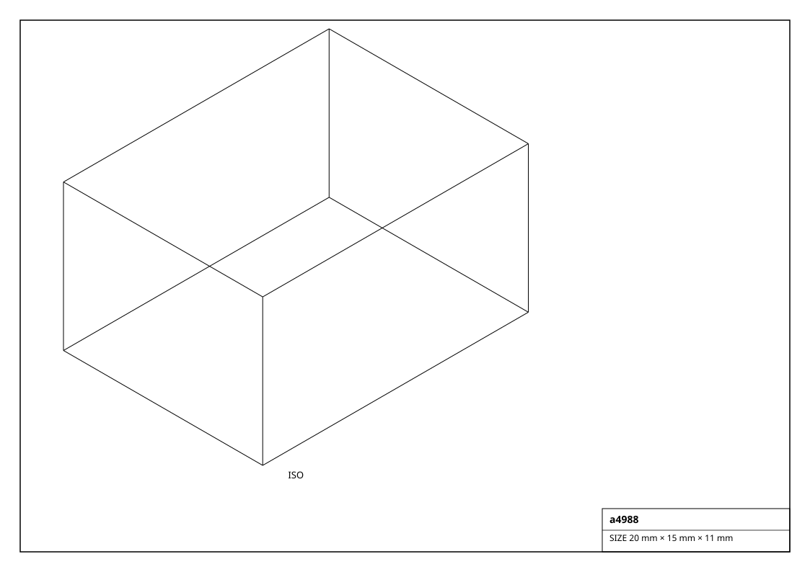
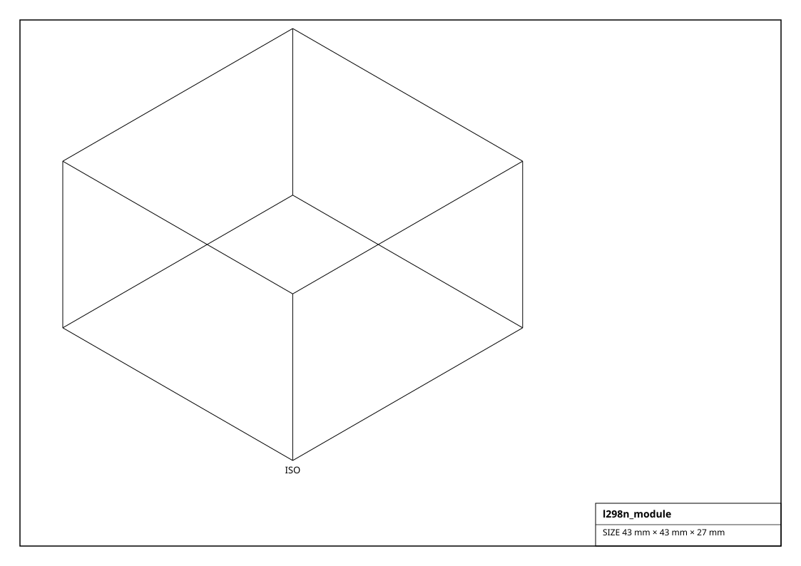
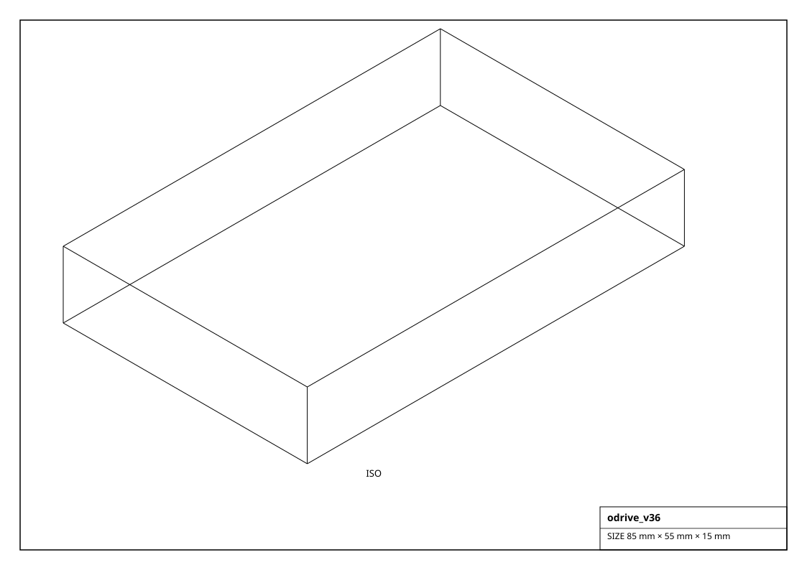

# Motor Drivers & Controllers

The electronics between a microcontroller and the actuators: STEP/DIR stepper drivers, brushed-DC H-bridges, brushless ESCs, servo drivers and FOC motion controllers.

## Renderings

*Isometric projections of `a4988` and others (generated from the parts themselves).*

## Stepper Driver  (5)

| Factory | Part | Channels | Max current | Voltage | Interface | Drives | Size (mm) | Mass (g) |
|---|---|---|---|---|---|---|---|---|
| `get_a4988()` | A4988 | 1 | 2.0 A | 35 V | STEP/DIR | stepper | 20.0 x 15.0 x 11.0 | 3.0 |
| `get_drv8825()` | DRV8825 | 1 | 2.2 A | 45 V | STEP/DIR | stepper | 20.0 x 15.0 x 11.0 | 3.0 |
| `get_tmc2208()` | TMC2208 | 1 | 1.4 A | 36 V | STEP/DIR + UART | stepper | 20.0 x 15.0 x 10.0 | 3.0 |
| `get_tmc2209()` | TMC2209 | 1 | 2.0 A | 28 V | STEP/DIR + UART | stepper | 20.0 x 15.0 x 10.0 | 3.0 |
| `get_tmc5160()` | TMC5160 | 1 | 3.0 A | 46 V | STEP/DIR + SPI | stepper | 26.0 x 20.0 x 11.0 | 5.0 |

## H Bridge  (5)

| Factory | Part | Channels | Max current | Voltage | Interface | Drives | Size (mm) | Mass (g) |
|---|---|---|---|---|---|---|---|---|
| `get_bts7960()` | BTS7960 | 1 | 43 A | 27 V | PWM + DIR | brushed DC | 50.0 x 50.0 x 15.0 | 40.0 |
| `get_cytron_md13s()` | MD13S | 1 | 13 A | 30 V | PWM + DIR | brushed DC | 43.0 x 43.0 x 15.0 | 30.0 |
| `get_drv8871()` | DRV8871 | 1 | 3.6 A | 45 V | PWM | brushed DC | 20.0 x 18.0 x 3.0 | 3.0 |
| `get_l298n_module()` | L298N | 2 | 2.0 A | 46 V | PWM + DIR | brushed DC | 43.0 x 43.0 x 27.0 | 30.0 |
| `get_tb6612fng()` | TB6612FNG | 2 | 1.2 A | 13.5 V | PWM + DIR | brushed DC | 20.0 x 20.0 x 3.0 | 3.0 |

## Esc  (3)

| Factory | Part | Channels | Max current | Voltage | Interface | Drives | Size (mm) | Mass (g) |
|---|---|---|---|---|---|---|---|---|
| `get_esc_30a_bldc()` | 30A BLHeli | 1 | 30 A | 16.8 V | servo PWM / DShot | BLDC | 48.0 x 24.0 x 10.0 | 28.0 |
| `get_esc_4in1_45a()` | 4-in-1 45A | 4 | 45 A | 25.2 V | DShot600 | BLDC | 38.0 x 38.0 x 8.0 | 12.0 |
| `get_esc_car_60a()` | 60A car ESC | 1 | 60 A | 16.8 V | servo PWM | BLDC (sensored) | 55.0 x 32.0 x 25.0 | 70.0 |

## Servo Driver  (1)

| Factory | Part | Channels | Max current | Voltage | Interface | Drives | Size (mm) | Mass (g) |
|---|---|---|---|---|---|---|---|---|
| `get_pca9685()` | PCA9685 | 16 | 25 A | 6 V | I2C | servos | 62.0 x 26.0 x 4.0 | 10.0 |

## Motion Controller  (5)

| Factory | Part | Channels | Max current | Voltage | Interface | Drives | Size (mm) | Mass (g) |
|---|---|---|---|---|---|---|---|---|
| `get_grbl_cnc_shield()` | CNC Shield v3 | 4 | 2 A | 36 V | STEP/DIR (GRBL) | steppers | 69.0 x 53.0 x 20.0 | 30.0 |
| `get_moteus_r4()` | moteus r4.11 | 1 | 40 A | 44 V | CAN-FD | BLDC (FOC) | 46.0 x 53.0 x 14.0 | 30.0 |
| `get_odrive_s1()` | ODrive S1 | 1 | 40 A | 48 V | CAN / UART | BLDC (FOC) | 50.0 x 50.0 x 15.0 | 40.0 |
| `get_odrive_v36()` | ODrive v3.6 | 2 | 60 A | 56 V | UART / CAN / STEP-DIR | BLDC (FOC) | 85.0 x 55.0 x 15.0 | 70.0 |
| `get_simplefoc_shield()` | SimpleFOCShield | 1 | 5 A | 24 V | PWM (Arduino) | BLDC / stepper (FOC) | 69.0 x 53.0 x 15.0 | 35.0 |
