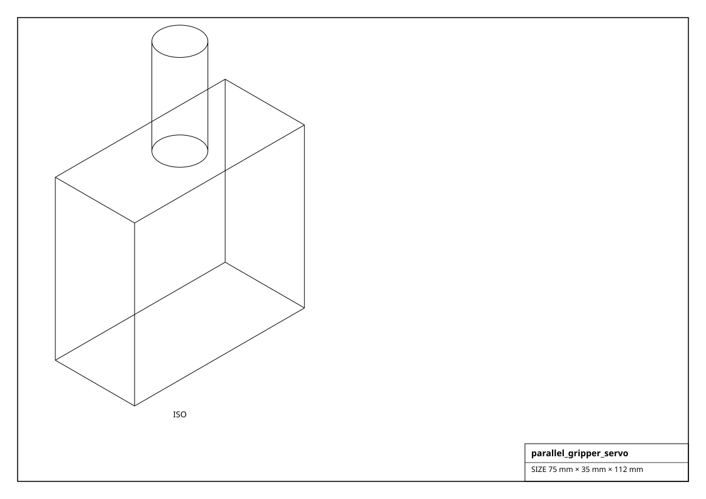
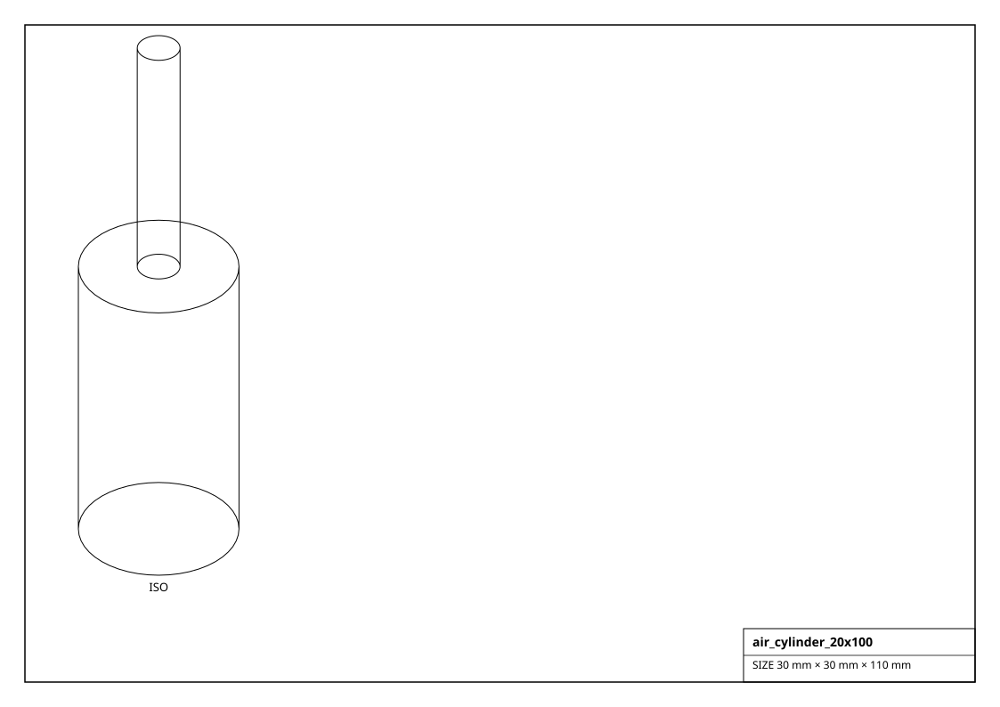

# End Effectors & Pneumatics

Grippers (with a jaw on a prismatic joint -- `open()` / `close()`), vacuum / suction, solenoid valves and air cylinders.

## Renderings

*Isometric projections of `parallel_gripper_servo` and others (generated from the parts themselves).*

## Gripper  (3)

| Factory | Part | Jaw travel | Grip force | Drive | Voltage | Size (mm) | Mass (g) |
|---|---|---|---|---|---|---|---|
| `get_micro_gripper_sg90()` | micro gripper | 25 mm | 5 N | SG90 servo | 5.0 V | 55.0 x 22.0 x 60.0 | 35.0 |
| `get_parallel_gripper_servo()` | servo gripper | 35 mm | 20 N | servo | 6.0 V | 75.0 x 35.0 x 70.0 | 120.0 |
| `get_robotiq_2f85()` | 2F-85 | 85 mm | 235 N | brushless | 24.0 V | 114.0 x 96.0 x 152.0 | 900.0 |

## Gripper Tool  (1)

| Factory | Part | Size (mm) | Mass (g) |
|---|---|---|---|
| `get_electromagnet_25mm()` | P25/20 | 25.0 x 25.0 x 22.0 | 60.0 |

## Suction  (3)

| Factory | Part | Size (mm) | Mass (g) |
|---|---|---|---|
| `get_suction_cup_20mm()` | 20mm cup | 20.0 x 20.0 x 18.0 | 6.0 |
| `get_suction_cup_30mm()` | 30mm cup | 30.0 x 30.0 x 22.0 | 10.0 |
| `get_vacuum_pump_12v()` | 12V diaphragm | 90.0 x 40.0 x 40.0 | 200.0 |

## Valve  (2)

| Factory | Part | Size (mm) | Mass (g) |
|---|---|---|---|
| `get_solenoid_valve_pneumatic_12v()` | 4V210-08 | 60.0 x 30.0 x 60.0 | 150.0 |
| `get_solenoid_valve_water_12v()` | 1/2" solenoid | 70.0 x 40.0 x 55.0 | 120.0 |

## Air Cylinder  (3)

| Factory | Part | Bore | Stroke | Size (mm) | Mass (g) |
|---|---|---|---|---|---|
| `get_air_cylinder_16x50()` | air_cylinder_16x50 | 16 mm | 50 mm | 24.0 x 24.0 x 30.0 | 120.0 |
| `get_air_cylinder_20x100()` | air_cylinder_20x100 | 20 mm | 100 mm | 30.0 x 30.0 x 60.0 | 220.0 |
| `get_air_cylinder_32x200()` | air_cylinder_32x200 | 32 mm | 200 mm | 48.0 x 48.0 x 120.0 | 600.0 |
