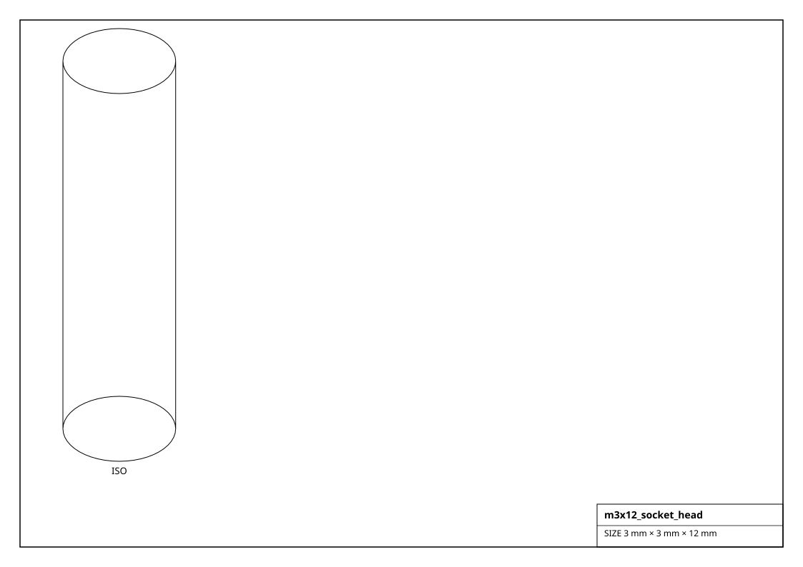
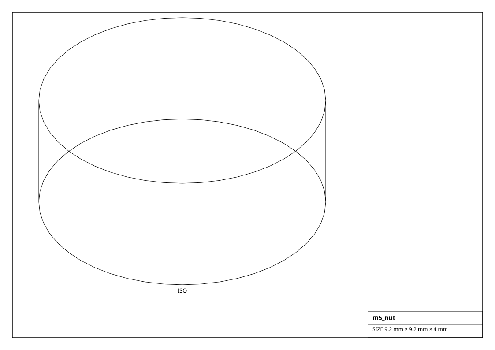
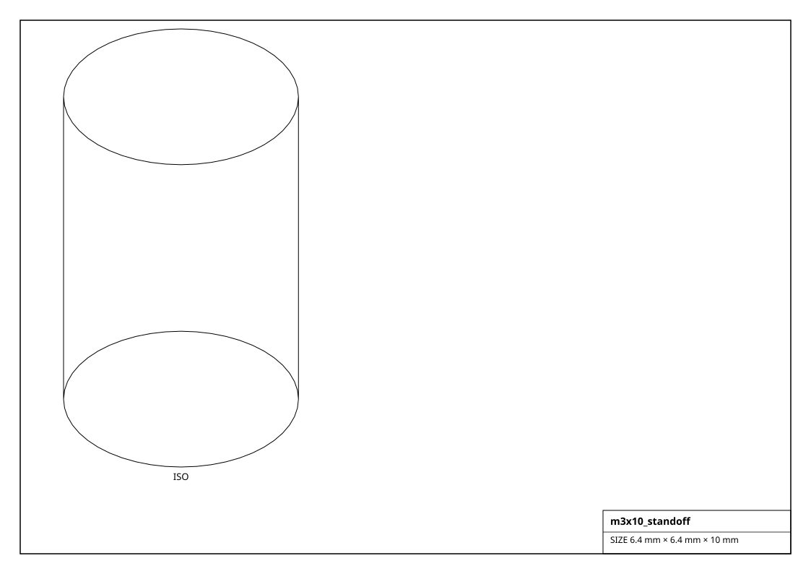

# Fasteners

Metric bolts, nuts, washers, brass standoffs, heat-set inserts and threaded rod. Complements the core `codetocad.CommonFasteners` enum (bridged via `from_common`); each carries a datasheet clearance-hole size and can `clearance_hole()` a part.

## Renderings

*Isometric projections of `m3x12_socket_head` and others (generated from the parts themselves).*

## Bolt  (31)

| Factory | Part | Thread | Length | Head | Drive | Clearance | Size (mm) | Mass (g) |
|---|---|---|---|---|---|---|---|---|
| `get_m2.5x12_socket_head()` | M2.5x12 SHCS | M2.5 | 12 mm | 4.5 mm | hex socket | 2.9 mm | 2.5 x 2.5 x 12.0 | 0.8 |
| `get_m2.5x8_socket_head()` | M2.5x8 SHCS | M2.5 | 8 mm | 4.5 mm | hex socket | 2.9 mm | 2.5 x 2.5 x 8.0 | 0.6 |
| `get_m2x10_socket_head()` | M2x10 SHCS | M2 | 10 mm | 3.8 mm | hex socket | 2.4 mm | 2.0 x 2.0 x 10.0 | 0.4 |
| `get_m2x6_socket_head()` | M2x6 SHCS | M2 | 6 mm | 3.8 mm | hex socket | 2.4 mm | 2.0 x 2.0 x 6.0 | 0.3 |
| `get_m3x10_socket_head()` | M3x10 SHCS | M3 | 10 mm | 5.5 mm | hex socket | 3.4 mm | 3.0 x 3.0 x 10.0 | 1.1 |
| `get_m3x12_socket_head()` | M3x12 SHCS | M3 | 12 mm | 5.5 mm | hex socket | 3.4 mm | 3.0 x 3.0 x 12.0 | 1.2 |
| `get_m3x16_socket_head()` | M3x16 SHCS | M3 | 16 mm | 5.5 mm | hex socket | 3.4 mm | 3.0 x 3.0 x 16.0 | 1.4 |
| `get_m3x20_socket_head()` | M3x20 SHCS | M3 | 20 mm | 5.5 mm | hex socket | 3.4 mm | 3.0 x 3.0 x 20.0 | 1.7 |
| `get_m3x25_socket_head()` | M3x25 SHCS | M3 | 25 mm | 5.5 mm | hex socket | 3.4 mm | 3.0 x 3.0 x 25.0 | 1.9 |
| `get_m3x30_socket_head()` | M3x30 SHCS | M3 | 30 mm | 5.5 mm | hex socket | 3.4 mm | 3.0 x 3.0 x 30.0 | 2.2 |
| `get_m3x6_socket_head()` | M3x6 SHCS | M3 | 6 mm | 5.5 mm | hex socket | 3.4 mm | 3.0 x 3.0 x 6.0 | 0.9 |
| `get_m3x8_socket_head()` | M3x8 SHCS | M3 | 8 mm | 5.5 mm | hex socket | 3.4 mm | 3.0 x 3.0 x 8.0 | 1.0 |
| `get_m4x12_socket_head()` | M4x12 SHCS | M4 | 12 mm | 7 mm | hex socket | 4.5 mm | 4.0 x 4.0 x 12.0 | 2.4 |
| `get_m4x16_socket_head()` | M4x16 SHCS | M4 | 16 mm | 7 mm | hex socket | 4.5 mm | 4.0 x 4.0 x 16.0 | 2.8 |
| `get_m4x20_socket_head()` | M4x20 SHCS | M4 | 20 mm | 7 mm | hex socket | 4.5 mm | 4.0 x 4.0 x 20.0 | 3.2 |
| `get_m4x25_socket_head()` | M4x25 SHCS | M4 | 25 mm | 7 mm | hex socket | 4.5 mm | 4.0 x 4.0 x 25.0 | 3.7 |
| `get_m4x8_socket_head()` | M4x8 SHCS | M4 | 8 mm | 7 mm | hex socket | 4.5 mm | 4.0 x 4.0 x 8.0 | 2.0 |
| `get_m5x10_socket_head()` | M5x10 SHCS | M5 | 10 mm | 8.5 mm | hex socket | 5.5 mm | 5.0 x 5.0 x 10.0 | 3.8 |
| `get_m5x16_socket_head()` | M5x16 SHCS | M5 | 16 mm | 8.5 mm | hex socket | 5.5 mm | 5.0 x 5.0 x 16.0 | 4.7 |
| `get_m5x20_socket_head()` | M5x20 SHCS | M5 | 20 mm | 8.5 mm | hex socket | 5.5 mm | 5.0 x 5.0 x 20.0 | 5.3 |
| `get_m5x25_socket_head()` | M5x25 SHCS | M5 | 25 mm | 8.5 mm | hex socket | 5.5 mm | 5.0 x 5.0 x 25.0 | 6.1 |
| `get_m5x30_socket_head()` | M5x30 SHCS | M5 | 30 mm | 8.5 mm | hex socket | 5.5 mm | 5.0 x 5.0 x 30.0 | 6.9 |
| `get_m6x16_socket_head()` | M6x16 SHCS | M6 | 16 mm | 10 mm | hex socket | 6.6 mm | 6.0 x 6.0 x 16.0 | 7.3 |
| `get_m6x20_socket_head()` | M6x20 SHCS | M6 | 20 mm | 10 mm | hex socket | 6.6 mm | 6.0 x 6.0 x 20.0 | 8.1 |
| `get_m6x25_socket_head()` | M6x25 SHCS | M6 | 25 mm | 10 mm | hex socket | 6.6 mm | 6.0 x 6.0 x 25.0 | 9.2 |
| `get_m6x30_socket_head()` | M6x30 SHCS | M6 | 30 mm | 10 mm | hex socket | 6.6 mm | 6.0 x 6.0 x 30.0 | 10.4 |
| `get_m6x40_socket_head()` | M6x40 SHCS | M6 | 40 mm | 10 mm | hex socket | 6.6 mm | 6.0 x 6.0 x 40.0 | 12.6 |
| `get_m8x20_socket_head()` | M8x20 SHCS | M8 | 20 mm | 13 mm | hex socket | 9 mm | 8.0 x 8.0 x 20.0 | 16.2 |
| `get_m8x25_socket_head()` | M8x25 SHCS | M8 | 25 mm | 13 mm | hex socket | 9 mm | 8.0 x 8.0 x 25.0 | 18.2 |
| `get_m8x30_socket_head()` | M8x30 SHCS | M8 | 30 mm | 13 mm | hex socket | 9 mm | 8.0 x 8.0 x 30.0 | 20.2 |
| `get_m8x40_socket_head()` | M8x40 SHCS | M8 | 40 mm | 13 mm | hex socket | 9 mm | 8.0 x 8.0 x 40.0 | 24.1 |

## Nut  (8)

| Factory | Part | Thread | Across flats | Size (mm) | Mass (g) |
|---|---|---|---|---|---|
| `get_m10_nut()` | M10 nut | M10 | 17 mm | 19.6 x 19.6 x 8.0 | 8.6 |
| `get_m2.5_nut()` | M2.5 nut | M2.5 | 5 mm | 5.8 x 5.8 x 2.0 | 0.2 |
| `get_m2_nut()` | M2 nut | M2 | 4 mm | 4.6 x 4.6 x 1.6 | 0.1 |
| `get_m3_nut()` | M3 nut | M3 | 5.5 mm | 6.4 x 6.4 x 2.4 | 0.3 |
| `get_m4_nut()` | M4 nut | M4 | 7 mm | 8.1 x 8.1 x 3.2 | 0.6 |
| `get_m5_nut()` | M5 nut | M5 | 8 mm | 9.2 x 9.2 x 4.0 | 0.9 |
| `get_m6_nut()` | M6 nut | M6 | 10 mm | 11.5 x 11.5 x 4.8 | 1.8 |
| `get_m8_nut()` | M8 nut | M8 | 13 mm | 15.0 x 15.0 x 6.4 | 4.0 |

## Washer  (7)

| Factory | Part | Thread | Outer dia | Size (mm) | Mass (g) |
|---|---|---|---|---|---|
| `get_m10_washer()` | M10 washer | M10 | 22 mm | 22.0 x 22.0 x 2.0 | 4.2 |
| `get_m2_washer()` | M2 washer | M2 | 4.4 mm | 4.4 x 4.4 x 0.5 | 0.0 |
| `get_m3_washer()` | M3 washer | M3 | 6.6 mm | 6.6 x 6.6 x 0.6 | 0.1 |
| `get_m4_washer()` | M4 washer | M4 | 8.8 mm | 8.8 x 8.8 x 0.8 | 0.3 |
| `get_m5_washer()` | M5 washer | M5 | 11 mm | 11.0 x 11.0 x 1.0 | 0.5 |
| `get_m6_washer()` | M6 washer | M6 | 13.2 mm | 13.2 x 13.2 x 1.2 | 0.9 |
| `get_m8_washer()` | M8 washer | M8 | 17.6 mm | 17.6 x 17.6 x 1.6 | 2.1 |

## Standoff  (8)

| Factory | Part | Thread | Length | Across flats | Size (mm) | Mass (g) |
|---|---|---|---|---|---|---|
| `get_m2.5x10_standoff()` | M2.5x10 | M2.5 | 10 mm | 5 mm | 5.8 x 5.8 x 10.0 | 1.2 |
| `get_m3x10_standoff()` | M3x10 | M3 | 10 mm | 5.5 mm | 6.4 x 6.4 x 10.0 | 1.4 |
| `get_m3x15_standoff()` | M3x15 | M3 | 15 mm | 5.5 mm | 6.4 x 6.4 x 15.0 | 2.1 |
| `get_m3x20_standoff()` | M3x20 | M3 | 20 mm | 5.5 mm | 6.4 x 6.4 x 20.0 | 2.8 |
| `get_m3x25_standoff()` | M3x25 | M3 | 25 mm | 5.5 mm | 6.4 x 6.4 x 25.0 | 3.5 |
| `get_m3x6_standoff()` | M3x6 | M3 | 6 mm | 5.5 mm | 6.4 x 6.4 x 6.0 | 0.8 |
| `get_m4x15_standoff()` | M4x15 | M4 | 15 mm | 7 mm | 8.1 x 8.1 x 15.0 | 3.4 |
| `get_m4x25_standoff()` | M4x25 | M4 | 25 mm | 7 mm | 8.1 x 8.1 x 25.0 | 5.7 |

## Insert  (5)

| Factory | Part | Thread | Outer dia | Size (mm) | Mass (g) |
|---|---|---|---|---|---|
| `get_m2x4_heatset_insert()` | M2 insert | M2 | 3.2 mm | 3.2 x 3.2 x 4.0 | 0.2 |
| `get_m3x4_heatset_insert()` | M3 insert | M3 | 4 mm | 4.0 x 4.0 x 4.0 | 0.3 |
| `get_m3x5.7_heatset_insert()` | M3 insert | M3 | 4.6 mm | 4.6 x 4.6 x 5.7 | 0.5 |
| `get_m4x5.7_heatset_insert()` | M4 insert | M4 | 5.6 mm | 5.6 x 5.6 x 5.7 | 0.7 |
| `get_m5x5.8_heatset_insert()` | M5 insert | M5 | 6.4 mm | 6.4 x 6.4 x 5.8 | 1.0 |

## Threaded Rod  (6)

| Factory | Part | Thread | Length | Size (mm) | Mass (g) |
|---|---|---|---|---|---|
| `get_m3x100_threaded_rod()` | M3x100 rod | M3 | 100 mm | 3.0 x 3.0 x 100.0 | 5.5 |
| `get_m4x250_threaded_rod()` | M4x250 rod | M4 | 250 mm | 4.0 x 4.0 x 250.0 | 24.7 |
| `get_m5x300_threaded_rod()` | M5x300 rod | M5 | 300 mm | 5.0 x 5.0 x 300.0 | 46.2 |
| `get_m6x300_threaded_rod()` | M6x300 rod | M6 | 300 mm | 6.0 x 6.0 x 300.0 | 66.6 |
| `get_m8x300_threaded_rod()` | M8x300 rod | M8 | 300 mm | 8.0 x 8.0 x 300.0 | 118.4 |
| `get_m8x500_threaded_rod()` | M8x500 rod | M8 | 500 mm | 8.0 x 8.0 x 500.0 | 197.3 |
