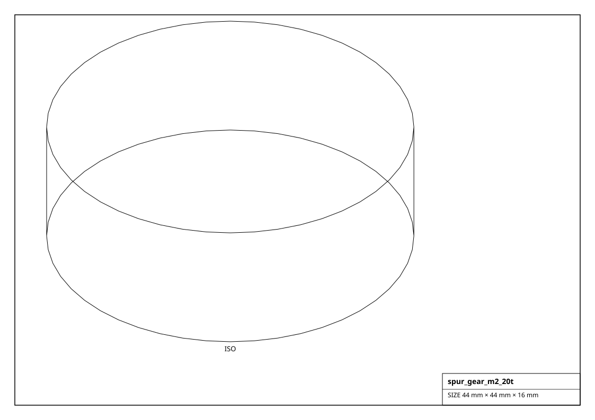
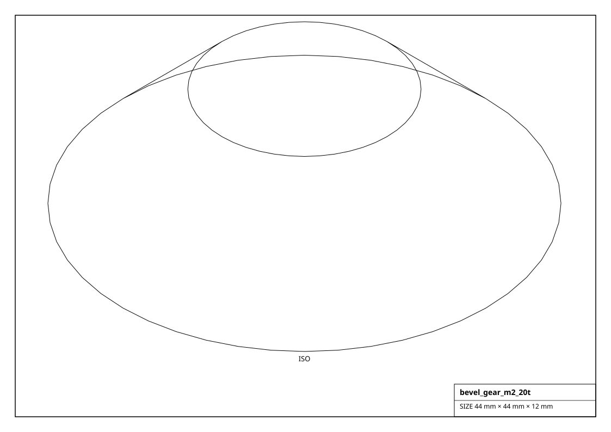
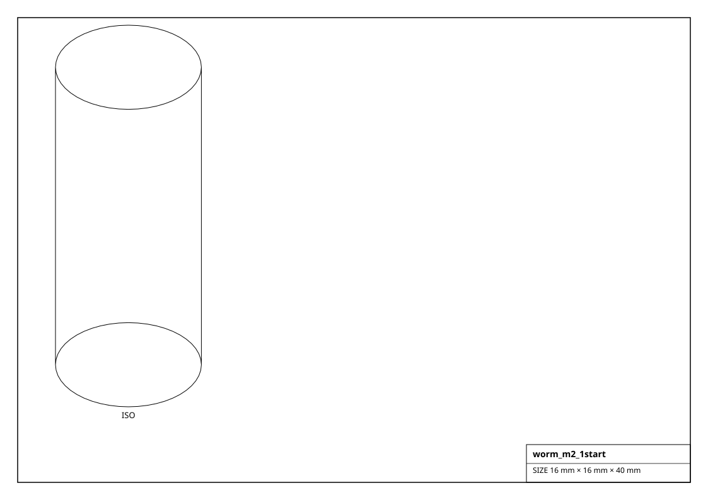

# Gears

Spur, helical, bevel, worm and rack gears -- from the `spur_gear()` / `bevel_gear()` / `worm()` / `gear_rack()` generators. Blanks at the outer diameter; `ratio_with()` and `center_distance_to()` give exact meshing math.

## Renderings

*Isometric projections of `spur_gear_m2_20t` and others (generated from the parts themselves).*

## Gear  (26)

| Factory | Part | Module | Teeth | Pitch dia | Outer dia | Size (mm) | Mass (g) |
|---|---|---|---|---|---|---|---|
| `get_helical_gear_m1_20t()` | - | 1 | 20 | 20 mm | 22 mm | 22.0 x 22.0 x 8.0 | 23.9 |
| `get_helical_gear_m2_20t()` | - | 2 | 20 | 40 mm | 44 mm | 44.0 x 44.0 x 16.0 | 191.0 |
| `get_helical_gear_m2_40t()` | - | 2 | 40 | 80 mm | 84 mm | 84.0 x 84.0 x 16.0 | 696.0 |
| `get_spur_gear_m0.5_20t()` | - | 0.5 | 20 | 10 mm | 11 mm | 11.0 x 11.0 x 4.0 | 3.0 |
| `get_spur_gear_m0.5_40t()` | - | 0.5 | 40 | 20 mm | 21 mm | 21.0 x 21.0 x 4.0 | 10.9 |
| `get_spur_gear_m1.5_15t()` | - | 1.5 | 15 | 22.5 mm | 25.5 mm | 25.5 x 25.5 x 12.0 | 48.1 |
| `get_spur_gear_m1.5_30t()` | - | 1.5 | 30 | 45 mm | 48 mm | 48.0 x 48.0 x 12.0 | 170.5 |
| `get_spur_gear_m1.5_45t()` | - | 1.5 | 45 | 67.5 mm | 70.5 mm | 70.5 x 70.5 x 12.0 | 367.7 |
| `get_spur_gear_m1_10t()` | - | 1 | 10 | 10 mm | 12 mm | 12.0 x 12.0 x 8.0 | 7.1 |
| `get_spur_gear_m1_12t()` | - | 1 | 12 | 12 mm | 14 mm | 14.0 x 14.0 x 8.0 | 9.7 |
| `get_spur_gear_m1_15t()` | - | 1 | 15 | 15 mm | 17 mm | 17.0 x 17.0 x 8.0 | 14.3 |
| `get_spur_gear_m1_20t()` | - | 1 | 20 | 20 mm | 22 mm | 22.0 x 22.0 x 8.0 | 23.9 |
| `get_spur_gear_m1_24t()` | - | 1 | 24 | 24 mm | 26 mm | 26.0 x 26.0 x 8.0 | 33.3 |
| `get_spur_gear_m1_30t()` | - | 1 | 30 | 30 mm | 32 mm | 32.0 x 32.0 x 8.0 | 50.5 |
| `get_spur_gear_m1_40t()` | - | 1 | 40 | 40 mm | 42 mm | 42.0 x 42.0 x 8.0 | 87.0 |
| `get_spur_gear_m1_60t()` | - | 1 | 60 | 60 mm | 62 mm | 62.0 x 62.0 x 8.0 | 189.6 |
| `get_spur_gear_m1_80t()` | - | 1 | 80 | 80 mm | 82 mm | 82.0 x 82.0 x 8.0 | 331.6 |
| `get_spur_gear_m2_12t()` | - | 2 | 12 | 24 mm | 28 mm | 28.0 x 28.0 x 16.0 | 77.3 |
| `get_spur_gear_m2_15t()` | - | 2 | 15 | 30 mm | 34 mm | 34.0 x 34.0 x 16.0 | 114.0 |
| `get_spur_gear_m2_20t()` | - | 2 | 20 | 40 mm | 44 mm | 44.0 x 44.0 x 16.0 | 191.0 |
| `get_spur_gear_m2_30t()` | - | 2 | 30 | 60 mm | 64 mm | 64.0 x 64.0 x 16.0 | 404.1 |
| `get_spur_gear_m2_40t()` | - | 2 | 40 | 80 mm | 84 mm | 84.0 x 84.0 x 16.0 | 696.0 |
| `get_spur_gear_m2_60t()` | - | 2 | 60 | 120 mm | 124 mm | 124.0 x 124.0 x 16.0 | 1516.8 |
| `get_spur_gear_m3_15t()` | - | 3 | 15 | 45 mm | 51 mm | 51.0 x 51.0 x 24.0 | 384.9 |
| `get_spur_gear_m3_20t()` | - | 3 | 20 | 60 mm | 66 mm | 66.0 x 66.0 x 24.0 | 644.6 |
| `get_spur_gear_m3_40t()` | - | 3 | 40 | 120 mm | 126 mm | 126.0 x 126.0 x 24.0 | 2349.2 |

## Bevel Gear  (4)

| Factory | Part | Module | Teeth | Pitch angle | Size (mm) | Mass (g) |
|---|---|---|---|---|---|---|
| `get_bevel_gear_m1.5_20t()` | - | 1.5 | 20 | 45deg | 33.0 x 33.0 x 9.0 | 42.3 |
| `get_bevel_gear_m1_20t()` | - | 1 | 20 | 45deg | 22.0 x 22.0 x 6.0 | 12.5 |
| `get_bevel_gear_m2_20t()` | - | 2 | 20 | 45deg | 44.0 x 44.0 x 12.0 | 100.3 |
| `get_bevel_gear_m2_30t()` | - | 2 | 30 | 45deg | 64.0 x 64.0 x 12.0 | 212.1 |

## Worm  (4)

| Factory | Part | Module | Starts | Lead | Size (mm) | Mass (g) |
|---|---|---|---|---|---|---|
| `get_worm_m1.5_1start()` | - | 1.5 | 1 | 4.71 mm | 12.0 x 12.0 x 40.0 | 35.5 |
| `get_worm_m1_1start()` | - | 1 | 1 | 3.14 mm | 8.0 x 8.0 x 40.0 | 15.8 |
| `get_worm_m2_1start()` | - | 2 | 1 | 6.28 mm | 16.0 x 16.0 x 40.0 | 63.1 |
| `get_worm_m2_2start()` | - | 2 | 2 | 12.57 mm | 16.0 x 16.0 x 40.0 | 63.1 |

## Rack  (4)

| Factory | Part | Module | Length | Teeth | Size (mm) | Mass (g) |
|---|---|---|---|---|---|---|
| `get_gear_rack_m1.5_300mm()` | - | 1.5 | 300 mm | 63 | 300.0 x 9.0 x 6.0 | 127.2 |
| `get_gear_rack_m1_200mm()` | - | 1 | 200 mm | 63 | 200.0 x 6.0 x 4.0 | 37.7 |
| `get_gear_rack_m2_1000mm()` | - | 2 | 1000 mm | 159 | 1000.0 x 12.0 x 8.0 | 753.6 |
| `get_gear_rack_m2_500mm()` | - | 2 | 500 mm | 79 | 500.0 x 12.0 x 8.0 | 376.8 |
