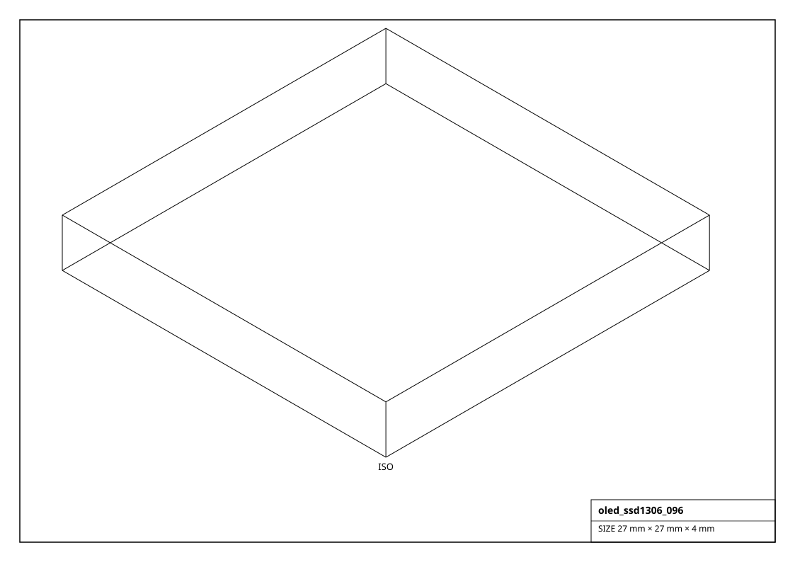
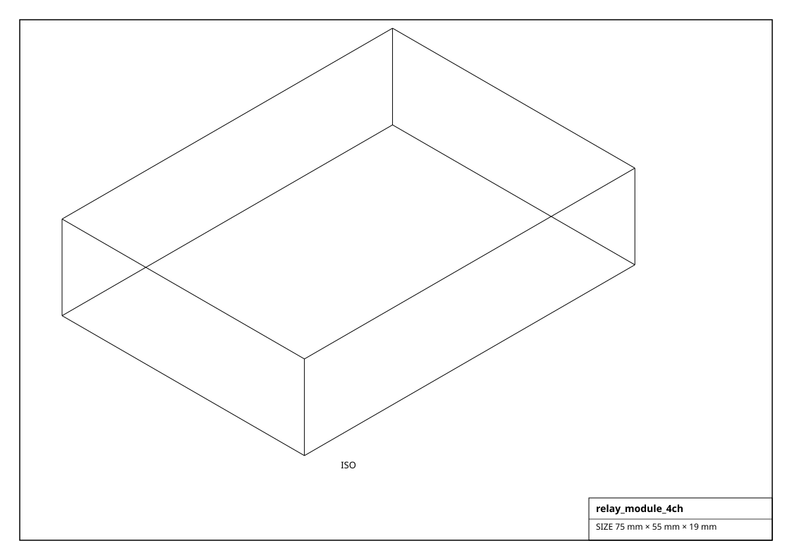
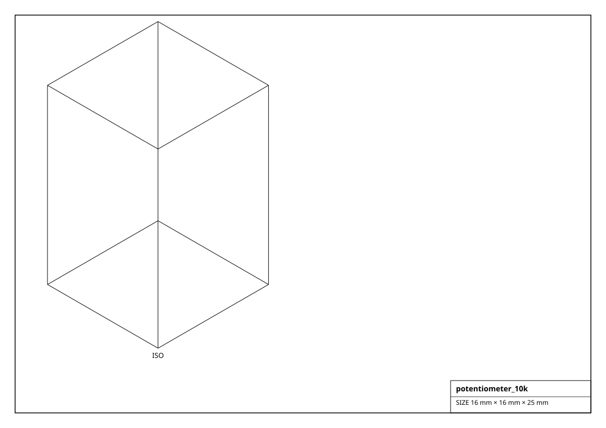

# Displays, Indicators & Controls

Human-machine interface parts: OLED/TFT displays, LEDs and addressable pixels, buzzers/speakers, relays, MOSFET switches and potentiometers.

## Renderings

*Isometric projections of `oled_ssd1306_096` and others (generated from the parts themselves).*

## Display  (5)

| Factory | Part | Resolution | Interface | Voltage | Size (mm) | Mass (g) |
|---|---|---|---|---|---|---|
| `get_eink_29()` | 2.9" e-Paper | 296x128 | SPI | 3.3 V | 37.0 x 89.0 x 4.0 | 20.0 |
| `get_lcd_1602_i2c()` | 1602 + PCF8574 | 16x2 | I2C | 5.0 V | 80.0 x 36.0 x 19.0 | 45.0 |
| `get_oled_sh1106_13()` | SH1106 1.3" | 128x64 | I2C | 3.3 V | 36.0 x 33.0 x 4.0 | 9.0 |
| `get_oled_ssd1306_096()` | SSD1306 0.96" | 128x64 | I2C | 3.3 V | 27.0 x 27.0 x 4.0 | 6.0 |
| `get_tft_ili9341_24()` | ILI9341 2.4" | 320x240 | SPI | 3.3 V | 72.0 x 52.0 x 4.0 | 30.0 |

## Indicator  (5)

| Factory | Part | Voltage | Size (mm) | Mass (g) |
|---|---|---|---|---|
| `get_led_3mm()` | 3mm LED | 2.0 V | 3.0 x 3.0 x 6.0 | 0.2 |
| `get_led_5mm()` | 5mm LED | 2.0 V | 5.0 x 5.0 x 9.0 | 0.3 |
| `get_led_bar_10()` | 10-seg bargraph | 2.0 V | 25.0 x 10.0 x 8.0 | 3.0 |
| `get_neopixel_ring_16()` | NeoPixel Ring 16 | 5.0 V | 44.0 x 44.0 x 3.0 | 8.0 |
| `get_ws2812b_pixel()` | WS2812B | 5.0 V | 5.0 x 5.0 x 1.6 | 0.2 |

## Audio  (3)

| Factory | Part | Voltage | Size (mm) | Mass (g) |
|---|---|---|---|---|
| `get_buzzer_active()` | active buzzer | 5.0 V | 12.0 x 12.0 x 9.0 | 2.0 |
| `get_buzzer_passive()` | passive buzzer | 5.0 V | 12.0 x 12.0 x 9.0 | 2.0 |
| `get_speaker_8ohm_1w()` | 8ohm 1W | 5.0 V | 40.0 x 40.0 x 5.0 | 10.0 |

## Control  (4)

| Factory | Part | Voltage | Size (mm) | Mass (g) |
|---|---|---|---|---|
| `get_mosfet_module_irf520()` | IRF520 module | 24 V | 34.0 x 25.0 x 18.0 | 12.0 |
| `get_potentiometer_10k()` | B10K pot | 5.0 V | 16.0 x 16.0 x 25.0 | 10.0 |
| `get_relay_module_1ch()` | 1-ch relay | 5.0 V | 50.0 x 26.0 x 19.0 | 20.0 |
| `get_relay_module_4ch()` | 4-ch relay | 5.0 V | 75.0 x 55.0 x 19.0 | 55.0 |
