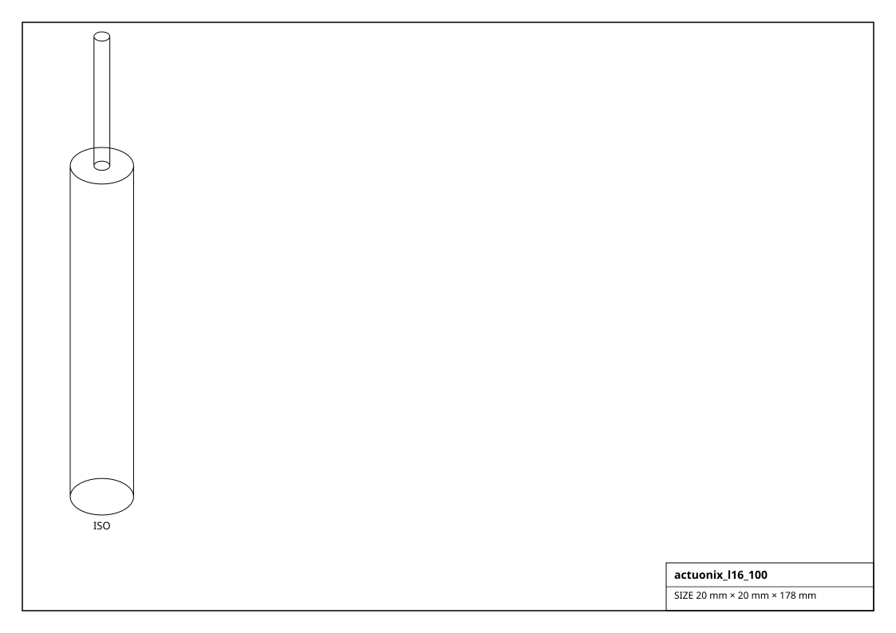
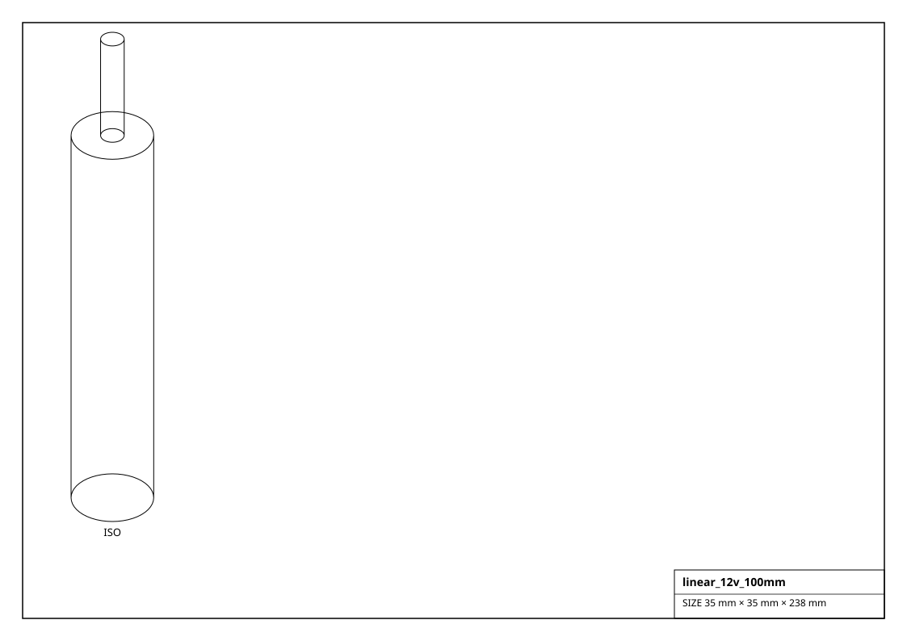

# Linear Actuators

Powered linear actuators with a rod on a prismatic joint. `extend()` / `retract()` / `set_stroke(mm)` drive it.

## Renderings

*Isometric projections of `actuonix_l16_100` and others (generated from the parts themselves).*

| Factory | Part | Stroke | Force | Speed | Voltage | Driven by | Size (mm) | Mass (g) |
|---|---|---|---|---|---|---|---|---|
| `get_actuonix_l12_100()` | L12-100-100-6-P | 100 mm | 42 N | 23 mm/s | 6 V | brushed DC | 12.0 x 12.0 x 99.0 | 28.0 |
| `get_actuonix_l16_100()` | L16-100-63-12-P | 100 mm | 200 N | 32 mm/s | 12 V | brushed DC | 20.0 x 20.0 x 128.0 | 56.0 |
| `get_actuonix_pq12()` | PQ12-100-6-P | 20 mm | 45 N | 15 mm/s | 6 V | brushed DC | 15.0 x 15.0 x 46.0 | 15.0 |
| `get_linear_12v_100mm()` | 12V-100mm-750N | 100 mm | 750 N | 12 mm/s | 12 V | brushed DC | 35.0 x 35.0 x 188.0 | 340.0 |
| `get_linear_12v_150mm()` | 12V-150mm-750N | 150 mm | 750 N | 12 mm/s | 12 V | brushed DC | 35.0 x 35.0 x 238.0 | 400.0 |
| `get_linear_12v_200mm()` | 12V-200mm-900N | 200 mm | 900 N | 10 mm/s | 12 V | brushed DC | 35.0 x 35.0 x 288.0 | 460.0 |
| `get_linear_12v_50mm()` | 12V-50mm-750N | 50 mm | 750 N | 12 mm/s | 12 V | brushed DC | 35.0 x 35.0 x 138.0 | 280.0 |
| `get_nema17_t8_actuator()` | NEMA17 + T8 | 100 mm | 300 N | 30 mm/s | 12 V | stepper | 42.0 x 42.0 x 150.0 | 350.0 |
| `get_nema23_ballscrew_actuator()` | NEMA23 + 1605 ballscrew | 200 mm | 2000 N | 25 mm/s | 24 V | stepper | 57.0 x 57.0 x 300.0 | 2500.0 |
| `get_progressive_pa04()` | PA-04 | 152 mm | 2200 N | 8 mm/s | 12 V | brushed DC | 45.0 x 45.0 x 250.0 | 1100.0 |
