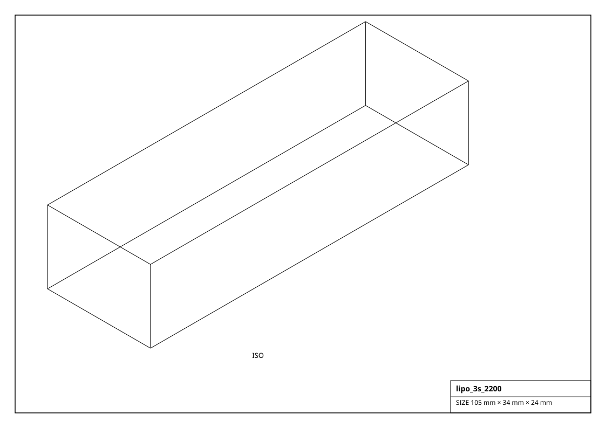
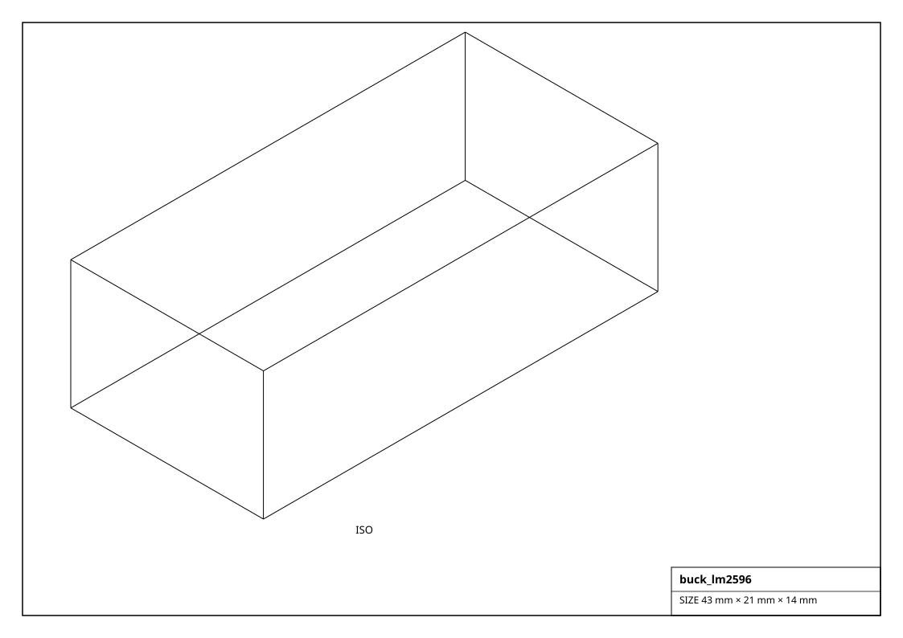
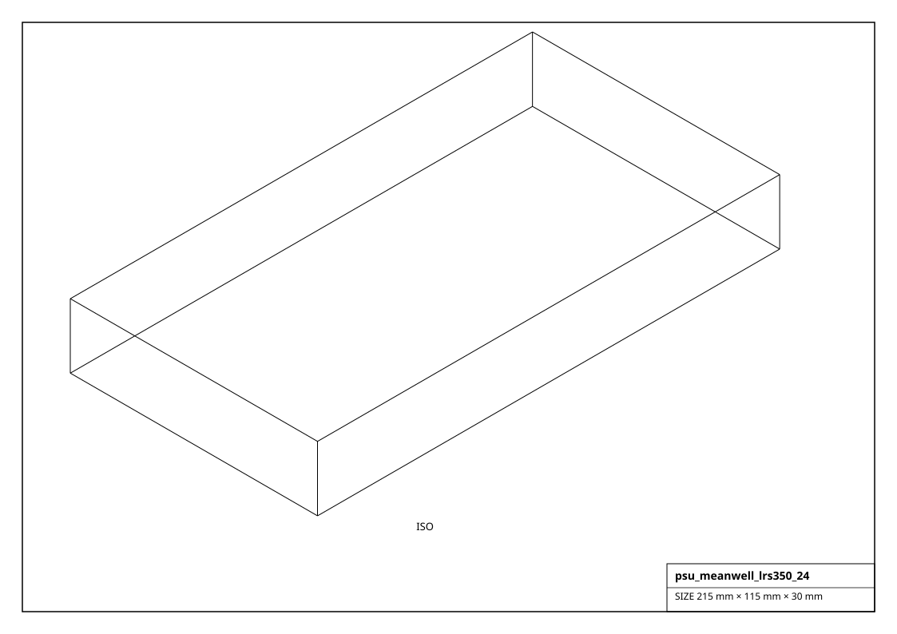

# Power

Batteries, DC-DC converters / regulators, bench supplies and protection. Electrical ratings are on `part.power`.

## Renderings

*Isometric projections of `lipo_3s_2200` and others (generated from the parts themselves).*

## Battery  (10)

| Factory | Part | Voltage | Capacity | Chemistry | Size (mm) | Mass (g) |
|---|---|---|---|---|---|---|
| `get_aa_holder_4()` | 4xAA holder | 6.0 V | 2000 mAh | alkaline | 58.0 x 58.0 x 15.0 | 30.0 |
| `get_battery_9v()` | 9V (PP3) | 9.0 V | 550 mAh | alkaline | 48.0 x 26.0 x 17.0 | 45.0 |
| `get_coin_cr2032()` | CR2032 | 3.0 V | 220 mAh | Li coin | 20.0 x 20.0 x 3.2 | 3.0 |
| `get_li18650_cell()` | 18650 | 3.7 V | 3500 mAh | Li-ion | 18.4 x 18.4 x 65.0 | 48.0 |
| `get_li21700_cell()` | 21700 | 3.7 V | 5000 mAh | Li-ion | 21.0 x 21.0 x 70.0 | 70.0 |
| `get_lifepo4_12v_6ah()` | 12V 6Ah | 12.8 V | 6000 mAh | LiFePO4 | 151.0 x 65.0 x 95.0 | 900.0 |
| `get_lipo_1s_450()` | 1S 450mAh | 3.7 V | 450 mAh | LiPo | 35.0 x 20.0 x 6.0 | 11.0 |
| `get_lipo_2s_1000()` | 2S 1000mAh | 7.4 V | 1000 mAh | LiPo | 72.0 x 35.0 x 12.0 | 60.0 |
| `get_lipo_3s_2200()` | 3S 2200mAh | 11.1 V | 2200 mAh | LiPo | 105.0 x 34.0 x 24.0 | 185.0 |
| `get_lipo_4s_5000()` | 4S 5000mAh | 14.8 V | 5000 mAh | LiPo | 145.0 x 50.0 x 25.0 | 480.0 |

## Converter  (6)

| Factory | Part | Input | Output | Current | Size (mm) | Mass (g) |
|---|---|---|---|---|---|---|
| `get_boost_xl6009()` | XL6009 | 3-32 V | 5-35 V | 3 A | 43.0 x 21.0 x 14.0 | 11.0 |
| `get_buck_lm2596()` | LM2596 | 3-40 V | 1.5-35 V | 3 A | 43.0 x 21.0 x 14.0 | 11.0 |
| `get_buck_mp1584()` | MP1584EN | 4.5-28 V | 0.8-20 V | 3 A | 22.0 x 17.0 x 4.0 | 2.0 |
| `get_buckboost_sepic()` | SEPIC | 3-30 V | 1.2-35 V | 2 A | 48.0 x 23.0 x 15.0 | 13.0 |
| `get_pololu_d24v22f5()` | D24V22F5 | 6-36 V | 5 V | 2.4 A | 17.8 x 10.2 x 4.0 | 2.0 |
| `get_ubec_5v_3a()` | 5V 3A UBEC | 6-26 V | 5 V | 3 A | 30.0 x 12.0 x 8.0 | 8.0 |

## Regulator  (2)

| Factory | Part | Input | Output | Size (mm) | Mass (g) |
|---|---|---|---|---|---|
| `get_vreg_7805()` | L7805 | 7-35 V | 5 V | 10.2 x 4.6 x 15.0 | 3.0 |
| `get_vreg_ams1117_33()` | AMS1117-3.3 | 4.5-15 V | 3.3 V | 6.5 x 3.5 x 2.3 | 1.0 |

## Supply  (3)

| Factory | Part | Output | Current | Power | Size (mm) | Mass (g) |
|---|---|---|---|---|---|---|
| `get_psu_12v_10a()` | 12V 10A | 12 V | 10 A | 120 W | 200.0 x 98.0 x 42.0 | 700.0 |
| `get_psu_5v_10a()` | 5V 10A | 5 V | 10 A | 50 W | 110.0 x 80.0 x 37.0 | 400.0 |
| `get_psu_meanwell_lrs350_24()` | LRS-350-24 | 24 V | 14.6 A | 350 W | 215.0 x 115.0 x 30.0 | 850.0 |

## Protection  (3)

| Factory | Part | Rating | Size (mm) | Mass (g) |
|---|---|---|---|---|
| `get_blade_fuse_holder()` | ATC holder | 30 A | 60.0 x 20.0 x 20.0 | 10.0 |
| `get_ptc_resettable_1a()` | MF-R | 1 A | 7.0 x 3.0 x 8.0 | 1.0 |
| `get_rocker_switch_spst()` | KCD1 | 6 A | 21.0 x 15.0 x 23.0 | 8.0 |
