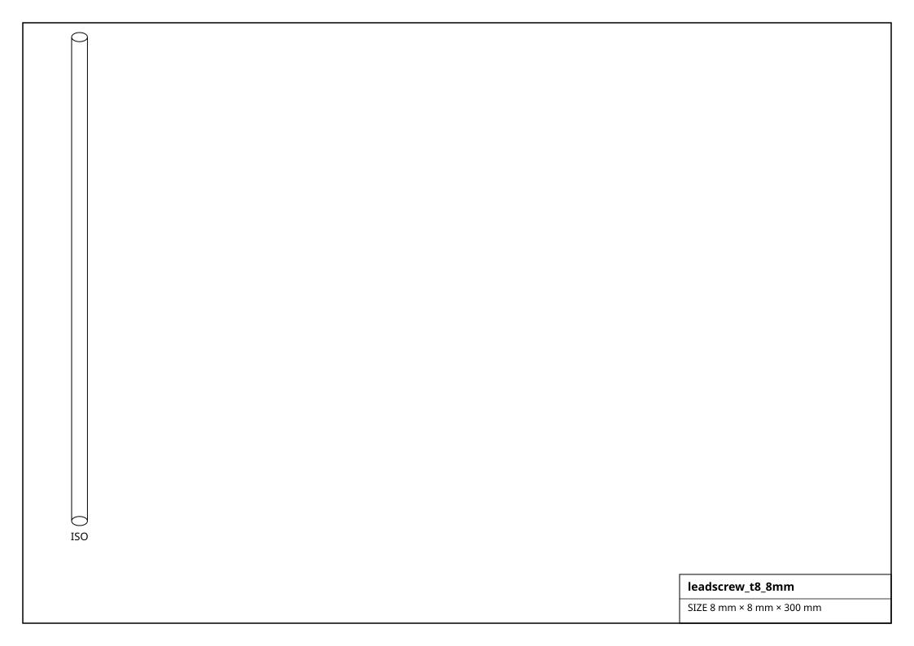
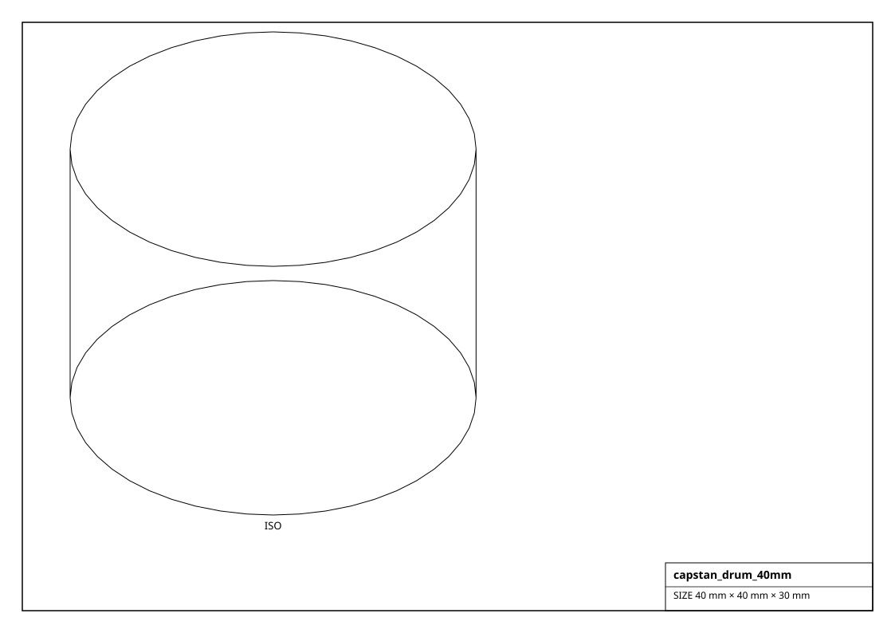

# Lead Screws, Ball Screws, Capstans & Pulleys

Passive linear-motion transmission. `linear_travel(revs)` and `travel_per_rev_mm` convert turns to millimetres.

## Renderings

*Isometric projections of `leadscrew_t8_8mm` and others (generated from the parts themselves).*

| Factory | Part | Travel/rev | Lead | Type | Size (mm) | Mass (g) |
|---|---|---|---|---|---|---|
| `get_acme_half_10()` | 1/2"-10 ACME | 2.54 mm | 2.54 mm | screw | 12.7 x 12.7 x 300.0 | 300.0 |
| `get_ballscrew_1204()` | SFU1204 | 4 mm | 4 mm | ballscrew | 12.0 x 12.0 x 300.0 | 280.0 |
| `get_ballscrew_1605()` | SFU1605 | 5 mm | 5 mm | ballscrew | 16.0 x 16.0 x 400.0 | 630.0 |
| `get_ballscrew_1610()` | SFU1610 | 10 mm | 10 mm | ballscrew | 16.0 x 16.0 x 400.0 | 630.0 |
| `get_capstan_drum_20mm()` | capstan 20 | 62.832 mm | - | capstan | 20.0 x 20.0 x 25.0 | 30.0 |
| `get_capstan_drum_40mm()` | capstan 40 | 125.664 mm | - | capstan | 40.0 x 40.0 x 30.0 | 80.0 |
| `get_gt2_belt_200mm()` | gt2_belt_200mm | 0 mm | - | belt | 200.0 x 6.0 x 1.4 | 2.0 |
| `get_gt2_belt_280mm()` | gt2_belt_280mm | 0 mm | - | belt | 280.0 x 6.0 x 1.4 | 2.8 |
| `get_gt2_belt_610mm()` | gt2_belt_610mm | 0 mm | - | belt | 610.0 x 6.0 x 1.4 | 6.1 |
| `get_gt2_belt_open_6mm()` | gt2_belt_open_6mm | 0 mm | - | belt | 1000.0 x 6.0 x 1.4 | 10.1 |
| `get_gt2_idler_20t()` | GT2 idler | 40 mm | - | pulley | 12.7 x 12.7 x 6.0 | 6.0 |
| `get_gt2_pulley_16t()` | GT2-16T | 32 mm | - | pulley | 10.2 x 10.2 x 6.0 | 5.0 |
| `get_gt2_pulley_20t()` | GT2-20T | 40 mm | - | pulley | 12.7 x 12.7 x 6.0 | 6.0 |
| `get_htd5m_belt_450mm()` | htd5m_belt_450mm | 0 mm | - | belt | 450.0 x 9.0 x 1.4 | 6.8 |
| `get_htd5m_pulley_15t()` | HTD5M-15T | 75 mm | - | pulley | 23.9 x 23.9 x 9.0 | 20.0 |
| `get_leadscrew_t8_1mm()` | T8 1mm-1mm | 1 mm | 1 mm | screw | 8.0 x 8.0 x 300.0 | 110.0 |
| `get_leadscrew_t8_2mm()` | T8 2mm-2mm | 2 mm | 2 mm | screw | 8.0 x 8.0 x 300.0 | 110.0 |
| `get_leadscrew_t8_8mm()` | T8 2mm-8mm | 8 mm | 8 mm | screw | 8.0 x 8.0 x 300.0 | 110.0 |
