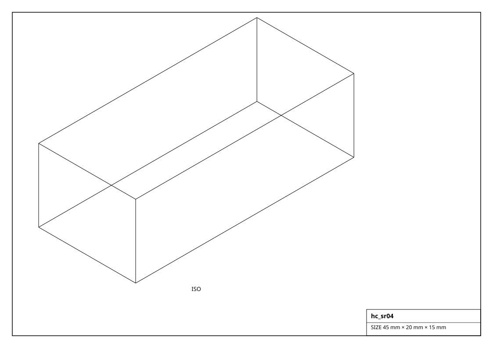
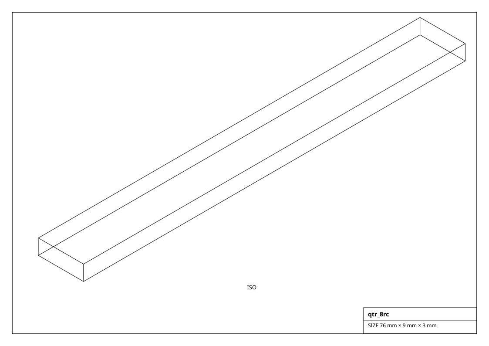
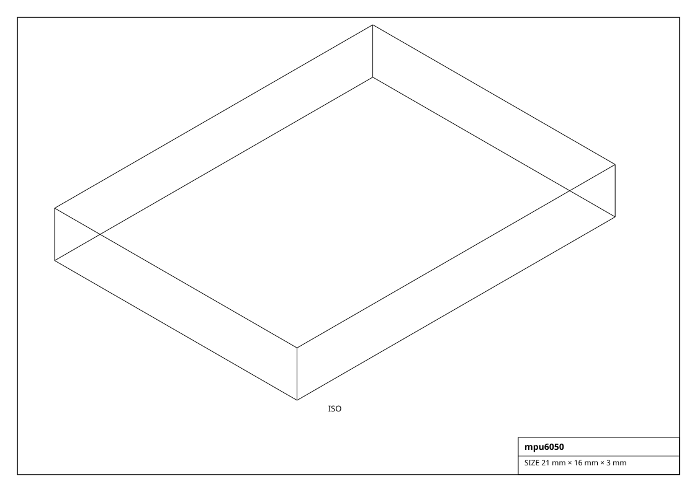
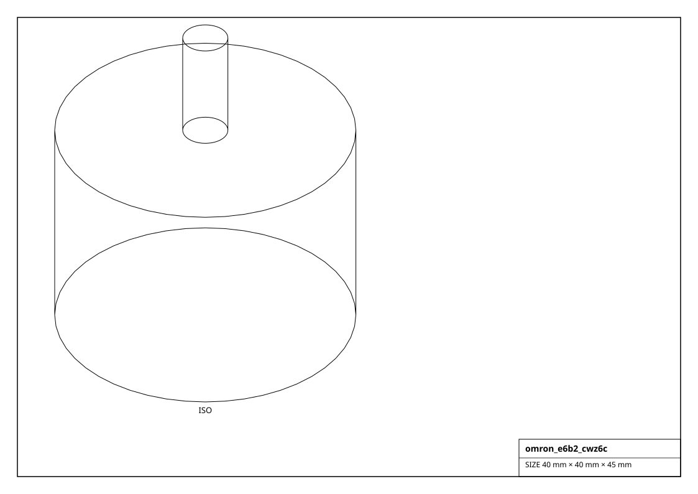

# Sensors

Line / reflectance, distance, switch & end-stop, proximity, IMU, encoder, current and temperature sensors. Each carries its matching sensor mixin and binds to a `Microcontroller` pin.

## Renderings

*Isometric projections of `hc_sr04` and others (generated from the parts themselves).*

## Line Sensor  (3)

| Factory | Part | Channels | Voltage | Size (mm) | Mass (g) |
|---|---|---|---|---|---|
| `get_qtr_1rc()` | QTR-1RC | 1 | 5 V | 12.0 x 9.0 x 3.0 | 10.0 |
| `get_qtr_8rc()` | QTR-8RC | 8 | 5 V | 76.0 x 9.0 x 3.0 | 10.0 |
| `get_tcrt5000()` | TCRT5000 | 1 | 5 V | 10.5 x 8.0 x 5.0 | 10.0 |

## Distance Sensor  (5)

| Factory | Part | Range | Voltage | Size (mm) | Mass (g) |
|---|---|---|---|---|---|
| `get_hc_sr04()` | HC-SR04 | 2-400 cm | 5 V | 45.0 x 20.0 x 15.0 | 10.0 |
| `get_sharp_gp2y0a21()` | GP2Y0A21YK0F | 10-80 cm | 5 V | 44.0 x 18.9 x 13.5 | 10.0 |
| `get_tf_luna()` | TF-Luna | 20-800 cm | 5 V | 35.0 x 21.0 x 16.0 | 10.0 |
| `get_vl53l0x()` | VL53L0X | 3-200 cm | 2.8 V | 25.0 x 11.0 x 3.0 | 10.0 |
| `get_vl53l1x()` | VL53L1X | 4-400 cm | 2.8 V | 25.0 x 11.0 x 3.0 | 10.0 |

## Switch  (8)

| Factory | Part | Normally | Size (mm) | Mass (g) |
|---|---|---|---|---|
| `get_endstop_hall()` | hall endstop | open | 20.0 x 13.0 x 5.0 | 10.0 |
| `get_endstop_mechanical()` | mechanical endstop | open | 33.0 x 16.0 x 12.0 | 10.0 |
| `get_endstop_optical()` | optical endstop | open | 33.0 x 11.0 x 15.0 | 10.0 |
| `get_ir_obstacle_fc51()` | FC-51 | open | 32.0 x 14.0 x 7.0 | 10.0 |
| `get_microswitch_limit()` | SS-5GL | open | 20.0 x 6.4 x 10.0 | 10.0 |
| `get_reed_switch()` | reed switch | open | 14.0 x 2.5 x 2.5 | 10.0 |
| `get_tactile_button()` | 6x6 tactile | open | 6.0 x 6.0 x 5.0 | 10.0 |
| `get_toggle_switch()` | MTS-101 | open | 13.0 x 8.0 x 23.0 | 10.0 |

## Proximity  (2)

| Factory | Part | Range | Voltage | Size (mm) | Mass (g) |
|---|---|---|---|---|---|
| `get_capacitive_ldc1000()` | capacitive prox | 10 mm | 3.3 V | 30.0 x 18.0 x 3.0 | 10.0 |
| `get_inductive_lj12a3()` | LJ12A3-4-Z/BX | 4 mm | 12 V | 12.0 x 12.0 x 60.0 | 10.0 |

## Imu  (4)

| Factory | Part | Voltage | Size (mm) | Mass (g) |
|---|---|---|---|---|
| `get_bno055()` | BNO055 | 3.3 V | 20.0 x 27.0 x 3.0 | 10.0 |
| `get_icm20948()` | ICM-20948 | 3.3 V | 24.0 x 17.0 x 3.0 | 10.0 |
| `get_mpu6050()` | MPU-6050 | 3.3 V | 21.0 x 16.0 x 3.0 | 10.0 |
| `get_mpu9250()` | MPU-9250 | 3.3 V | 21.0 x 16.0 x 3.0 | 10.0 |

## Encoder  (5)

| Factory | Part | Counts/rev | Interface | Voltage | Size (mm) | Mass (g) |
|---|---|---|---|---|---|---|
| `get_as5048a()` | AS5048A | 16384 | SPI | 3.3 V | 20.0 x 20.0 x 3.0 | 4.0 |
| `get_as5600()` | AS5600 | 4096 | I2C | 3.3 V | 20.0 x 20.0 x 3.0 | 4.0 |
| `get_ky040()` | KY-040 | 20 | quadrature | 5.0 V | 32.0 x 19.0 x 25.0 | 10.0 |
| `get_omron_e6b2_cwz6c()` | E6B2-CWZ6C | 600 | quadrature | 12 V | 40.0 x 40.0 x 30.0 | 100.0 |
| `get_optical_wheel_600ppr()` | optical wheel | 600 | quadrature | 5.0 V | 38.0 x 38.0 x 20.0 | 20.0 |

## Current Sensor  (3)

| Factory | Part | Voltage | Size (mm) | Mass (g) |
|---|---|---|---|---|
| `get_acs712_30a()` | ACS712-30A | 5 V | 31.0 x 13.0 x 13.0 | 10.0 |
| `get_ina219()` | INA219 | 3.3 V | 26.0 x 18.0 x 3.0 | 10.0 |
| `get_ina260()` | INA260 | 3.3 V | 26.0 x 18.0 x 3.0 | 10.0 |

## Temperature Sensor  (3)

| Factory | Part | Voltage | Size (mm) | Mass (g) |
|---|---|---|---|---|
| `get_ds18b20()` | DS18B20 | 3.3 V | 4.0 x 4.0 x 40.0 | 10.0 |
| `get_mlx90614()` | MLX90614 | 3.3 V | 17.0 x 17.0 x 8.0 | 10.0 |
| `get_ntc_thermistor_10k()` | NTC 10k | 3.3 V | 3.0 x 3.0 x 6.0 | 10.0 |
