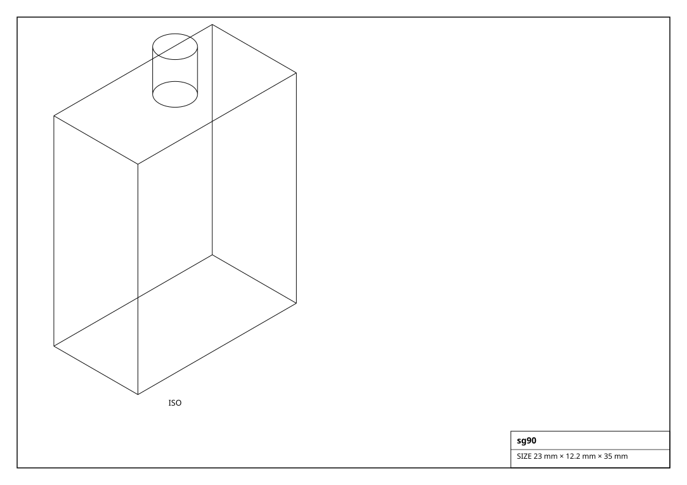
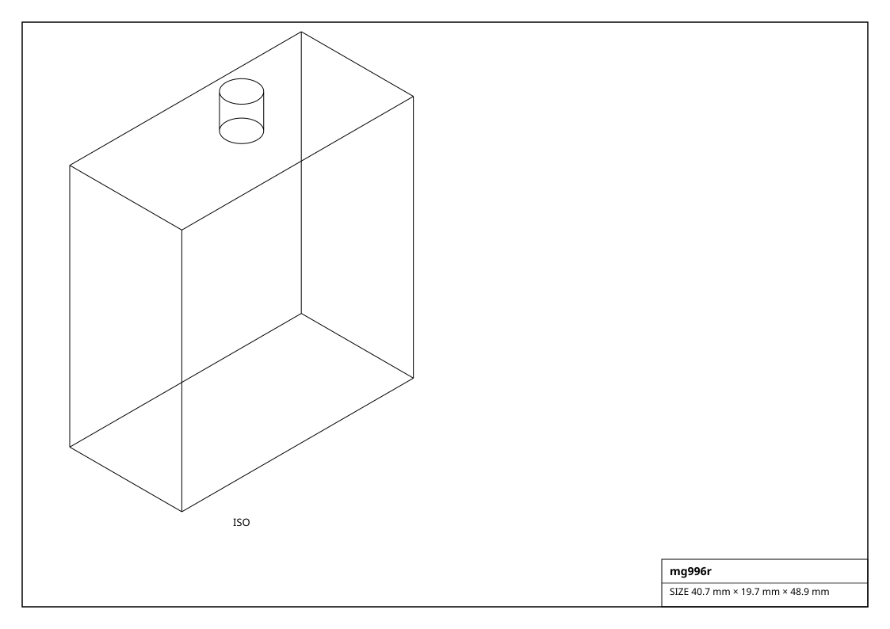
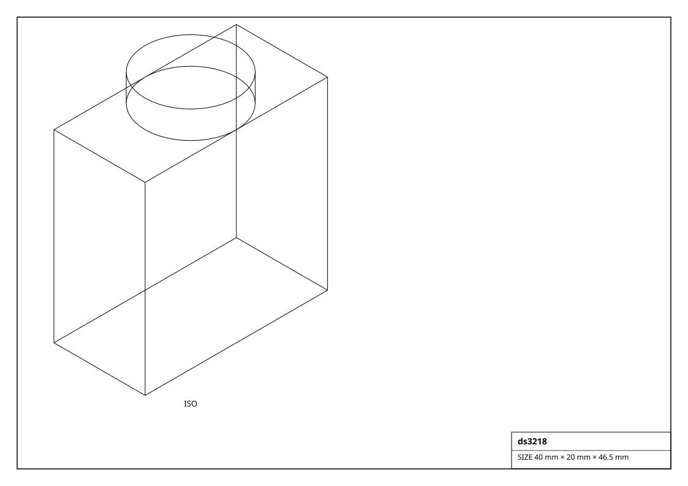
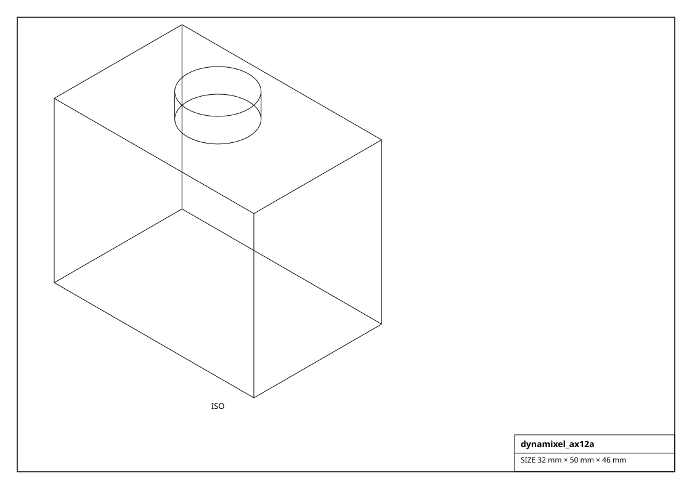

# Servos

Hobby PWM and smart serial (Dynamixel / FeeTech / LX-16A) servos. `set_angle(deg)` commands position; continuous-rotation servos take `set_speed(-1..1)`.

## Renderings

*Isometric projections of `sg90` and others (generated from the parts themselves).*

| Factory | Part | Stall torque | Voltage | Travel | Bus | Size (mm) | Mass (g) |
|---|---|---|---|---|---|---|---|
| `get_ds3218()` | DS3218 | 0.667 N*m | 21.5 V | 270deg | pwm | 40.0 x 20.0 x 40.5 | 60.0 |
| `get_ds3225()` | DS3225 | 0.667 N*m | 25 V | 270deg | pwm | 40.0 x 20.0 x 40.7 | 62.0 |
| `get_ds3235()` | DS3235 | 0.667 N*m | 35 V | 270deg | pwm | 40.0 x 20.0 x 40.7 | 65.0 |
| `get_dynamixel_ax12a()` | AX-12A | 1.177 N*m | 15 V | 300deg | serial | 32.0 x 50.0 x 40.0 | 53.5 |
| `get_dynamixel_mx28()` | MX-28 | 1.177 N*m | 14 V | 360deg | serial | 35.6 x 50.6 x 35.5 | 77.0 |
| `get_dynamixel_xl320()` | XL-320 | 0.726 N*m | 6 V | 300deg | serial | 24.0 x 36.0 x 27.0 | 16.6 |
| `get_dynamixel_xl430_w250()` | XL430-W250 | 1.089 N*m | 12 V | 360deg | serial | 28.5 x 46.5 x 34.0 | 57.0 |
| `get_dynamixel_xm430_w350()` | XM430-W350 | 1.177 N*m | 24 V | 360deg | serial | 28.5 x 46.5 x 34.0 | 82.0 |
| `get_es08ma()` | ES08MA | 0.588 N*m | 1.8 V | 180deg | pwm | 25.0 x 13.0 x 30.0 | 12.0 |
| `get_feetech_scs15()` | SCS15 | 0.726 N*m | 17 V | 300deg | serial | 40.0 x 20.0 x 38.0 | 60.0 |
| `get_feetech_sts3215()` | STS3215 | 1.177 N*m | 30 V | 360deg | serial | 45.2 x 24.7 x 35.0 | 60.0 |
| `get_fs90r()` | FS90R | 0.588 N*m | 1.5 V | continuous | pwm | 23.0 x 12.2 x 29.0 | 9.0 |
| `get_futaba_s3003()` | S3003 | 0.588 N*m | 3.2 V | 180deg | pwm | 40.0 x 20.0 x 36.0 | 37.0 |
| `get_herkulex_drs0101()` | HerkuleX DRS-0101 | 0.726 N*m | 12 V | 320deg | serial | 46.0 x 24.0 x 31.0 | 60.0 |
| `get_hitec_hs311()` | HS-311 | 0.588 N*m | 3.7 V | 180deg | pwm | 40.0 x 20.0 x 36.5 | 43.0 |
| `get_hitec_hs422()` | HS-422 | 0.588 N*m | 4.1 V | 180deg | pwm | 40.0 x 20.0 x 37.0 | 46.0 |
| `get_hitec_hs645mg()` | HS-645MG | 0.726 N*m | 9.6 V | 180deg | pwm | 40.6 x 19.8 x 37.6 | 55.0 |
| `get_jx_pdi6221mg()` | PDI-6221MG | 0.588 N*m | 20 V | 180deg | pwm | 40.5 x 20.2 x 38.0 | 62.0 |
| `get_lx16a()` | LX-16A | 0.726 N*m | 20 V | 240deg | serial | 45.2 x 24.6 x 35.0 | 60.0 |
| `get_mg90s()` | MG90S | 0.588 N*m | 2.2 V | 180deg | pwm | 23.0 x 12.2 x 29.0 | 13.0 |
| `get_mg995()` | MG995 | 0.588 N*m | 10 V | 180deg | pwm | 40.7 x 19.7 x 42.9 | 55.0 |
| `get_mg996r()` | MG996R | 0.588 N*m | 11 V | 180deg | pwm | 40.7 x 19.7 x 42.9 | 55.0 |
| `get_miuzei_ms24()` | MS24 | 0.647 N*m | 24 V | 270deg | pwm | 40.0 x 20.0 x 40.0 | 60.0 |
| `get_powerhd_1501mg()` | HD-1501MG | 0.588 N*m | 15.5 V | 180deg | pwm | 40.8 x 20.2 x 38.0 | 60.0 |
| `get_savox_sc1258tg()` | SC-1258TG | 0.588 N*m | 12 V | 180deg | pwm | 40.3 x 20.2 x 36.0 | 52.0 |
| `get_sg90()` | SG90 | 0.588 N*m | 1.6 V | 180deg | pwm | 23.0 x 12.2 x 29.0 | 9.0 |
| `get_sg92r()` | SG92R | 0.588 N*m | 2.5 V | 180deg | pwm | 23.0 x 12.2 x 30.0 | 9.0 |
