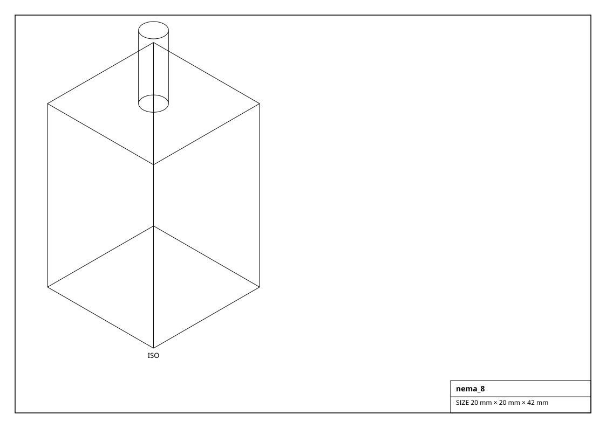
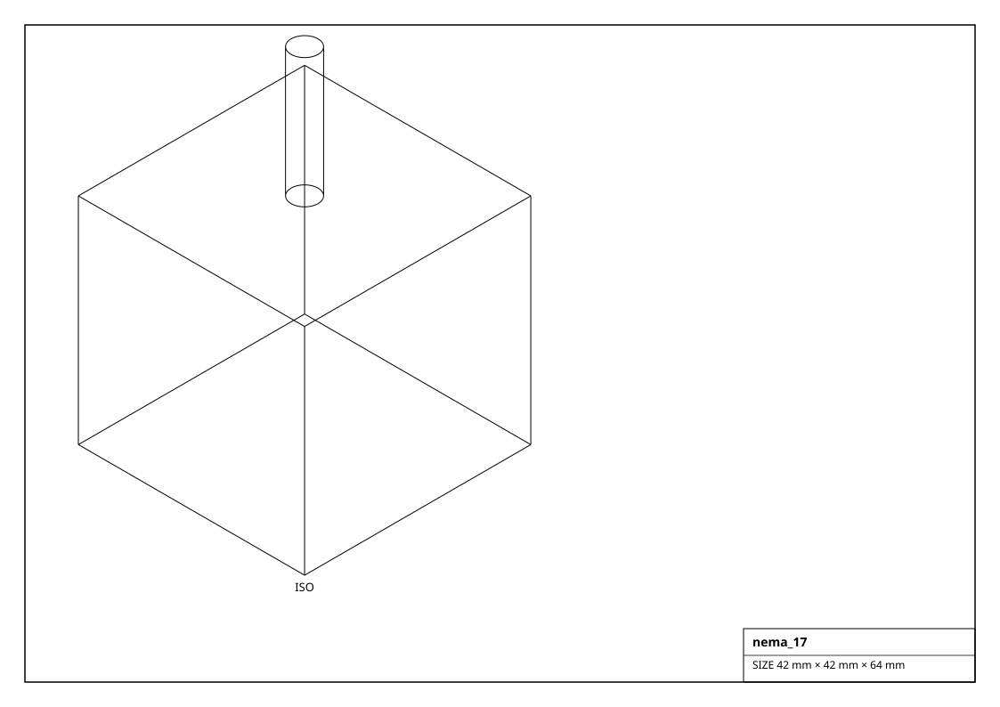
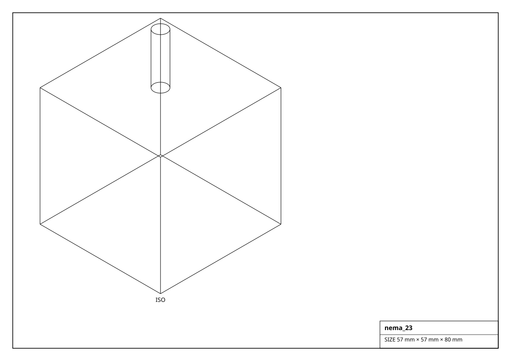
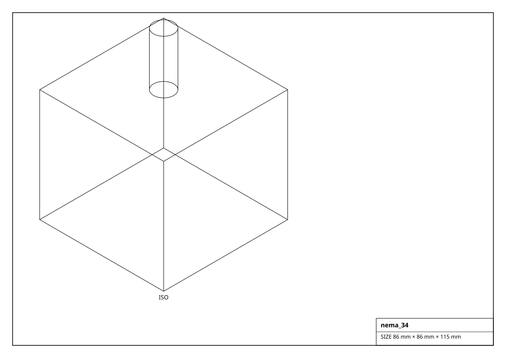

# Stepper Motors

NEMA-frame stepper motors. Frame size names the NEMA standard (NEMA 17 == 42 mm square face). Each is a `StepperMotor` with a hinged output shaft; drive it open-loop with `move_steps()` / `set_position(deg)`.

## Renderings

*Isometric projections of `nema_8` and others (generated from the parts themselves).*

| Factory | Part | Frame | Holding torque | Current | Voltage | Step | Size (mm) | Mass (g) |
|---|---|---|---|---|---|---|---|---|
| `get_nema_11()` | 11HS12-0674S | 28 mm | 0.043 N*m | 0.67 A | 3.8 V | 1.8deg | 28.0 x 28.0 x 32.0 | 120.0 |
| `get_nema_11_high_torque()` | 11HS20-1004S | 28 mm | 0.14 N*m | 1.0 A | 4.0 V | 1.8deg | 28.0 x 28.0 x 51.0 | 240.0 |
| `get_nema_11_long()` | 11HS20-0674S | 28 mm | 0.09 N*m | 0.67 A | 4.5 V | 1.8deg | 28.0 x 28.0 x 45.0 | 200.0 |
| `get_nema_11_pancake()` | 11HS10-0674S | 28 mm | 0.02 N*m | 0.67 A | 2.8 V | 1.8deg | 28.0 x 28.0 x 20.0 | 80.0 |
| `get_nema_14()` | 14HS13-0804S | 35 mm | 0.14 N*m | 0.8 A | 3.4 V | 1.8deg | 35.0 x 35.0 x 34.0 | 190.0 |
| `get_nema_14_0_9deg()` | 14HM11-0404S | 35 mm | 0.11 N*m | 0.8 A | 3.5 V | 0.9deg | 35.0 x 35.0 x 34.0 | 200.0 |
| `get_nema_14_high_torque()` | 14HS20-1504S | 35 mm | 0.25 N*m | 1.5 A | 3.2 V | 1.8deg | 35.0 x 35.0 x 52.0 | 280.0 |
| `get_nema_14_pancake()` | 14HS11-1004S | 35 mm | 0.08 N*m | 1.0 A | 2.7 V | 1.8deg | 35.0 x 35.0 x 26.0 | 140.0 |
| `get_nema_17()` | 17HS4401 | 42 mm | 0.4 N*m | 1.7 A | 2.4 V | 1.8deg | 42.0 x 42.0 x 40.0 | 280.0 |
| `get_nema_17_0_9deg()` | 17HM19-2004S | 42 mm | 0.44 N*m | 2.0 A | 2.8 V | 0.9deg | 42.0 x 42.0 x 48.0 | 400.0 |
| `get_nema_17_creality()` | 42-34 / 17HS15-0804S | 42 mm | 0.28 N*m | 0.8 A | 3.4 V | 1.8deg | 42.0 x 42.0 x 34.0 | 220.0 |
| `get_nema_17_dual_shaft()` | 17HS4401D | 42 mm | 0.4 N*m | 1.7 A | 2.4 V | 1.8deg | 42.0 x 42.0 x 40.0 | 290.0 |
| `get_nema_17_high_torque()` | 17HS19-2004S1 | 42 mm | 0.59 N*m | 2.0 A | 2.8 V | 1.8deg | 42.0 x 42.0 x 48.0 | 400.0 |
| `get_nema_17_ldo()` | LDO-42STH48-2504AC | 42 mm | 0.55 N*m | 2.5 A | 2.9 V | 1.8deg | 42.0 x 42.0 x 48.0 | 390.0 |
| `get_nema_17_long()` | 17HS24-2104S | 42 mm | 0.65 N*m | 2.1 A | 3.1 V | 1.8deg | 42.0 x 42.0 x 60.0 | 500.0 |
| `get_nema_17_low_current()` | 17HS15-1204S | 42 mm | 0.26 N*m | 1.2 A | 3.0 V | 1.8deg | 42.0 x 42.0 x 34.0 | 230.0 |
| `get_nema_17_moons()` | MS17HD2P4100 | 42 mm | 0.44 N*m | 1.5 A | 3.1 V | 1.8deg | 42.0 x 42.0 x 40.0 | 300.0 |
| `get_nema_17_pancake()` | 17HS08-1004S | 42 mm | 0.16 N*m | 1.0 A | 2.8 V | 1.8deg | 42.0 x 42.0 x 20.0 | 140.0 |
| `get_nema_17_planetary_5to1()` | 17HS15-1684S-HG5 | 42 mm | 1.8 N*m | 1.68 A | 2.8 V | 1.8deg | 42.0 x 42.0 x 74.0 | 520.0 |
| `get_nema_17_slim()` | 17HS13-0616S | 42 mm | 0.09 N*m | 1.0 A | 2.3 V | 1.8deg | 42.0 x 42.0 x 16.0 | 110.0 |
| `get_nema_23()` | 23HS22-2804S | 57 mm | 1.26 N*m | 2.8 A | 3.0 V | 1.8deg | 57.0 x 57.0 x 56.0 | 700.0 |
| `get_nema_23_30()` | 23HS30-2804S | 57 mm | 1.9 N*m | 2.8 A | 3.4 V | 1.8deg | 57.0 x 57.0 x 76.0 | 1100.0 |
| `get_nema_23_dual_shaft()` | 23HS22-2804D | 57 mm | 1.26 N*m | 2.8 A | 3.0 V | 1.8deg | 57.0 x 57.0 x 56.0 | 720.0 |
| `get_nema_23_geared_10to1()` | 23HS22-2804S-PG10 | 57 mm | 12.0 N*m | 2.8 A | 3.0 V | 1.8deg | 57.0 x 57.0 x 100.0 | 1400.0 |
| `get_nema_23_high_torque()` | 23HS45-4204S | 57 mm | 3.0 N*m | 4.2 A | 3.6 V | 1.8deg | 57.0 x 57.0 x 114.0 | 1900.0 |
| `get_nema_23_low_inductance()` | 23HS41-1804S | 57 mm | 2.45 N*m | 1.8 A | 6.0 V | 1.8deg | 57.0 x 57.0 x 100.0 | 1500.0 |
| `get_nema_23_short()` | 23HS16-2004S | 57 mm | 0.7 N*m | 2.0 A | 2.5 V | 1.8deg | 57.0 x 57.0 x 41.0 | 550.0 |
| `get_nema_34()` | 34HS31-5004S | 86 mm | 4.5 N*m | 5.0 A | 3.5 V | 1.8deg | 86.0 x 86.0 x 78.0 | 2200.0 |
| `get_nema_34_high_torque()` | 34HS59-5504S | 86 mm | 12.0 N*m | 5.5 A | 5.0 V | 1.8deg | 86.0 x 86.0 x 151.0 | 4200.0 |
| `get_nema_34_low_current()` | 34HS38-3504S | 86 mm | 6.5 N*m | 3.5 A | 6.4 V | 1.8deg | 86.0 x 86.0 x 98.0 | 2800.0 |
| `get_nema_34_mid()` | 34HS46-5064S | 86 mm | 8.5 N*m | 5.0 A | 4.6 V | 1.8deg | 86.0 x 86.0 x 118.0 | 3200.0 |
| `get_nema_42()` | 110BYGH201 | 110 mm | 20.0 N*m | 6.0 A | 4.0 V | 1.8deg | 110.0 x 110.0 x 201.0 | 9000.0 |
| `get_nema_42_high_torque()` | 110HS28-6004S | 110 mm | 30.0 N*m | 6.0 A | 4.6 V | 1.8deg | 110.0 x 110.0 x 235.0 | 11500.0 |
| `get_nema_8()` | 8HS15-0604S | 20 mm | 0.018 N*m | 0.6 A | 3.8 V | 1.8deg | 20.0 x 20.0 x 30.0 | 60.0 |
| `get_nema_8_high_torque()` | 8HS20-0604S | 20 mm | 0.03 N*m | 0.6 A | 4.5 V | 1.8deg | 20.0 x 20.0 x 38.0 | 80.0 |
