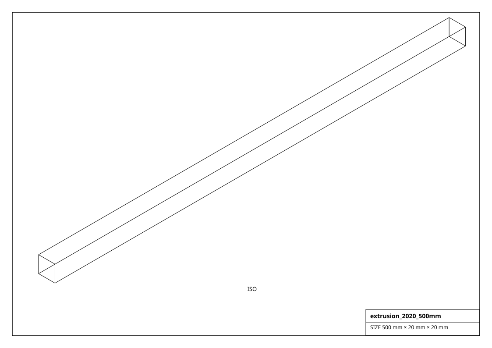
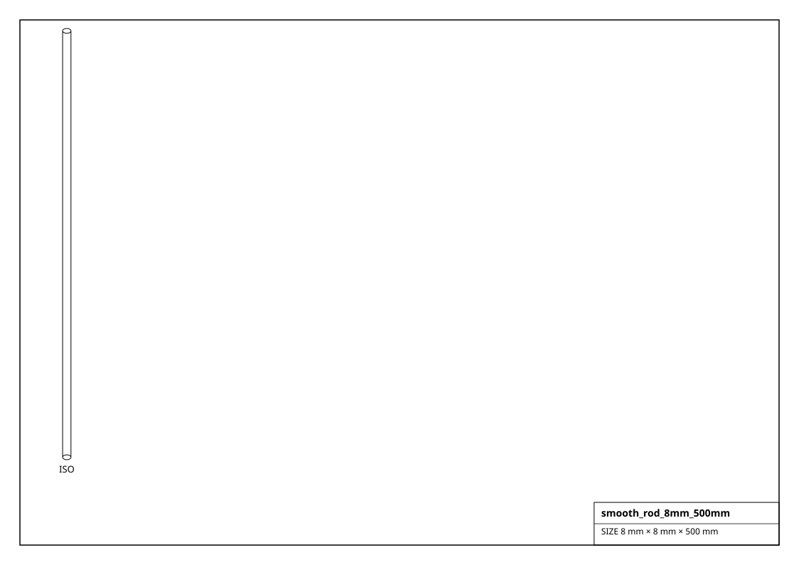

# Structure & Motion Hardware

Aluminum extrusion, brackets, linear rails, smooth rods and plates. `extrusion()` and `smooth_rod()` generate any size.

## Renderings

*Isometric projections of `extrusion_2020_500mm` and others (generated from the parts themselves).*

## Extrusion  (9)

| Factory | Part | Profile | Length | Size (mm) | Mass (g) |
|---|---|---|---|---|---|
| `get_extrusion_2020_1000mm()` | 2020x1000 | 2020 | 1000 mm | 1000.0 x 20.0 x 20.0 | 378.0 |
| `get_extrusion_2020_100mm()` | 2020x100 | 2020 | 100 mm | 100.0 x 20.0 x 20.0 | 37.8 |
| `get_extrusion_2020_250mm()` | 2020x250 | 2020 | 250 mm | 250.0 x 20.0 x 20.0 | 94.5 |
| `get_extrusion_2020_500mm()` | 2020x500 | 2020 | 500 mm | 500.0 x 20.0 x 20.0 | 189.0 |
| `get_extrusion_2040_250mm()` | 2040x250 | 2040 | 250 mm | 250.0 x 40.0 x 20.0 | 189.0 |
| `get_extrusion_2040_500mm()` | 2040x500 | 2040 | 500 mm | 500.0 x 40.0 x 20.0 | 378.0 |
| `get_extrusion_3030_500mm()` | 3030x500 | 3030 | 500 mm | 500.0 x 30.0 x 30.0 | 425.2 |
| `get_extrusion_4040_1000mm()` | 4040x1000 | 4040 | 1000 mm | 1000.0 x 40.0 x 40.0 | 1512.0 |
| `get_extrusion_4040_500mm()` | 4040x500 | 4040 | 500 mm | 500.0 x 40.0 x 40.0 | 756.0 |

## Bracket  (6)

| Factory | Part | Size (mm) | Mass (g) |
|---|---|---|---|
| `get_angle_bracket_2040()` | 2040 angle | 40.0 x 20.0 x 40.0 | 35.0 |
| `get_corner_bracket_2020()` | 2020 inside corner | 20.0 x 20.0 x 20.0 | 10.0 |
| `get_corner_cube_3way()` | 3-way corner | 20.0 x 20.0 x 20.0 | 15.0 |
| `get_gusset_2020()` | 2020 gusset | 28.0 x 28.0 x 20.0 | 20.0 |
| `get_l_bracket_steel()` | steel L-bracket | 38.0 x 38.0 x 20.0 | 30.0 |
| `get_t_nut_2020()` | M5 T-nut | 6.0 x 10.0 x 6.0 | 2.0 |

## Linear Rail  (5)

| Factory | Part | Rail | Length | Size (mm) | Mass (g) |
|---|---|---|---|---|---|
| `get_linear_rail_mgn12_250mm()` | MGN12 250mm | mgn12 | 250 mm | 250.0 x 12.0 x 8.0 | 131.9 |
| `get_linear_rail_mgn12_400mm()` | MGN12 400mm | mgn12 | 400 mm | 400.0 x 12.0 x 8.0 | 211.0 |
| `get_linear_rail_mgn9_250mm()` | MGN9 250mm | mgn9 | 250 mm | 250.0 x 9.0 x 8.0 | 98.9 |
| `get_linear_rail_sbr16_500mm()` | SBR16 500mm | sbr16 | 500 mm | 500.0 x 40.0 x 40.0 | 4396.0 |
| `get_mgn12_carriage()` | MGN12H block | - | 0 mm | 44.0 x 27.0 x 13.0 | 55.0 |

## Rod  (4)

| Factory | Part | Diameter | Length | Size (mm) | Mass (g) |
|---|---|---|---|---|---|
| `get_smooth_rod_10mm_400mm()` | rod 10x400 | 10 mm | 400 mm | 10.0 x 10.0 x 400.0 | 246.6 |
| `get_smooth_rod_12mm_500mm()` | rod 12x500 | 12 mm | 500 mm | 12.0 x 12.0 x 500.0 | 443.9 |
| `get_smooth_rod_8mm_300mm()` | rod 8x300 | 8 mm | 300 mm | 8.0 x 8.0 x 300.0 | 118.4 |
| `get_smooth_rod_8mm_500mm()` | rod 8x500 | 8 mm | 500 mm | 8.0 x 8.0 x 500.0 | 197.3 |

## Plate  (3)

| Factory | Part | Size (mm) | Mass (g) |
|---|---|---|---|
| `get_alu_plate_100x100()` | alu plate | 100.0 x 100.0 x 3.0 | 81.0 |
| `get_breadboard_830()` | MB-102 | 165.0 x 55.0 x 10.0 | 60.0 |
| `get_perfboard_70x90()` | perfboard | 90.0 x 70.0 x 1.6 | 30.0 |

## Mount  (1)

| Factory | Part | Size (mm) | Mass (g) |
|---|---|---|---|
| `get_rubber_foot_m6()` | M6 foot | 25.0 x 25.0 x 15.0 | 10.0 |
