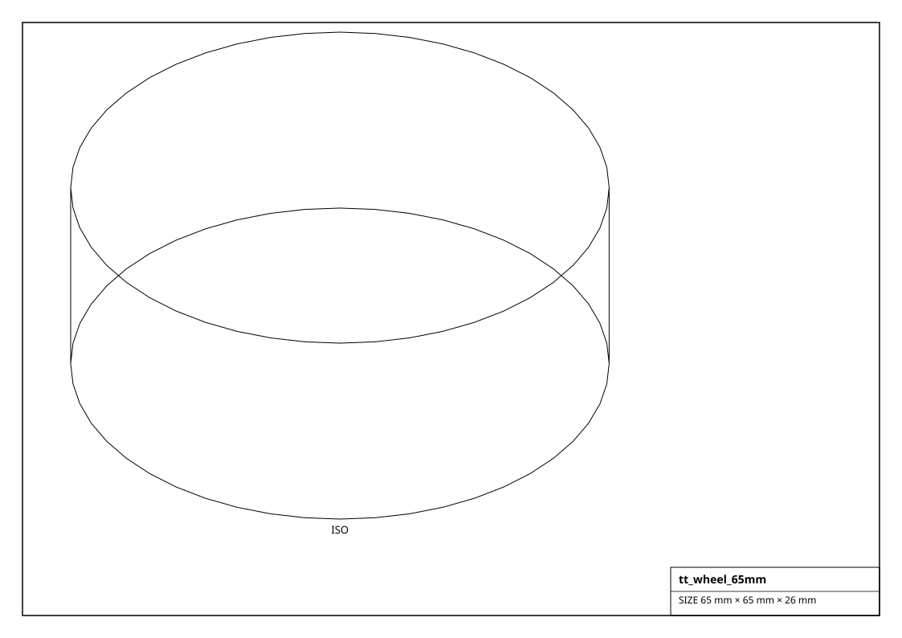
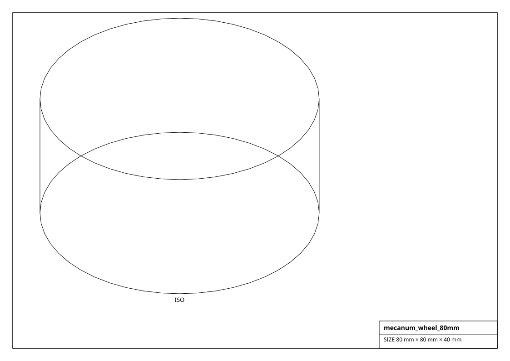
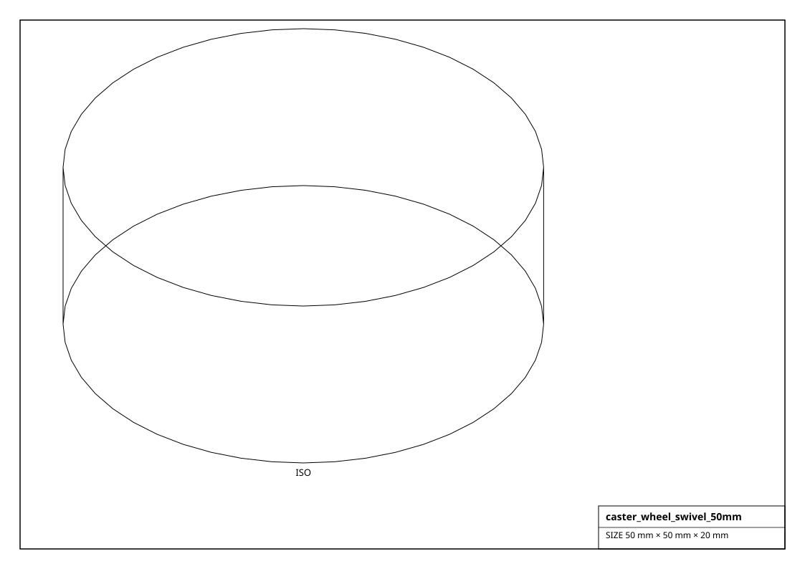

# Wheels, Casters & Tracks

What a mobile robot rolls on. `distance_per_rev_mm()` gives the odometry step per wheel revolution.

## Renderings

*Isometric projections of `tt_wheel_65mm` and others (generated from the parts themselves).*

## Wheel  (5)

| Factory | Part | Diameter | Width | Bore | Hub | Size (mm) | Mass (g) |
|---|---|---|---|---|---|---|---|
| `get_pololu_wheel_90mm()` | 90x10mm | 90 mm | 10 mm | 3 mm | 3mm D | 90.0 x 90.0 x 10.0 | 45.8 |
| `get_rc_tire_100mm()` | 100mm hex | 100 mm | 40 mm | 12 mm | hex 12mm | 100.0 x 100.0 x 40.0 | 226.2 |
| `get_robot_wheel_60mm()` | 60mm | 60 mm | 8 mm | 4 mm | D-shaft | 60.0 x 60.0 x 8.0 | 16.3 |
| `get_scooter_wheel_200mm()` | 200mm PU | 200 mm | 45 mm | 8 mm | hub bearing | 200.0 x 200.0 x 45.0 | 1017.9 |
| `get_tt_wheel_65mm()` | 65mm TT | 65 mm | 26 mm | 5.4 mm | TT dual-flat | 65.0 x 65.0 x 26.0 | 62.1 |

## Omni Wheel  (2)

| Factory | Part | Diameter | Width | Bore | Hub | Size (mm) | Mass (g) |
|---|---|---|---|---|---|---|---|
| `get_omni_wheel_38mm()` | 38mm omni | 38 mm | 20 mm | 4 mm | hub | 38.0 x 38.0 x 20.0 | 16.3 |
| `get_omni_wheel_58mm()` | 58mm omni | 58 mm | 25 mm | 6 mm | hub | 58.0 x 58.0 x 25.0 | 47.6 |

## Mecanum Wheel  (2)

| Factory | Part | Diameter | Width | Bore | Hub | Size (mm) | Mass (g) |
|---|---|---|---|---|---|---|---|
| `get_mecanum_wheel_100mm()` | 100mm mecanum | 100 mm | 50 mm | 12 mm | hub | 100.0 x 100.0 x 50.0 | 282.7 |
| `get_mecanum_wheel_80mm()` | 80mm mecanum | 80 mm | 40 mm | 6 mm | hub 4-hole | 80.0 x 80.0 x 40.0 | 144.8 |

## Caster  (2)

| Factory | Part | Diameter | Width | Bore | Hub | Size (mm) | Mass (g) |
|---|---|---|---|---|---|---|---|
| `get_caster_ball_25mm()` | 25mm ball | 25 mm | 25 mm | - | M3 mount plate | 25.0 x 25.0 x 25.0 | 8.8 |
| `get_caster_wheel_swivel_50mm()` | 50mm swivel | 50 mm | 20 mm | - | top plate | 50.0 x 50.0 x 20.0 | 28.3 |

## Track  (1)

| Factory | Part | Diameter | Width | Bore | Hub | Size (mm) | Mass (g) |
|---|---|---|---|---|---|---|---|
| `get_track_link_set()` | tank track | 80 mm | 30 mm | - | sprocket | 80.0 x 80.0 x 30.0 | 108.6 |
