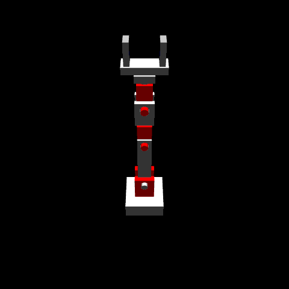

# MuJoCo simulation examples

Model with Build123D (or Blender), then `simulate(part)` exports the meshes
and joint constraints to an MJCF model and loads it into MuJoCo. Requires
`mujoco` and `build123d` installed.

- `arm_6dof.py` — a 6-DOF arm with a parallel-jaw gripper and a cube on
  the floor to pick up. Every joint is visible hardware: hinge joints are
  clevis slots cut into the link cubes with protruding pin cylinders, yaw
  joints are cylinder necks seated in recesses, and the gripper fingers
  are cubes on prismatic joints. In the viewer, keys **a/s/d/f/g/h** move
  joints 1-6, **j/k** close/open the gripper, and tapping **Shift**
  reverses the direction of joint motion. `--test` runs a headless
  scripted pick-and-lift.

  

- `arm_6dof_keyframes.py` — the same arm, driven the animator's way:
  command the joints to a pose, pin it with `sim.set_keyframe(t)`, then
  `sim.record_gif(keyframes=True)` interpolates between the poses and writes
  `images/arm_6dof_keyframes.gif`. Headless (needs an OpenGL context).

  

- `pendulum.py` — a rod + bob hinged to a mount, swinging freely from 60°
  (`actuated=False`).

  

- `double_pendulum.py` — two chained links released from horizontal
  (chaotic).

  

Run: `mjpython <example>.py` for the viewer on macOS (`python` elsewhere),
or `python <example>.py --test` for headless.
