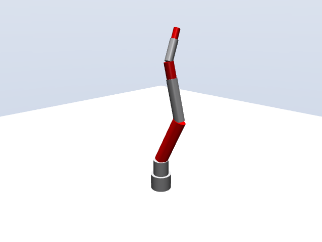
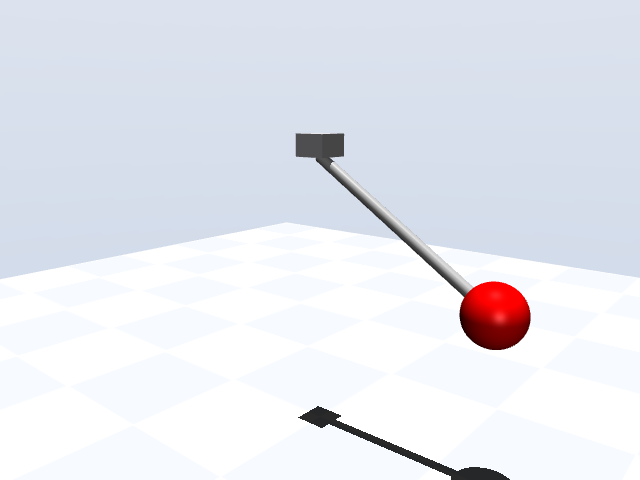

# MuJoCo simulation examples

Model with Build123D (or Blender), then `simulate(part)` exports the meshes
and joint constraints to an MJCF model and loads it into MuJoCo. Requires
`mujoco` and `build123d` installed.

- `arm_6dof.py` — a 6-DOF arm; in the viewer, keys **a/s/d/f/g/h** move
  joints 1-6 and tapping **Shift** reverses the direction of joint motion.
  `--test` runs headless position control.

  

- `pendulum.py` — a rod + bob hinged to a mount, swinging freely from 60°
  (`actuated=False`).

  

- `double_pendulum.py` — two chained links released from horizontal
  (chaotic).

  

Run: `mjpython <example>.py` for the viewer on macOS (`python` elsewhere),
or `python <example>.py --test` for headless.
