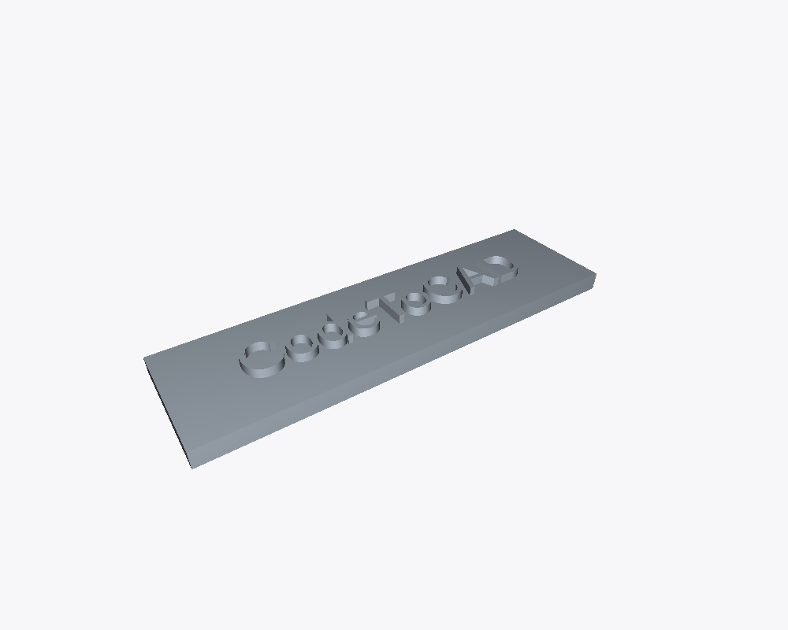

# Open3D integration examples

Run with a normal Python interpreter (`codetocad <example>.py` or `python
<example>.py`). Requires the `open3d` extra (`uv sync --extra open3d`); this
example also models with Build123D (`uv sync --extra build123d`) since
booleans need a federated backend to produce real geometry.

- `embossed_text_logo.py` — a "CodeToCAD" logo plate: text extruded and
  unioned onto a plate with Build123D, rendered to a PNG with
  `codetocad_integrations.open3d.render()`.

  

Use `show(part)` instead of `render(part, path=...)` to open an interactive
Open3D window rather than saving a screenshot.
