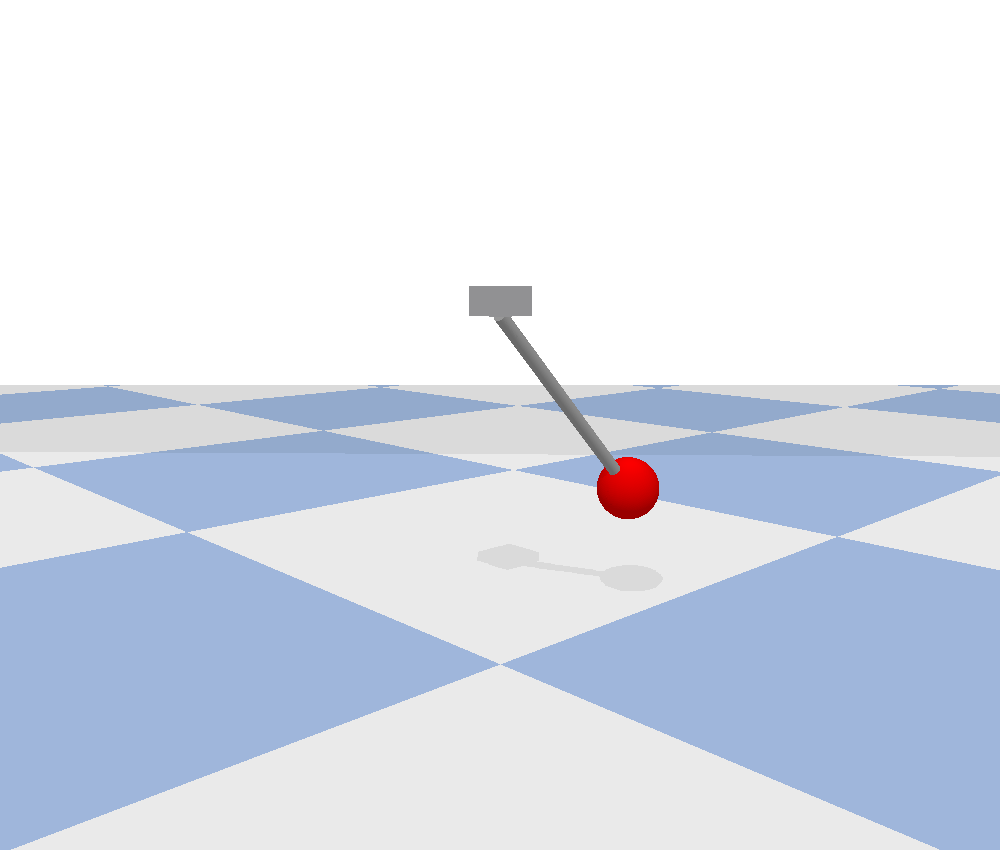
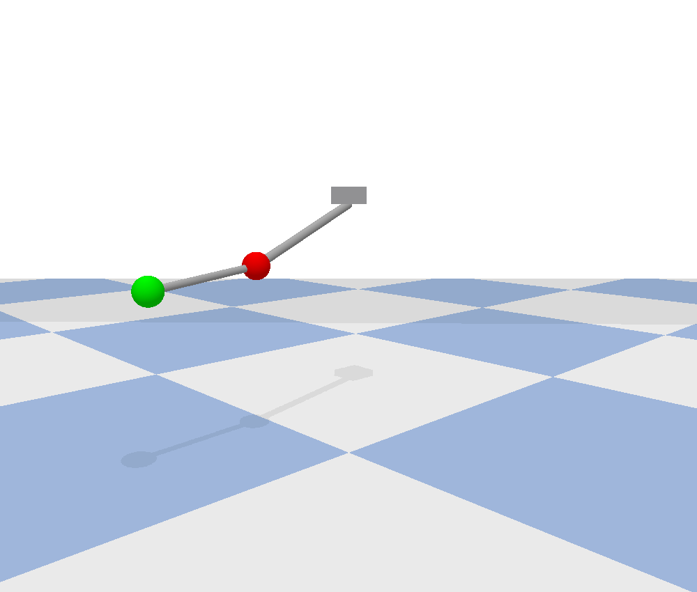

# PyBullet simulation examples

Model with Build123D (or Blender), then `simulate(part)` exports the meshes
and joint constraints to a URDF and loads it into PyBullet. Requires
`pybullet` and `build123d` installed.

- `arm_6dof.py` — a 6-DOF arm; in the GUI, keys **a/s/d/f/g/h** move joints
  1-6 and holding **Shift** reverses the direction of the joint value.
  `--test` runs headless position control.

  

- `pendulum.py` — a rod + bob hinged to a mount, swinging freely from 60°.

  

- `double_pendulum.py` — two chained links released from horizontal
  (chaotic).

  

Run: `python <example>.py` (GUI) or `python <example>.py --test` (headless).
