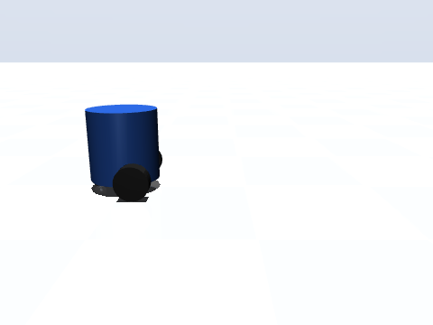
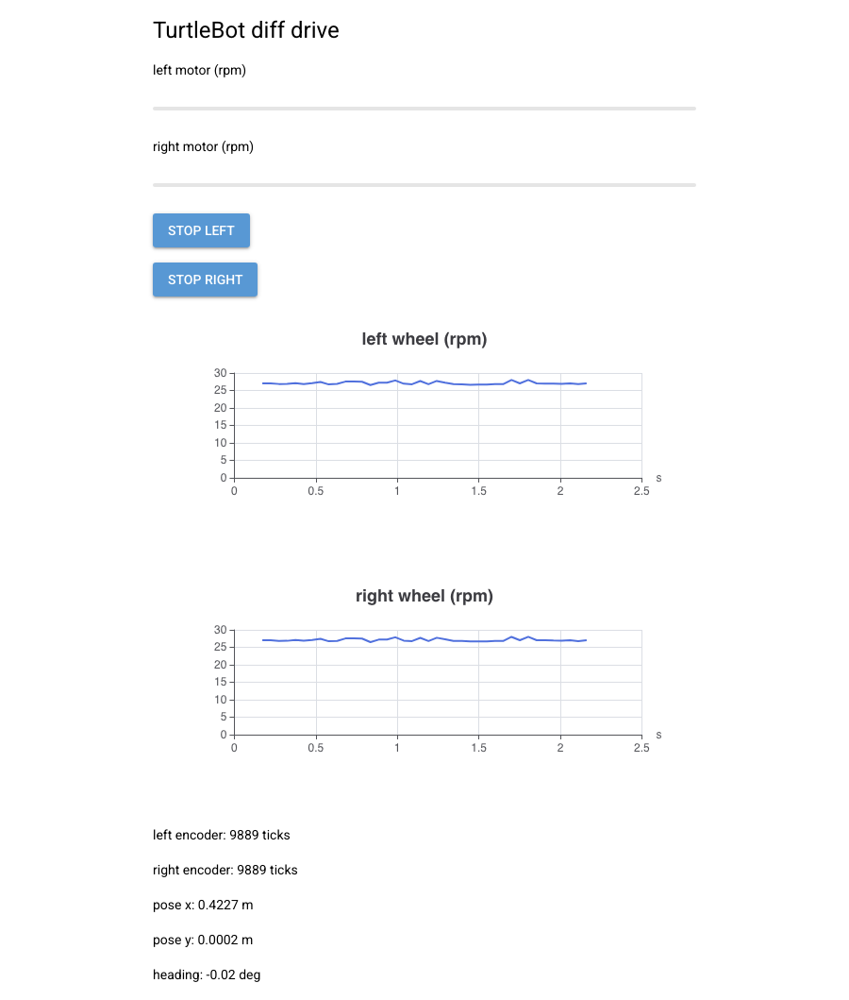

# TurtleBot diff-drive example

A differential-drive TurtleBot simulated in MuJoCo, driven from a WebApp —
everything a real robot would have, emulated in-process:

- **Parts** with real TurtleBot3 Burger dimensions: a 138 mm chassis,
  66 x 27 mm wheels with a 160 mm track, and a 1-inch steel caster ball.
  Each wheel is a custom Part3D that *is also* a DC motor
  (`DrivenWheel(Part3D, DCMotorMixin)`) with Dynamixel XL430-W250 specs
  (57 rpm no-load at 11.1 V, 1.4 N*m stall, 4096-tick encoder).
- **A microcontroller** (ESP32 definition with pin bindings for both
  motors and both quadrature encoders) run by `EmulatedMicrocontroller`:
  motor commands drive MuJoCo velocity actuators and encoder telemetry is
  read back from the simulated joints, over the same JSON-lines wire
  protocol real firmware speaks.
- **A camera**: a housing part on the chassis front
  (`FrontCamera(Part3D, CameraMixin)`) with a matching MuJoCo camera at
  its lens; frames render offscreen and stream to the app as PNG
  telemetry.
- **A WebApp** with sliders for the left/right motors, the live camera
  feed, encoder gauges/plots, and the robot's pose.
- **Terrain**: gentle rolling bumps (a MuJoCo heightfield with a checker
  texture) with a flat launch pad at the origin.





## Run it

Needs the mujoco and nicegui extras:

```
uv run python codetocad_integrations/robotics/turtlebot/turtlebot_diff_drive.py
```

Then open http://localhost:8080 and drive. Equal slider values drive
straight; opposite values spin in place. By default the MuJoCo viewer
window opens so you can watch the robot — on macOS run the script with
`mjpython` (MuJoCo's requirement for the viewer); without it the example
falls back to headless physics automatically. Pass `--no-gui` to skip the
viewer window entirely. Swapping the emulator for a
`SerialCommunication` to a real board is the only change needed to drive
physical hardware from the same app.

## Export to URDF

`export_urdf.py` walks the same assembly and writes `turtlebot.urdf`
plus every link's mesh to `meshes/`, self-contained for PyBullet, RViz,
or any URDF viewer:

```
uv run python codetocad_integrations/robotics/turtlebot/export_urdf.py
```

## Regenerating the media

`images/shoot_turtlebot.py` drives the robot forward and records
`images/turtlebot_drive.gif` from a fixed offscreen MuJoCo camera.
`images/shoot_turtlebot_gui.py` drives the robot in the background and
screenshots the running WebApp with
[`codetocad_integrations.playwright`](../../playwright/README.md) into
`images/turtlebot_gui.png` (needs the playwright extra and its Chromium
binary — see that package's README for the one-time install step).
