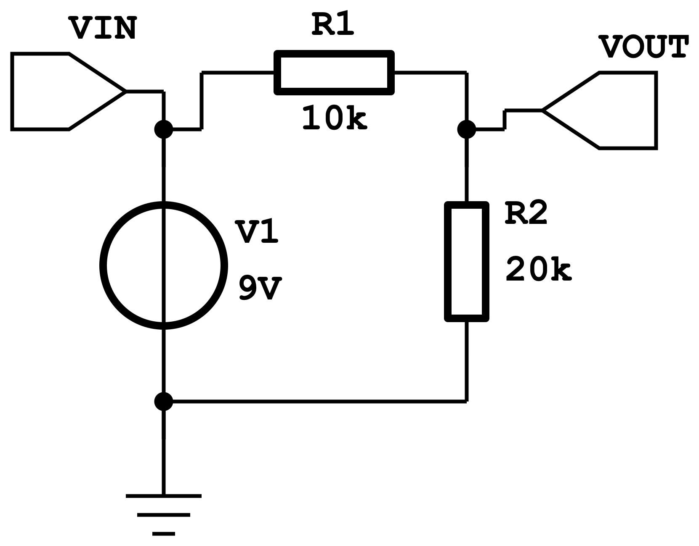
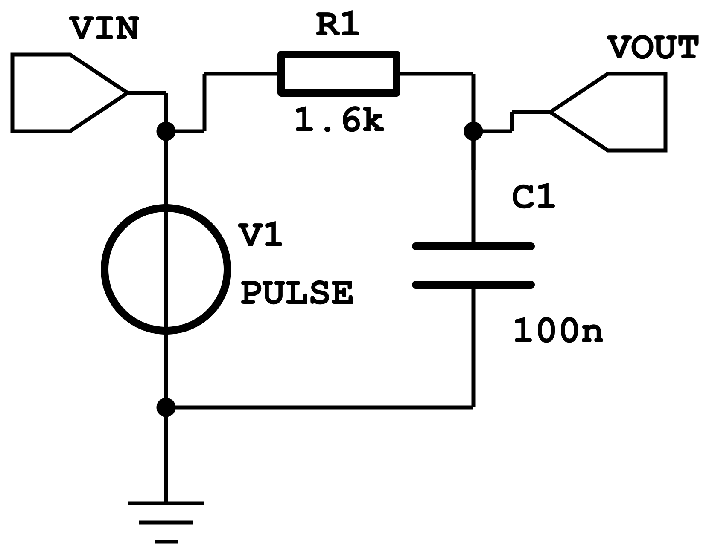
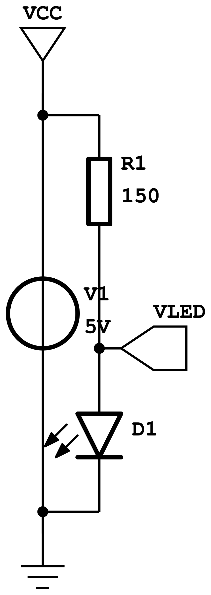
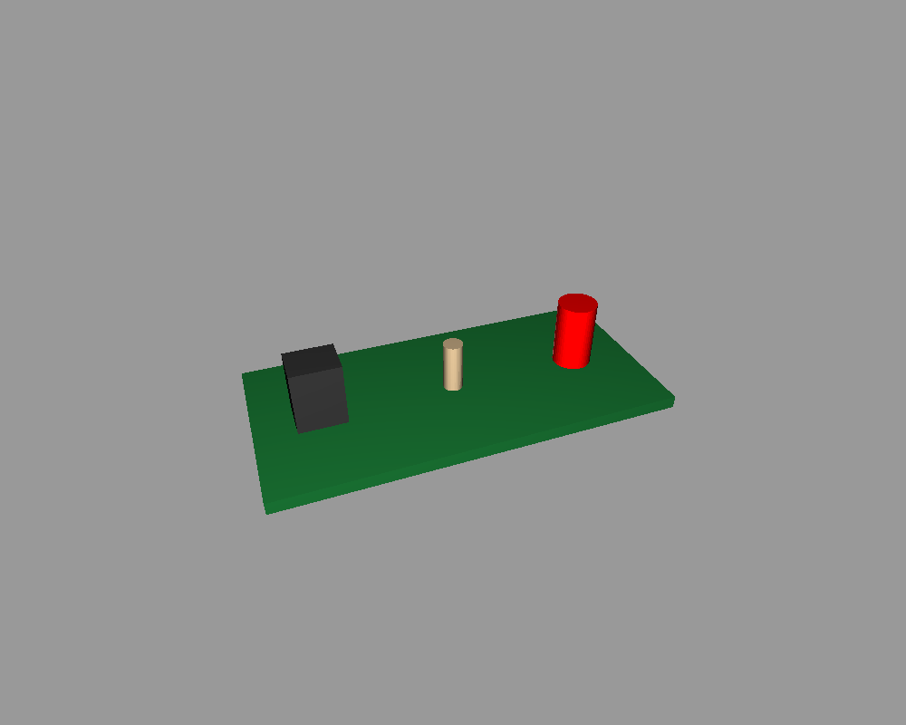

# skidl schematic examples

Each script builds a `codetocad.Circuit`, then exports a KiCad netlist and a
schematic SVG (rendered to PNG here with netlistsvg's analog symbol skin).

- `voltage_divider.py` — a 9V → 6V resistive divider. Exports the netlist,
  a BOM XML and the schematic, and runs skidl's electrical rules check.

  

- `rc_lowpass.py` — an RC low-pass filter (fc ≈ 1 kHz). The same circuit is
  simulated in
  [../../spice/examples/rc_lowpass.py](../../spice/examples/rc_lowpass.py).

  

- `led_board.py` — an LED driver captured **and** built as a board. Because
  every circuit component carries a `Footprint` with a placeholder 3D body,
  the same component objects are `Part3D`s: the script places them on a PCB
  blank, exports per-part STLs, and (with the open3d extra) renders the
  board.

  
  

## Requirements

```sh
uv sync --extra skidl          # skidl
npm install -g netlistsvg      # schematic SVGs (needs Node.js)
uv sync --extra open3d         # optional: led_board's 3D render
```

netlistsvg is auto-discovered from the PATH or `CODETOCAD_NETLISTSVG`. Turning
the schematic SVGs into PNGs (as done here) additionally needs an SVG
rasterizer — `cairosvg` (`pip install cairosvg`), `rsvg-convert`, `inkscape`,
or macOS `qlmanage`; `images/render_svg.py` tries each in turn.

Run an example (writes into this folder):

```sh
python voltage_divider.py
```

Regenerate every image in `images/`:

```sh
./images/generate_images.sh
```
