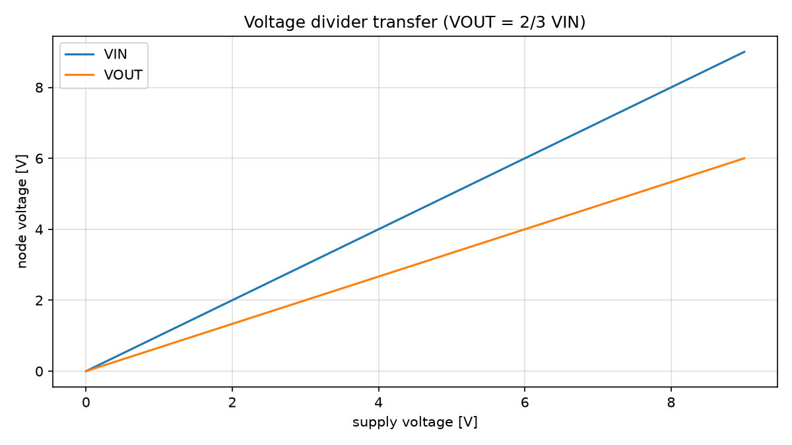
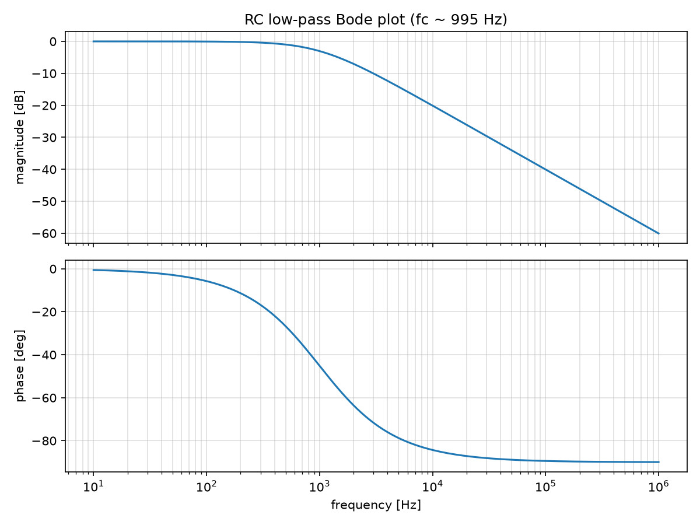
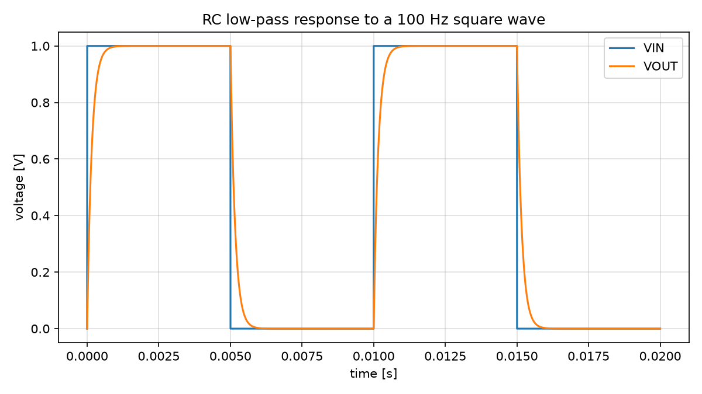
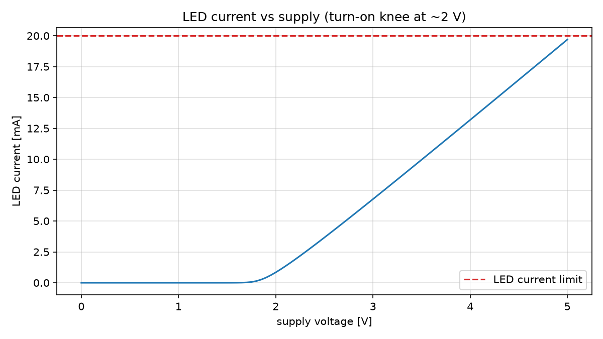

# SPICE simulation examples

Each script builds a `codetocad.Circuit` and simulates it with ngspice,
then plots the results.

- `voltage_divider.py` — DC operating point of a 9V → 6V divider
  (VOUT = 6V exactly) and a supply sweep of the transfer curve.

  

- `rc_lowpass.py` — an AC sweep of an RC low-pass filter (the −3dB corner
  lands within 1% of the analytic 1/2πRC ≈ 1 kHz) plus its time-domain
  response to a square wave. The same circuit is captured as a schematic in
  [../../skidl/examples/rc_lowpass.py](../../skidl/examples/rc_lowpass.py).

  
  

- `led_driver.py` — an LED driven from 5V through a 150Ω resistor. The LED's
  SPICE diode model is derived from its `forward_voltage`; the operating
  point lands near 20 mA and the supply sweep shows the diode turn-on knee.

  

## Requirements

```sh
uv sync --extra spice     # matplotlib for the plots
```

plus the ngspice simulator, installed any of these ways:

- `brew install ngspice`                              (macOS)
- `apt install ngspice`                               (Debian/Ubuntu)
- `micromamba create -p ~/.codetocad/ngspice -c conda-forge ngspice`
  (auto-discovered by the integration)

ngspice is found via `CODETOCAD_NGSPICE`, the PATH, or
`~/.codetocad/ngspice/bin/ngspice`.

Run an example (writes its PNGs into this folder):

```sh
python rc_lowpass.py
```

Regenerate every image in `images/`:

```sh
./images/generate_images.sh
```
