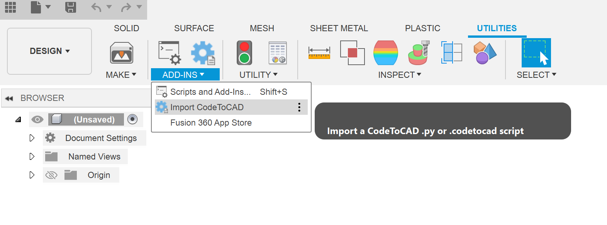
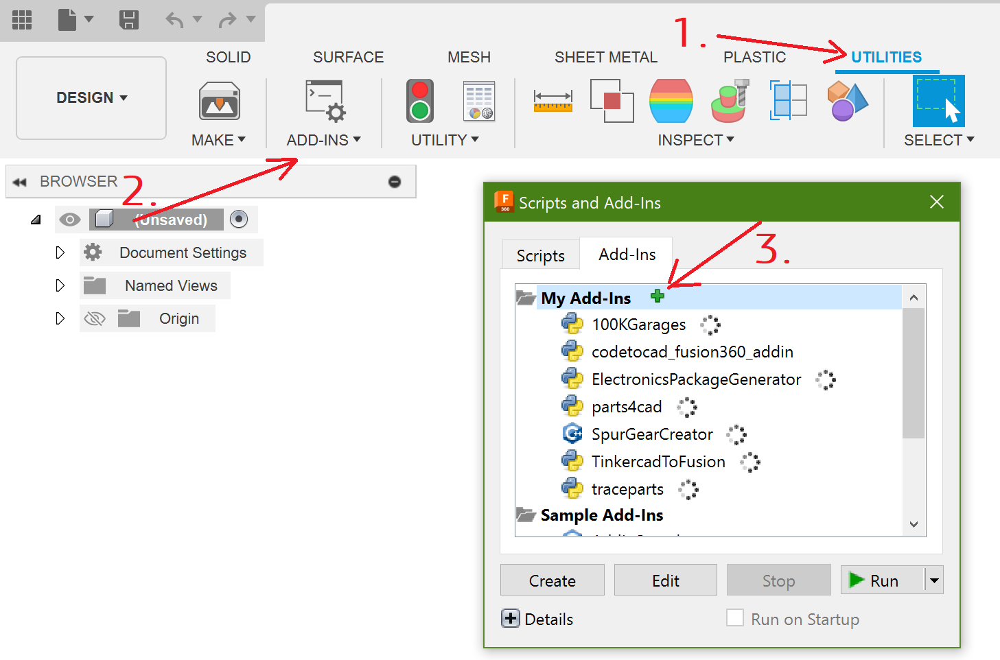
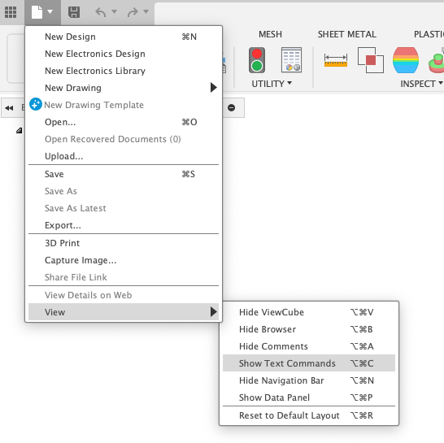

# CodeToCAD Fusion360 Add-In

An add-in to allow CodeToCAD scripts to run in Fusion360. For more information visit https://github.com/CodeToCAD/CodeToCAD

## Usage

Use the "Import CodeToCAD" button under Utilities -> Add-Ins to run a CodeToCAD script.



## Installation

1. Download Fusion360
2. Clone this repo
3. under Utilities -> Add-Ins -> Scripts and Add-ins -> choose the "Add-ins" tab
4. Click the "+" button next to "My Add-ins", and choose this folder: [`providers\fusion360\codetocad_fusion360_addin`](./)



5. The add-in is now installed. Before importing scripts, it may be helpful to enable the Text Commands view: 



## Development

For development, you should clone the CodeToCAD repo normally, then use the 

In [`.vscode/settings.json`](./.vscode/settings.json), you may want to add `../../..` to `python.analysis.extraPaths`, in order to get syntax highlighting, e.g.:
```json
{
	"python.autoComplete.extraPaths":	["PATH FUSION NORMALLY PUTS IN FOR YOU", "../../..",
		"../"],
	"python.analysis.extraPaths":	[
		"PATH FUSION NORMALLY PUTS IN FOR YOU",
		"../../..",
		"../"
	]
}
```